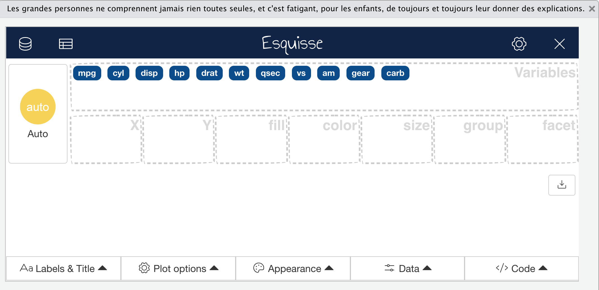
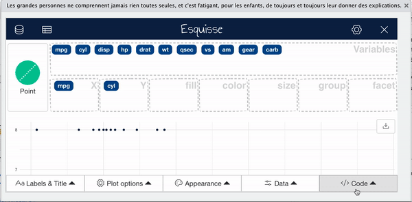
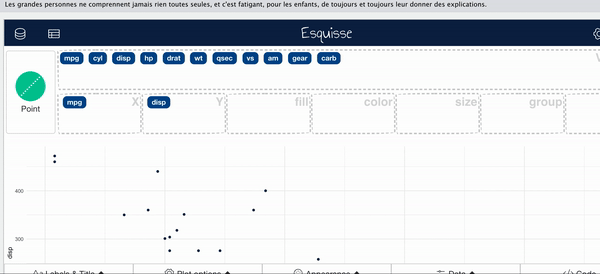
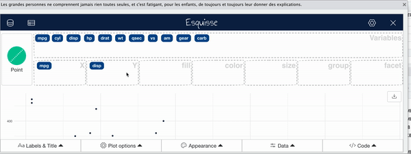
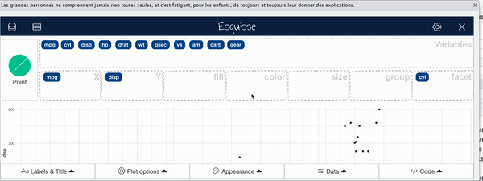
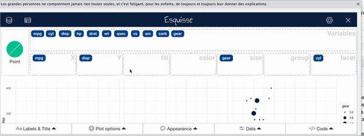
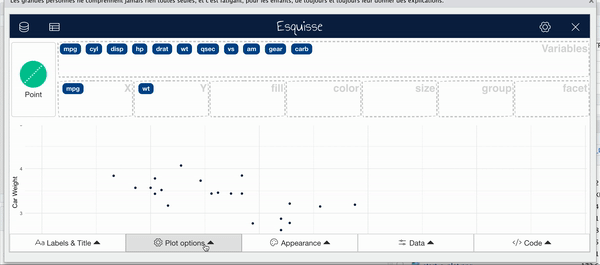
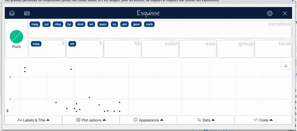

```{r setup, include=FALSE}
knitr::opts_chunk$set(echo = TRUE)
library(here)
```

## Esquisse Package

```{r esquisse}
#install.packages("esquisse")
library(esquisse)
```

## Esquisse Package

The [`esquisse` package](https://cran.r-project.org/web/packages/esquisse/vignettes/get-started.html) is helpful for getting used to creating plots in R.

It is an interactive tool to help you in RStudio.

It's super **nifty**!

```{r, fig.alt="starting a plot", out.width = "50%", echo = FALSE, fig.align='center'}
knitr::include_graphics("https://media.giphy.com/media/xUOxf7XfmpxuSode1O/giphy.gif")
```

## Starting a plot

Using the `esquisser()` function you can start creating a plot for a `data.frame` or `tibble`.

```{r, eval = FALSE}
esquisser(mtcars)
```

```{r, fig.alt="starting a plot", out.width = "100%", echo = FALSE, fig.align='center'}

```


## Select Variables

To select variables you can drag and drop variables to the respective axis that you would like the variable to be plotted on.

```{r, fig.alt="select variables", out.width = "100%", echo = FALSE, fig.align='center'}
  knitr::include_graphics("images/variables.gif")

```

## Find code

To select variables you can drag and drop variables to the respective axis that you would like the variable to be plotted on.

```{r, fig.alt="select variables", out.width = "100%", echo = FALSE, fig.align='center'}
  
```


## Change plot type

`esquisse` automatically assumes a plot type, but you might want to change this.

```{r, fig.alt="change plot type", out.width = "100%", echo = FALSE, fig.align='center'}
  
```

## Add Facets

Facets create multiple plots based on the different values of a variable.

```{r, fig.alt="add facets", out.width = "100%", echo = FALSE, fig.align='center'}
  
```


## Add size

Sometimes it is useful to change the way points are plotted so that size represents a variable. This can especially be helpful if you need your plot to be black and white.

```{r, fig.alt="add color", out.width = "100%", echo = FALSE, fig.align='center'}
  
```

## Add color

For plots with points use the color region to change coloring according to a variable.
(use "fill" for bar plots)

```{r, fig.alt="add color", out.width = "100%", echo = FALSE, fig.align='center'}
  
```


## Appearance

You can change the overall appearance with the appearance tab.

```{r, fig.alt="change overall appearance", out.width = "100%", echo = FALSE, fig.align='center'}
  knitr::include_graphics("images/appearance.gif")
```

## Smooth Lines

Especially when you have a scatter plot, it can be helpful to add a smooth/trend line. 

```{r, fig.alt="add smooth line", out.width = "100%", echo = FALSE, fig.align='center'}
  

```

## Change titles

To change titles on your plot, use the titles tab.

```{r, fig.alt="change titles", out.width = "100%", echo = FALSE, fig.align='center'}
  
```


