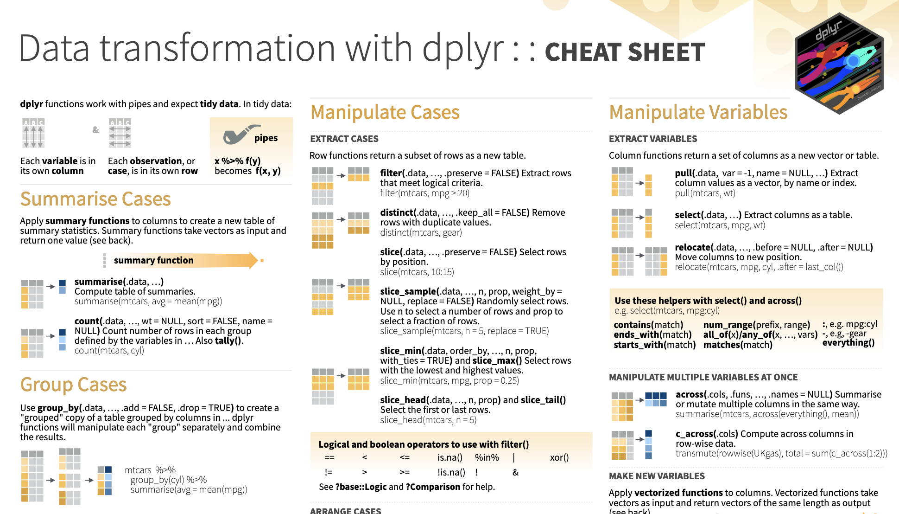

```{r, echo = FALSE, include=FALSE}
library(knitr)
library(readr)
opts_chunk$set(comment = "")
library(tidyverse)
```

## Reshaping Data 

```{r, echo = FALSE, message=FALSE}
library(tidyverse)
```

In this module, we will show you how to:

1. Reshape data from wide (fat) to long (tall)
2. Reshape data from long (tall) to wide (fat)
3. Merge Data/Joins
4. Perform operations by a grouping variable

## Cheatsheet

https://raw.githubusercontent.com/rstudio/cheatsheets/main/data-transformation.pdf

```{r, fig.alt="A preview of the Data transformation cheatsheet produced by RStudio.", out.width = "80%", echo = FALSE, align = "center"}

```

## What is wide/long data?

Data is stored *differently* in the tibble.

```{r, echo = FALSE}
ex_wide <- tibble(State = "Alabama",
                 June_vacc_rate = "37.2%",
                 May_vacc_rate = "36.0%",
                 April_vacc_rate = "32.4%"
                     )
ex_long <- pivot_longer(ex_wide, cols = !State)
```

Wide: has many columns

```{r, echo = FALSE}
ex_wide
```

Long: column names become data

```{r, echo = FALSE}
ex_long
```

## What is wide/long data?

```{r, echo = FALSE}
ex_wide <- tibble(State = c("Alabama", "Alaska"),
                 June_vacc_rate = c("37.2%", "47.5%"),
                 May_vacc_rate = c("36.0%", "46.2%"),
                 April_vacc_rate = c("32.4%", "41.7%")
                     )
ex_long <- pivot_longer(ex_wide, cols = !State)
```

Wide: multiple columns per individual, values spread across multiple columns 

```{r, echo = FALSE}
ex_wide
```

Long: multiple rows per observation, a single column contains the values

```{r, echo = FALSE}
ex_long
```

## What is wide/long data?

<div style="font-size:40pt">
Data is wide or long **with respect** to certain variables.
</div>

```{r, fig.alt="Wide versus long data rearanges the position of column names and row content.", out.width = "60%", echo = FALSE, fig.align='center'}
knitr::include_graphics("../images/pivot.jpg")
```

## Why do we need to switch between wide/long data?

Wide: **Easier for humans to read**

```{r, echo = FALSE}
ex_wide
```

Long: **Easier for R to make plots & do analysis**

```{r, echo = FALSE}
ex_long
```

## tidyr package

`tidyr` allows you to "tidy" your data.  We will be talking about:

- `pivot_longer` - make multiple columns into variables, (wide to long)
- `pivot_wider` - make a variable into multiple columns, (long to wide)
- `separate` - string into multiple columns (review)

The `reshape` command exists.  It is a **confusing** function.  Don't use it.

# `pivot_longer`

## Reshaping data from wide (fat) to long (tall): tidyr {.codesmall} 

`tidyr::pivot_longer` - puts column data into rows.

- First describe which columns we want to "pivot_longer"
- `names_to =` gives a new name to the pivoted columns
- `values_to =` gives a new name to the values that used to be in those columns

```{r, eval=FALSE}
{long_data} <- {wide_data} %>% pivot_longer(cols = {columns to pivot},
                                        names_to = {New column name: contains old column names},
                                        values_to = {New column name: contains cell values})
```

## Reshaping data from wide (fat) to long (tall): tidyr 

```{r, echo = FALSE}
wide_data <- tibble(June_vacc_rate = "37.2%",
                 May_vacc_rate = "36.0%",
                 April_vacc_rate = "32.4%")
```

```{r}
wide_data
long_data <- wide_data %>% pivot_longer(cols = everything(),
                                        names_to = "Month",
                                        values_to = "Rate")
long_data
```

## Data used: Charm City Circulator

http://jhudatascience.org/intro_to_R_class/data/Charm_City_Circulator_Ridership.csv

```{r, message = FALSE}
circ <- jhur::read_circulator()
head(circ, 5)
```

## Reshaping data from wide (fat) to long (tall): tidyr

```{r}
long <- circ %>% 
  pivot_longer(starts_with(c("orange","purple","green","banner")),
               names_to = "var", 
               values_to = "number")
long
```

## Reshaping data from wide (fat) to long (tall): tidyr 

There are many ways to select the columns we want. Use `?tidyr_tidy_select` to look at more column selection options.

```{r}
long <- circ %>% 
  pivot_longer( !c(day, date, daily),
               names_to = "var", 
               values_to = "number")
long
```

## Reshaping data from wide (fat) to long (tall): tidyr 

```{r}
long %>% count(var)
```

## Cleaning up long data

We will use `str_replace` from the `stringr` package to put `_` in the names

```{r}
long <- long %>% mutate(
  var = str_replace(var, "Board", "_Board"),
  var = str_replace(var, "Alight", "_Alight"),
  var = str_replace(var, "Average", "_Average") 
)
long
```

## Cleaning up long data

Now each `var` is Boardings, Averages, or Alightings.  We use "`into =`" to name the new columns and "`sep =`" to show where the separation should happen.

```{r}
long <- long %>% 
  separate(var, into = c("line", "type"), sep = "_")
long
```

# `pivot_wider`

## ## Reshaping data from long (tall) to wide (fat): tidyr

`tidyr::pivot_wider` - spreads row data into columns.

- `names_from =` the old column whose contents will be spread into multiple new column names.
- `values_from =` the old column whose contents will fill in the values of those new columns.

```{r, eval=FALSE}
{wide_data} <- {long_data} %>% 
  pivot_wider(names_from = {Old column name: contains new column names},
              values_from = {Old column name: contains new cell values})
```

## Reshaping data from long (tall) to wide (fat): tidyr

```{r}
long_data
wide_data <- long_data %>% pivot_wider(names_from = "Month", 
                                       values_from = "Rate") 
wide_data
```

## Reshaping Charm City Circulator

```{r}
long
```

## Reshaping Charm City Circulator

```{r}
wide <- long %>% pivot_wider(names_from = "type", 
                            values_from = "number") 
wide
```

## Lab Part 1

[Website](http://jhudatascience.org/intro_to_R_class/index.html)

## Joining in `dplyr`

* Merging/joining data sets together - usually on key variables, usually "id"
* `?join` - see different types of joining for `dplyr`
<!-- * Let's look at https://www.rstudio.com/wp-content/uploads/2015/02/data-wrangling-cheatsheet.pdf -->
* `inner_join(x, y)` - only rows that match for `x` and `y` are kept
* `full_join(x, y)` - all rows of `x` and `y` are kept 
* `left_join(x, y)` - all rows of `x` are kept even if not merged with `y`
* `right_join(x, y)` - all rows of `y` are kept even if not merged with `x`
* `anti_join(x, y)` - all rows from `x` not in `y` keeping just columns from `x`.

## Merging: Simple Data

`base` has baseline data for ids `1` to `10` and Age

```{r merging}
base <- tibble(id = 1:10, Age = seq(55,60, length=10))
head(base, 2)
```
`visits` has ids `2` to `11`, 3 different visits, and an outcome

```{r}
visits <- tibble(id = rep(2:11, 3), visit= rep(1:3, 10),
                    Outcome = seq(10,50, length=30))
head(visits, 2)
```

## Inner Join

```{r inner_join}
ij = inner_join(base, visits)
dim(ij)
head(ij)
```


## Left Join

```{r left_join}
lj = left_join(base, visits)
dim(lj)
head(lj)
```

## Install `tidylog` package to log outputs

```{r, include=FALSE}
library(tidylog)
```

```{r left_join_log}
# install.packages("tidylog")
library(tidylog)
left_join(base, visits)
```

## Right Join

```{r right_join}
rj = right_join(base, visits)
```


## Left Join: Switching arguments

```{r right_join2}
lj2 = left_join(visits, base)
```

<!-- ```{r right_join_arrange, echo = FALSE} -->
<!-- rj2 = arrange(rj2, id, visit) %>% select(id, visit, Outcome, Age) -->
<!-- lj = arrange(lj, id, visit) %>% select(id, visit, Outcome, Age) -->
<!-- ``` -->

<!-- ```{r right_join_arrange_out} -->
<!-- identical(rj2, lj) ## after some rearranging -->
<!-- ``` -->

## Full Join

```{r full_join}
fj = full_join(base, visits)
```

## Full Join

Note what tidylog means by `includes duplicates`. Data from `base` is being duplicated.

```{r}
# fj = full_join(base, visits)
head(fj, 10)
```

```{r include=FALSE}
unloadNamespace("tidylog")
```

## Duplicated

- The `duplicated` command can give you indications if there are duplications in a **vector**:

```{r}
duplicated(1:5)
duplicated(c(1:5, 1))
fj %>% mutate(dup_id = duplicated(id))
```

## Using the `by` argument

By default - uses intersection of column names.  If `by` specified, then uses that.

```{r use_by}
# for multiple, by = c(col1, col2)
head(full_join(base, visits, by = "id"))
```

## Lab Part 2

[Website](http://jhudatascience.org/intro_to_R_class/index.html)


<!-- perform operations by a grouping variable in r?? -->
