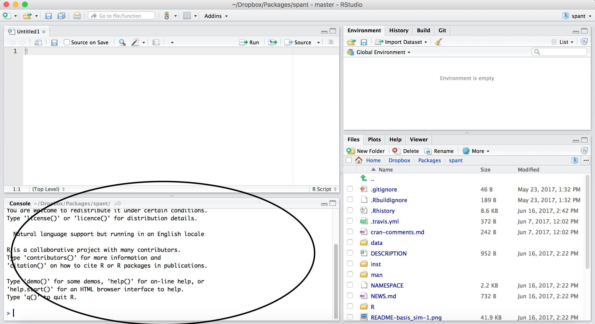

```{r, echo = FALSE}
library(knitr)
opts_chunk$set(comment = "")
```

## Working with R

* The R Console "interprets" whatever you type
    * Calculator
    * Creating variables
    * Applying functions

* "Analysis" Script + Interactive Exploration
    * Static copy of what you did (reproducability)
    * Try things out interactively, then add to your script

# R essentially is a command line with a set of functions loaded

## R Uses Functions, in Packages

* R revolves around functions
    * Commands that take input, performs computations, and returns results
    * When you download R, it has a "base" set of functions/packages (**base R**)
* Functions are enclosed in packages
    * These written by R users/developers (like us) - **some are bad**
    * Think of them as "R Extensions"
    
## Using Packages

* You **need to know base R** - answers on Google commonly use it
* We will show you some newer and **more intuitive** ways to do things, not in base R
* RStudio (the company) makes a lot of great packages
* **Hadley Wickham** writes a lot of them (Employee and Developer at RStudio)
    * One authority on all things R
    * How to trust an R package: http://simplystatistics.org/2015/11/06/how-i-decide-when-to-trust-an-r-package/
    

## RStudio (the software)

RStudio is an Integrated Development Environment (IDE) for R

  * It helps the user effectively use R.
  * Makes things easier  
* Is NOT dropdown statistical tools (such as Stata)
    * See [Rcmdr](https://cran.r-project.org/web/packages/Rcmdr/index.html) or [Radiant](http://vnijs.github.io/radiant/) 

* All snapshots in these slides are taken from http://ayeimanol-r.net/2013/04/21/289/

## RStudio

Easier working with R 

* Syntax highlighting, code completion, and smart indentation
* Easily manage multiple working directories and projects

More information

* Workspace browser and data viewer
* Plot history, zooming, and flexible image and PDF export
* Integrated R help and documentation
* Searchable command history

<!-- ## RStudio/R Console  -->

## RStudio

Super useful "cheat sheet": https://github.com/rstudio/cheatsheets/raw/master/rstudio-ide.pdf 

## RStudio/R Console 
<!--  -->

```{r, out.width = "90%", echo = FALSE}

```

## RStudio/R Console

* Where code is executed (where things happen)
* You can type here for things interactively
* Code is **not saved** on your disk

## RStudio Layout

If RStudio doesn't look like this (or our RStudio), then do:

RStudio --> Preferences --> Pane Layout

```{r, out.width = "500px", echo = FALSE}
knitr::include_graphics("pane_layout.png")
```


<!-- ## Source/Editor  -->
## Source/Editor

```{r, out.width = "90%", echo = FALSE}
knitr::include_graphics("rstudio_script.png")
```

## Source

* Where files open to
* Have R code and comments in them
* Can highlight and press (CMD+Enter (Mac) or Ctrl+Enter (Windows)) to run the code

In a .R file (we call a script), code is saved on your disk

<!-- ## Workspace/Environment  -->
## Workspace/Environment 
<!--  -->

```{r, out.width = "90%", echo = FALSE}
knitr::include_graphics("rstudio_environment.png")
```

## Workspace/Environment

* Tells you what **objects** are in R
* What exists in memory/what is loaded?/what did I read in?

History

* Shows previous commands.  Good to look at for debugging, but **don't rely** on it as a script.  Make a script!
* Also type the "up" key in the Console to scroll through previous commands

## Other Panes

* **Files** - shows the files on your computer of the directory you are working in
* **Viewer** - can view data or R objects
* **Help** - shows help of R commands
* **Plots** - pretty pictures
* **Packages** - list of R packages that are loaded in memory


## Useful R Studio Shortcuts

* `Ctrl + Enter` (`Cmd + Enter` on OS X) in your script evaluates that line of code
    * It's like copying and pasting the code into the console for it to run.
* `Ctrl+1` takes you to the script page
* `Ctrl+2` takes you to the console
* [http://www.rstudio.com/ide/docs/using/keyboard_shortcuts](http://www.rstudio.com/ide/docs/using/keyboard_shortcuts)

## Website

[Website](../index.html)
