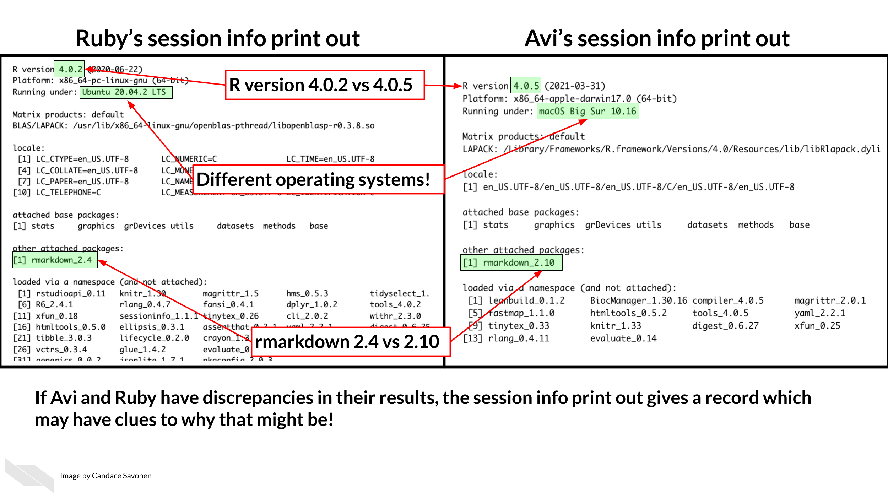

```{r, echo = FALSE, message = FALSE}
library(knitr)
opts_chunk$set(comment = "")
library(readr)
suppressPackageStartupMessages(library(dplyr))
library(tidyverse)
```

## Reproducibility
What's reproducibility?

A different analyst re-performs the analysis with
the same code and
the same data and obtains
the same result.

## Reproducibility vs Repeatability vs Replicability

```{r, fig.alt="session info", out.width = "60%", echo = FALSE, fig.align='center'}
knitr::include_graphics("images/reproducibility.png")
```

## Reproducibility
- Clean your environment regularly
- Use RMarkdown
- Check the knit of your RMarkdown regularly
- Tell your future self and others what you did!
- Print session info!

## RMarkdown

Clicking the knit button, will knit your document to create different types of reports. The default is html.

```{r, fig.alt="How to knit an Rmd", out.width = "60%", echo = FALSE, fig.align='center'}
knitr::include_graphics("images/knit.png")
```

## Code Chunks
```{r, fig.alt="Options for code chunks", out.width = "30%", echo = FALSE, fig.align='center'}
knitr::include_graphics("images/chunks.png")
```

After knitting:  
1) **echo** - determines if your code should be shown or not  
    - TRUE = code is **shown** (default)  
    - FALSE = code is not shown (but might be run...depends on eval)  
2) **eval** - determines if your code should be evaluated (run) or not  
    - TRUE = code is **run** (default)  
    - FALSE = code is not run (but might be shown...depends on echo)  
3) **message** = FALSE -suppresses messages when your run your code  

## RMarkdown syntax

Before:
```{r, fig.alt="Markdown sytax before rendering", out.width = "80%", echo = FALSE, fig.align='center'}
knitr::include_graphics("images/original.png")
```

After knit:
```{r, fig.alt="Result of markdown sytax after rendering", out.width = "80%", echo = FALSE, fig.align='center'}
knitr::include_graphics("images/rendered.png")
```

## RMarkdown syntax

Go to File > Help > Cheatsheets > R Markdown Cheatsheet

## Final Project

Specific guidelines and example on website  

Turn in through CoursePlus:  
1) RMarkdown file    
2) html file  

## Session Info

```{r, fig.alt="session info", out.width = "60%", echo = FALSE, fig.align='center'}

```

Session info helps

```{r}
sessionInfo()
```

## DRY code

[DRY](https://web.archive.org/web/20131204221336/http://programmer.97things.oreilly.com/wiki/index.php/Don't_Repeat_Yourself) is an acronym: "Don't repeat yourself" [@Smith2013].

> "I hate code, and I want as little of it as possible in our product."
> - Jack Diedrich

## More resources

These are just some quick tips, for more information:

- [The RMarkdown book](https://bookdown.org/yihui/rmarkdown/)
- [Jenny Bryan's organizational strategies](https://www.stat.ubc.ca/~jenny/STAT545A/block19_codeFormattingOrganization.html).
- [Write efficient R code for science](https://www.earthdatascience.org/courses/earth-analytics/automate-science-workflows/write-efficient-code-for-science-r/).
- [Reproducibility in Cancer Informatics course](https://jhudatascience.org/Reproducibility_in_Cancer_Informatics/introduction.html)
