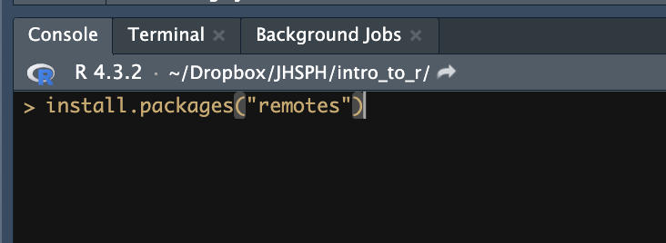
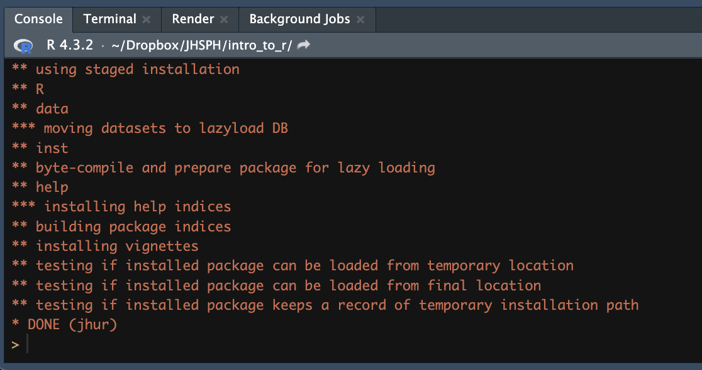

```{r setup, echo = FALSE, message = FALSE, warning=FALSE}
library(tidyverse)
source("../../scripts/utils.R")
schedule <- read_markdown("../_schedule_table.Rmd")
```

## Objectives

Upon completion of this session, you will be able to do the following:

1.  Successfully install R and RStudio.
2.  Install your first R packages.

## Material

```{r, results='asis', echo = FALSE, message=FALSE, warning=FALSE}
# The str_replace_all creates an absolute url to linked documents. Important because there are word and pdf rendered versions of the syllabus.
# The filter() step removes all dates but this date to make a smaller table.
pander::pandoc.table(
  schedule %>%
    urls_for_module_details() %>%
    filter(
      row_number() >= which(str_detect(schedule$`**Day**`, "\\[Day 0\\]")) &
        row_number() < which(str_detect(schedule$`**Day**`, "\\[Day 1\\]"))
    ),
  missing = "",
  split.tables = Inf,
  style = "rmarkdown"
)
```

## Instructions

Install the latest version of R `r config::get("r_version")`

-   [Download For Mac users (M1 chip)](`r config::get("r_dl_mac_m1")`) - (may need to copy-paste the link to the browser)

-   [Download For Mac users (Intel chip)](`r config::get("r_dl_mac_intel")`) - (may need to copy-paste the link to the browser)

-   [Download For Windows users](`r config::get("r_dl_windows")`) - (may need to copy-paste the link to the browser)

For other operating systems, or if you prefer to access the download link from the official website, visit <http://cran.us.r-project.org> and select `Download R for Linux`, `Download R for macOS` or `Download R for Windows` based on which device you have.

Install the latest version of RStudio (Desktop):

-   [Download For Mac users](`r config::get("rstudio_dl_mac")`) - (may need to copy-paste the link to the browser)

-   [Download For Windows users](`r config::get("rstudio_dl_windows")`) - (may need to copy-paste the link to the browser)

-   A more detailed walk-through of the steps above is provided in [R_and_RStudio_installation](../../modules/Setup/R_and_RStudio_installation.html). However, you should use the most recent versions of R and RStudio.

You can also visit the `RStudio` website, <https://posit.co/download/rstudio-desktop/>.

If you are using a computer issued from Hopkins, you may need to work with the IT department in advance to do these installations.

## Installing `jhur` (optional)

The instructor team has created a collection of code, called a "package", that will help get data into your programming environment quickly. Copy and paste the following into the console and hit "return" to run the code.

```{r eval=FALSE}
install.packages("remotes")
```

{width=50%}

Next, run the following:

```{r eval=FALSE}
remotes::install_github("jhudsl/jhur")
```

If you get the following message, `Enter one or more numbers, or an empty line to skip updates: `, you can hit return to enter an empty line (no updates).

You should see some messages in the console, ending with `* DONE (jhur)` if the process completed successfully.

{width=50%}

## Homework 1

**(Due `r config::get("final_due_date")` - but we strongly suggest you complete it before the course starts)**:

-   Complete the *FREE* lessons for Introduction to R on Dataquest.

-   Upload a screenshot of the completion page to the Drop Box link below.

## Homework

`r emo::ji("pencil")` **HOMEWORK 1**: [Dataquest](https://app.dataquest.io/login?target-url=%2Fm%2F499%2Fintroduction-to-programming-in-r)

## Drop Boxes

[Homework 1 Drop Box](`r config::get("courseplus_dropboxes")`)

**Note**: only people taking the course for credit must turn in the assignments. However, we will evaluate all submitted assignments in case others would like feedback on their work.

