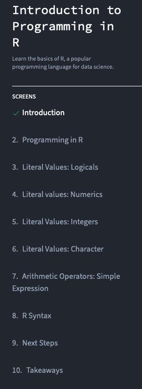

```{r setup, echo = FALSE, message = FALSE, warning=FALSE}
library(tidyverse)
source("../../scripts/utils.R")
schedule <- read_markdown("../_schedule_table.Rmd")
```

# Day 0

## Objectives

Upon completion of this session, you will be able to do the following:

1. Successfully install R and RStudio.
2. Install your first R packages.

## Material

```{r, results='asis', echo = FALSE, message=FALSE, warning=FALSE}
# The str_replace_all creates an absolute url to linked documents. Important because there are word and pdf rendered versions of the syllabus.
# The filter() step removes all dates but this date to make a smaller table.
pander::pandoc.table(
  schedule %>%
    urls_for_module_details() %>%
    filter(
      row_number() >= which(str_detect(schedule$`**Day**`, "\\[Day 0\\]")) &
        row_number() < which(str_detect(schedule$`**Day**`, "\\[Day 1\\]"))
    ),
  missing = "",
  split.tables = Inf,
  style = "rmarkdown"
)
``` 


## Instructions

- Install the latest version of R `r config::get("r_version")`
  - For Mac users: https://cloud.r-project.org/bin/macosx/base/R-4.2.2.pkg (may need to copy-paste the link to the browser)
  - For Windows users: https://cloud.r-project.org/bin/windows/base/R-4.2.2-win.exe (may need to copy-paste the link to the browser)
  - For other operating systems, or if you prefer to access the download link from the official website, visit: http://cran.us.r-project.org

- Install the latest version of RStudio (Desktop):
  - For Mac users: https://download1.rstudio.org/electron/macos/RStudio-2022.12.0-353.dmg (may need to copy-paste the link to the browser)
  - For Windows users: https://download1.rstudio.org/electron/windows/RStudio-2022.12.0-353.exe (may need to copy-paste the link to the browser and you will need Windows 10 or 11)
  - A more detailed walk-through of the steps above is provided in [R_and_RStudio_installation](../../modules/Setup/R_and_RStudio_installation.html)    .

If you are using a computer issued from Hopkins, you may need to work with the IT department in advance to do these installations. 

- **Homework 1 (Due Monday, January 30 at midnight ET - but we strongly suggest you complete it before the course starts)**: 
  - Complete the free lessons for Introduction to R on Dataquest. An image of the lessons in the module is shown below. Please complete all free exercises in "Introduction to Programming in R," starting with "1. Introduction" through "12. Takeaways."
  - Upload a screenshot of the completion page to the Drop Box link below.
    
    
    

## Homework

`r emo::ji("pencil")` **HOMEWORK 1**: [Dataquest](https://app.dataquest.io/login?target-url=%2Fm%2F499%2Fintroduction-to-programming-in-r) 


## Drop Boxes

[Homework 1 Drop Box](https://courseplus.jhu.edu/core/index.cfm/go/db:main/coID/17889/)

**Note**: only people taking the course for credit must turn in the assignments. However, we will evaluate all submitted assignments in case others would like feedback on their work.

