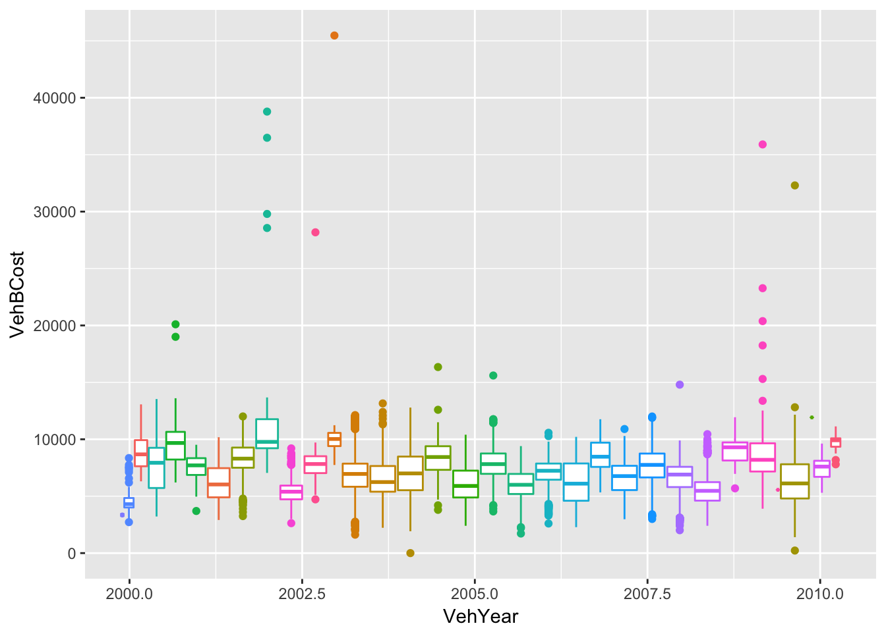

---
output:
  html_document: default
  word_document: default
  pdf_document: default
---


# I am a large section

## I am a smaller section


## Let's make a table


```r
df = data.frame(y = rnorm(1000),
           x = sample(letters, size = 1000, 
                      replace = TRUE),
           stringsAsFactors = FALSE)
df$y[ sample(1:1000, size = 20)] = NA
summ = df %>% 
  group_by(x) %>% 
  summarize(mean = mean(y, na.rm = TRUE),
            sd = sd(y, na.rm = TRUE),
            not_missing = sum(!is.na(y)),
            n =n())
summ = summ %>% 
  filter(x %in% letters[1:5])
```


```r
library(knitr)
library(kableExtra)
summ$z = "Hey I am a very long string and I  want to be wrapped"
knitr::kable(summ, digits = 2)
```


x      mean     sd   not_missing    n  z                                                     
---  ------  -----  ------------  ---  ------------------------------------------------------
a     -0.01   1.04            35   35  Hey I am a very long string and I  want to be wrapped 
b      0.10   1.09            35   36  Hey I am a very long string and I  want to be wrapped 
c      0.02   0.90            37   37  Hey I am a very long string and I  want to be wrapped 
d     -0.05   1.03            31   33  Hey I am a very long string and I  want to be wrapped 
e      0.02   0.88            39   40  Hey I am a very long string and I  want to be wrapped 


```r
library(plotly)
```

```
## 
## Attaching package: 'plotly'
```

```
## The following object is masked from 'package:ggplot2':
## 
##     last_plot
```

```
## The following object is masked from 'package:stats':
## 
##     filter
```

```
## The following object is masked from 'package:graphics':
## 
##     layout
```

```r
url = "http://johnmuschelli.com/intro_to_r/data/kaggleCarAuction.csv"
## best answer - quick and simple
cars = read_csv(
  url,
  col_types = cols(
    VehBCost = col_double()
  ))
g = ggplot(cars, aes(x = VehYear, y = VehBCost, 
                 colour = Make)) + 
  geom_boxplot() + guides(colour = FALSE)
print(g)
```




## Let's use plotly to get an interactive graph


```r
ggplotly(g)
```

preserveab84f50f7a526231


```r
ss = summ %>% as.data.frame
library(pander)
pander(ss, round = 2)
```


-------------------------------------------------------------------
 x   mean     sd    not_missing   n                 z              
--- ------- ------ ------------- ---- -----------------------------
 a   -0.01   1.04       35        35   Hey I am a very long string 
                                        and I want to be wrapped   

 b    0.1    1.09       35        36   Hey I am a very long string 
                                        and I want to be wrapped   

 c   0.02    0.9        37        37   Hey I am a very long string 
                                        and I want to be wrapped   

 d   -0.05   1.03       31        33   Hey I am a very long string 
                                        and I want to be wrapped   

 e   0.02    0.88       39        40   Hey I am a very long string 
                                        and I want to be wrapped   
-------------------------------------------------------------------


```r
library(DT)
datatable(summ) %>% formatRound(columns = c("mean", "sd"))
```

preservea4a434615cf5bbdd


Look at http://rmarkdown.rstudio.com/lesson-7.html and the Rmd: http://rmarkdown.rstudio.com/demos/6-tables.Rmd


