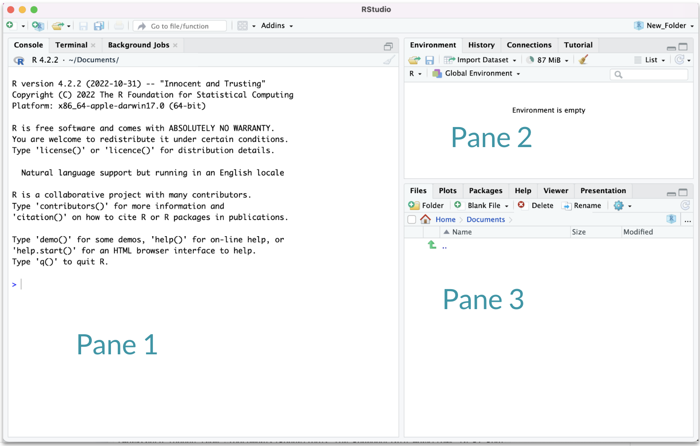
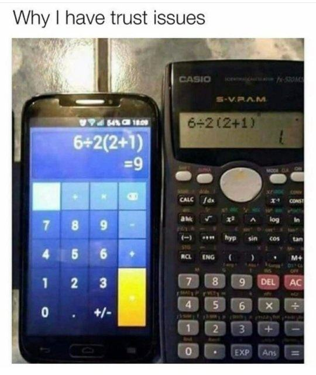
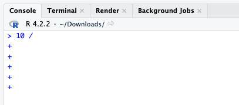

```{r, echo = FALSE}
library(knitr)
opts_chunk$set(comment = "")
```

## Working in R

For now, we will be working in the **Console** (Pane 1) in RStudio

```{r, fig.align='center', out.width="50%", echo = FALSE, fig.alt= "When RStudio is first opened you will see 3 panes"}

```

You can follow along with the demonstrations, then there will be more time for practice during the lab at the end of lecture

## R as a calculator

-   The R console is a full calculator
-   Try to play around with it:
    -   +, -, /, \* are add, subtract, divide and multiply
    -   \^ or \*\* is power
    -   parentheses -- ( and ) -- work with order of operations
    -   %% finds the remainder

## R as a calculator

Try evaluating the following. Type these in the Console and press *return* to evaluate:

-   `2 + 2`
-   `2 * 3 / 4`
-   `2^4 - 1`

```{r, fig.alt="Problem gives answer of 1 or 9 depending on calculator.", out.width = "30%", echo = FALSE, out.extra='style="float:left"'}

```

## Basic terms: "object"

**Object** - an object is something that can be worked with or on in R - can be lots of different things! 

You can think of objects as **nouns** in R.

-   a variable
-   a dataset
-   a plot

... many more

## Assigning values to objects

-   You can create <span style="color:blue">objects</span> within the R environment and from files on your computer
-   R uses `<-` to create objects (you might also see `=` used, but this is not best practice)

```{r}
x <- 2
x
x * 4
x + 2
```

## GUT CHECK: What is an "object"?

A. Something I can touch 

B. Something that can be worked with in R 

C. A software version

## Objects with text

Create objects with text using quotation marks:

```{r}
y <- "hello world!"
y
```

## numeric vs. character classes?

We will talk in-depth about classes. For now:

**numeric**

-   Numbers
-   No quotation marks

```{r eval = FALSE}
2
```

**character**

-   Text with quotation marks
-   Green lettering (default)

```{r eval = FALSE}
"hello!"
```

# Common issues

```{r, fig.alt="", out.width = "60%", echo = FALSE, out.extra='style="float:left"'}
knitr::include_graphics("images/debug.png")
```

## TROUBLESHOOTING: R is case sensitive

Object names are case-sensitive, i.e., `X` and `x` are different

```{r}
x
```

```{r error = TRUE}
X
```

## TROUBLESHOOTING: No commas in big numbers

Commas separate objects in R, so they shouldn't be used when entering big numbers.

```{r error = TRUE}
z <- 3,000
```

## TROUBLESHOOTING: Complete the statement

```{r error = TRUE}
10 /
```

`+` indicates an incomplete statement. Hit "esc" to clear and bring back the `>`.

```{r, fig.alt="Incomplete statements make a + sign appear in the Console.", out.width = "45%", echo = FALSE, out.extra='style="float:left"'}

```

## Simple object practice

Try assigning your full name to an R object called `name`

## Simple object practice

Try assigning your full name to an R object called `name`

```{r}
name <- "Ava Hoffman"
name
```

## Combining objects with `c()`

Use `c()` to collect/combine single R objects into a <span style="color:blue">vector</span> of R objects. It is mostly used for creating vectors of multiple items, including numbers and character strings.

```{r}
x <- c(1, 4, 6, 8)
x
```

## Combining objects with `c()`

Try assigning your first and last name as 2 separate character strings into a vector called `name2`

## Combining objects with `c()`

Try assigning your first and last name as 2 separate character strings into a vector called `name2`

```{r}
name2 <- c("Ava", "Hoffman")
name2
```

## Basic terms: "function"

**Function** - a function is a piece of code that allows you to do something in R. You can write your own, use functions that come directly from installing R, or use functions from additional packages.

You can think of a function as **verb** in R.

A function might help you add numbers together, create a plot, or organize your data.

## Using functions on our vector

-   `class()` tells us what kind of values the object contains (numeric, character, etc)
-   `length()` tells us how many elements.

```{r}
name
class(name)
x
length(x)
```

## GUT CHECK: What is a "function"?

A. a number or text 

B. a button inside RStudio 

C. code that does something

## Combining vectors

It's fine to combine vectors, but all values will end up with the same class!

```{r}
vect <- c(name, x)
vect
class(vect)
```

## Practicing functions

What do you expect for the length of the `name2` object?

What is the class?

## Practicing functions

What do you expect for the length of the `name2` object?

What is the class?

```{r}
length(name2)
class(name2)
```

## Commenting in code

`#` creates a comment in R code

```{r}
# 1 + 2 <- this does not get run

1 + 2 # <- this does
```

## Lab Part 1

-   Assign values to objects with `<-` (new name on left side)
-   Use the `c()` function to combine text/numbers/etc. into a vector
-   `class()` tells you the class (kind) of object
-   Use the `length()` function to determine number of elements
-   `#` for comments or to deactivate a line of code

<span style="color:red">This lab is a webpage. Soon we will be using R specific files!</span>

💻 [Lab](https://jhudatascience.org/intro_to_r/modules/Basic_R/lab/Basic_R_Lab.html)

## Math + vector objects

You can perform math with vectors.

```{r}
x + 2
x * 3
x + c(1, 2, 3, 4)
```

## Math + vector objects

But math can only be performed on numbers.

```{r, error=TRUE}
name2 + 4
```

## Reassigning to a new object

Save these modified vectors as a new vector called `y`.

```{r assign5}
y <- x + c(1, 2, 3, 4)
y
```

Note that the R object `y` is no longer "hello world!" - It has been overwritten by assigning new data to the same name.

## Reassigning to a new object

Reassigning allows you to make changes "in place"

```{r eval = FALSE}
# results not stored:
x + c(1, 2, 3, 4)

# x remains unchanged, results stored in `y`:
y <- x + c(1, 2, 3, 4)

# replace `x` in place
x <- x + c(1, 2, 3, 4)
```

## R objects

You can get more attributes than just class. The function `str()` gives you the structure of the object.

```{r assign2}
str(x)
str(y)
```

This tells you that `x` is a numeric vector and tells you the length.

## Basic terms: "argument"

**Argument** - what you pass to a function

-   can be data like the number 1 or 20234
-   can be options about how you want the function to work
-   separated by commas

Like an **adverb**.

## Create vectors with `seq()`

For numeric: `seq()`

-   The `from` <span style="color:blue">argument</span> says what number to start on.\
-   The `to` <span style="color:blue">argument</span> says what number to not go above.\
-   The `by` <span style="color:blue">argument</span> says how much to increment by.\
-   The `length.out` <span style="color:blue">argument</span> says how long the vector should be overall.

```{r}
seq(from = 0, to = 1, by = 0.2)
seq(from = 0, to = 10, by = 1)
seq(from = -5, to = 5, length.out = 10)
```

## Useful functions to create vectors `rep()`

For character: `rep()` can create very long vectors. Works for creating character and numeric vectors.

The `each` argument specifies how many of each item you want repeated. The `times` argument specifies how many times you want the vector repeated.

`rep(WHAT_TO_REPEAT, arguments)`

```{r}
rep(c("black", "white"), each = 3)
rep(c("black", "white"), times = 3)
rep(c("black", "white"), each = 2, times = 2)
```

## Creating numeric vectors `sample()`

You can use the `sample()` function to make a random sequence. The `x` argument specifies what you are sampling from. The `size` argument specifies how many values there should be. The `replace` argument specifies if values should be replaced or not.

```{r}
seq_hun <- seq(from = 0, to = 100, by = 1)
seq_hun
y <- sample(x = seq_hun, size = 5, replace = TRUE)
y
```

## When to replace in `sample()`

Use `replace = FALSE` if you are doing a random sample from a larger population, or if you want to randomize the order of a population.

Use `replace = TRUE` if you are doing bootstrapping or any resampling procedure.

## Installing packages to do more!

Some functions and data come with R right out of the box ("base R"). We will add more functionality with <span style="color:blue">packages</span>. Think of these like "expansion packs" for R.

Must be done **once** for each installation of R (e.g., version 4.4 \>\> 4.5).

An important package we will use is `tidyverse`. It is a mega-package great for data import, wrangling, and visualization.

```{r eval = FALSE}
install.packages("tidyverse")
```

## Loading packages

After installing packages, you will need to "load" them into memory so that you can use them.

This must be done **every time** you start R.

We use a function called `library` to load packages.

```{r, eval = FALSE}
library(tidyverse)
```

## Installing + Loading packages

```{r, fig.alt="Installing must be done once via 'install.packages() while loading must be done every R session via 'library()'.", out.width = "80%", echo = FALSE, fig.align='center'}
knitr::include_graphics("../../images/lol/install_packages.jpg")
```

## Summary

-   R functions as a calculator
-   Use quotes "" for characters
-   Use `<-` to save (assign) values to objects. Reassigning allows you to make changes "in place".
-   Use `c()` to **combine** into vectors
-   `length()`, `class()`, and `str()` tell you information about an object
-   The sequence `seq()` function helps you create numeric vectors (`from`,`to`, `by`, and `length.out` arguments)
-   The repeat `rep()` function helps you create vectors with the `each` and `times` arguments
-   `sample()` makes random vectors
-   `install.packages()` and `library()` install and load packages, respectively.

## Summary

🏠 [Class Website](https://jhudatascience.org/intro_to_r/)

💻 [Basic R Lab](https://jhudatascience.org/intro_to_r/modules/Basic_R/lab/Basic_R_Lab.html)

📃 [Day 1 Cheatsheet](https://jhudatascience.org/intro_to_r/modules/cheatsheets/Day-1.pdf)

```{r, fig.alt="The End", out.width = "30%", echo = FALSE, fig.align='center'}
knitr::include_graphics(here::here("images/the-end-g23b994289_1280.jpg"))
```

Image by <a href="https://pixabay.com/users/geralt-9301/?utm_source=link-attribution&amp;utm_medium=referral&amp;utm_campaign=image&amp;utm_content=812226">Gerd Altmann</a> from <a href="https://pixabay.com//?utm_source=link-attribution&amp;utm_medium=referral&amp;utm_campaign=image&amp;utm_content=812226">Pixabay</a>
