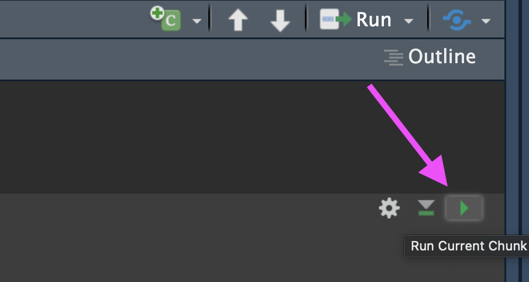
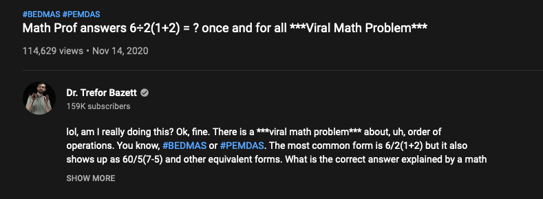

```{r, echo = FALSE}
library(knitr)
opts_chunk$set(comment = "")
```

## Explaining output on slides

In slides, a command (we'll also call them code or a code chunk) will look like this

```{r code}
class(3)
```

And then directly after it, will be the output of the code.  
So `class(3)` is the code chunk and '[1] "numeric" ' is the output.

## Running code chunks

Send code to run in the console:

- Run the whole chunk with the green play button (top right of the chunk)
- Run single line with ⌘+return or ctrl+return

```{r, fig.alt="The green RStudio play button is highlighted with an arrow. Press this button to run all the code inside the chunk.", out.width = "60%", echo = FALSE, out.extra='style="float:left"'}

```

## R as a calculator

```{r calcDemo}
2 + 2
2 * 4
2^3
```

Note: when you enter your command in the Console, R inherently thinks you want to print the result. 

## R as a calculator

- The R console is a full calculator
- Try to play around with it:
    - +, -, /, * are add, subtract, divide and multiply
    - ^ or ** is power
    - parentheses -- ( and ) -- work with order of operations 
    - %% finds the remainder

## R as a calculator

```{r calcDemo2}
2 + (2 * 3)^2
(1 + 3) / 2 + 45
6 / 2 * (1 + 2)
```

```{r, fig.alt="Problem gives answer of 1 or 9 depending on calculator.", out.width = "30%", echo = FALSE, out.extra='style="float:left"'}
knitr::include_graphics("images/Basic_R_calculator.jpg")
```

```{r, fig.alt="Problem gives answer of 1 or 9 depending on calculator.", out.width = "60%", echo = FALSE, out.extra='style="float:left"'}

```

## R as a calculator

Try evaluating the following:

- `2 + 2 * 3 / 4 -3`
- `2 * 3 / 4 * 2`
- `2^4 - 1`

## Commenting in Scripts

`#` creates a comment in R code

```{r}
# this is a comment

# nothing to its right is evaluated

# this # is still a comment
### you can use many #'s as you want

1 + 2 # Can be the right of code
```

In an `.Rmd` file, you can write notes outside the R chunks.

## Assigning values to objects

- You can create objects from within the R environment and from files on your computer
- R uses `<-` to assign values to an object name (you might also see `=` used, but this is not best practice)

```{r}
x <- 2
x
x * 4
x + 2
```

## Assigning values to objects

- The most comfortable and familiar class/data type for many of you will be `data.frame`
- You can think of these as essentially spreadsheets with rows (usually subjects or observations) and columns (usually variables)
- `data.frame`s are somewhat advanced objects in R; we will start with simpler objects

## Assigning values to objects

- Here we introduce "1 dimensional" classes; often referred to as 'vectors'
- Vectors can have multiple sets of observations, but each observation has to be the same class.
- Use the `class()` function to check the class of an object.

```{r assignClass}
class(x)
y <- "hello world!"
class(y)
```

## numeric vs. character classes?

We will talk in-depth about classes. For now:

**numeric**

-  Numbers
-  No quotation marks

```{r eval = FALSE}
2
```

**character**

-  Text with quotation marks
-  Green lettering (default)

```{r eval = FALSE}
"hello!"
```

# Common issues

```{r, fig.alt="", out.width = "60%", echo = FALSE, out.extra='style="float:left"'}
knitr::include_graphics("images/debug.png")
```

## TROUBLESHOOTING: R is case sensitive

Object names are case-sensitive, i.e., `X` and `x` are different

```{r}
x
```

```{r error = TRUE}
X
```

## TROUBLESHOOTING: No commas in big numbers

Commas separate objects in R, so they shouldn't be used when entering big numbers.

```{r error = TRUE}
z <- 3,000
```

## TROUBLESHOOTING: Complete the statement

```{r error = TRUE}
10 / 
```

`+` indicates an incomplete statement. Hit "esc" to clear and bring back the `>`.

```{r, fig.alt="Incomplete statements make a + sign appear in the Console.", out.width = "45%", echo = FALSE, out.extra='style="float:left"'}
knitr::include_graphics("images/incomplete_statement.png")
```

## Simple object practice

Try assigning your full name to an R object called `name`

## Simple object practice

Try assigning your full name to an R object called `name`

```{r myName}
name <- "Ava Hoffman"
name
```

## The 'combine' function `c()`

The function `c()` collects/combines/joins single R objects into a vector of R objects. It is mostly used for creating vectors of numbers, character strings, and other data types. 

```{r assign3a}
x <- c(1, 4, 6, 8)
x
class(x)
```

## The 'combine' function `c()`

Try assigning your first and last name as 2 separate character strings into a single vector called `name2`

## The 'combine' function `c()`

Try assigning your first and last name as 2 separate character strings into a length-2 vector called `name2`

```{r myName2}
name2 <- c("Ava", "Hoffman")
name2
```

## Arguments inside R functions

- The contents you give to an R function are called "arguments"
- Here, R assumes all arguments should be objects contained in the vector
- We will talk more about arguments as we use more complicated functions!

```{r eval = FALSE}
name2 <- c("Ava", "Hoffman")
# Arg 1    ^^^^^
```

```{r eval = FALSE}
name2 <- c("Ava", "Hoffman")
# Arg 2           ^^^^^^^^^
```

## `length` of R objects

`length()`: Get or set the length of vectors (including lists) and factors, and of any other R object for which a method has been defined.

```{r assign3b}
length(x)
y
length(y)
```

## `length` of R objects

What do you expect for the length of the `name` object? What about the `name2` object?

What are the lengths of each?

##  `length` of R objects

What do you expect for the length of the `name` object? What about the `name2` object?

What are the lengths of each?

```{r myName3}
length(name)
length(name2)
```

## Math + vector objects

You can perform functions to entire vectors of numbers very easily.

```{r assign4}
x + 2
x * 3
x + c(1, 2, 3, 4)
```

## Lab Part 1

- Assign values to objects with `<-` (new name on left side)
- `class()` tells you the class (kind) of object
- Use the `c()` function to combine text/numbers/etc. into a vector
- Use the `length()` function to determine number of elements

💻 [Lab](https://jhudatascience.org/intro_to_r/modules/Basic_R/lab/Basic_R_Lab.Rmd)


# Pause for Day 1

## Recap So Far

RStudio

-  The Editor is for static code like scripts or R Markdown documents  
-  Send code to the Console to run it  
-  The Console can be used for quickly testing code on the fly  
-  R code goes within what is called a chunk (the gray box with a green play button)  

📃[RStudio Cheatsheet](https://raw.githubusercontent.com/rstudio/cheatsheets/main/rstudio-ide.pdf)

## Recap So Far

Basic R

- Use `c()` to **combine** vectors  
- Use `<-` to save (assign) values to objects  
- if you don't use `<-` to reassign objects that you want to modify, they will stay the same  
- `length()` and `class()` tell you information about an object  

## Math + vector objects

You can perform functions to entire vectors of numbers very easily.

```{r}
x + 2
x * 3
x + c(1, 2, 3, 4)
```

## Math + vector objects

But things like algebra can only be performed on numbers.

```{r, error=TRUE}
name2 + 4
```

## Reassigning to a new object

Save these modified vectors as a new vector called `y`.

```{r assign5}
y <- x + c(1, 2, 3, 4)
y
```

Note that the R object `y` is no longer "hello  world!" - It has been overwritten by assigning new data to the same name.

## Reassigning to a new object

Reassigning allows you to make changes "in place"

```{r eval = FALSE}
# results not stored:
x + c(1, 2, 3, 4)

# x remains unchanged, results stored in `y`:
y <- x + c(1, 2, 3, 4)

# replace `x` in place
x <- x + c(1, 2, 3, 4)
```

## R objects

You can get more attributes than just class. The function `str()` gives you the structure of the object.

```{r assign2}
str(x)
str(y)
```

This tells you that `x` is a numeric vector and tells you the length.

## Lab Part 2

- Reassigning allows you to make changes "in place"
- `str()` tells you a lot of information about an object in your environment

💻 [Lab](https://jhudatascience.org/intro_to_r/modules/Basic_R/lab/Basic_R_Lab.Rmd)

## Useful functions to create vectors `seq()`

For numeric: `seq()` can be very useful- both integer and double.   
The `from` argument says what number to start on.    
The `to` argument says what number to not go above.   
The `by` argument says how much to increment by.    
The `length.out` argument says how long the vector should be overall.

```{r}
seq(from = 0, to = 1, by = 0.2)
seq(from = 0, to = 10, by = 1)
seq(from = -5, to = 5, length.out = 10)
```

## Useful functions to create vectors `rep()`

For character: `rep()` can create very long vectors. 
Works for creating character and numeric vectors.

The `each` argument specifies how many of each item you want repeated.
The `times` argument specifies how many times you want the vector repeated.

`rep(WHAT_TO_REPEAT, arguments)`

```{r}
rep(c("black", "white"), each = 3)
rep(c("black", "white"), times = 3)
rep(c("black", "white"), each = 2, times = 2)
```

## Creating numeric vectors `sample()`

 You can use the `sample()` function to make a random sequence.
 The `x` argument specifies what you are sampling from.
 The `size` argument specifies how many values there should be.
 The `replace` argument specifies if values should be replaced or not.
 
```{r}
seq_hun <- seq(from = 0, to = 100, by = 1)
seq_hun
y <- sample(x = seq_hun, size = 5, replace = TRUE)
y
``` 

## Summary

- R functions as a calculator
- Use `<-` to save (assign) values to objects
- Use `c()` to **combine** vectors
- `length()`, `class()`, and `str()` tell you information about an object
- The sequence `seq()` function helps you create numeric vectors (`from`,`to`, `by`, and `length.out` arguments)
- The repeat `rep()` function helps you create vectors with the `each` and `times` arguments
- `sample()` makes random vectors

## Summary

🏠 [Class Website](https://jhudatascience.org/intro_to_r/)

💻 [Basic R Lab](https://jhudatascience.org/intro_to_r/modules/Basic_R/lab/Basic_R_Lab.Rmd)

```{r, fig.alt="The End", out.width = "30%", echo = FALSE, fig.align='center'}
knitr::include_graphics(here::here("images/the-end-g23b994289_1280.jpg"))
```

Image by <a href="https://pixabay.com/users/geralt-9301/?utm_source=link-attribution&amp;utm_medium=referral&amp;utm_campaign=image&amp;utm_content=812226">Gerd Altmann</a> from <a href="https://pixabay.com//?utm_source=link-attribution&amp;utm_medium=referral&amp;utm_campaign=image&amp;utm_content=812226">Pixabay</a>
