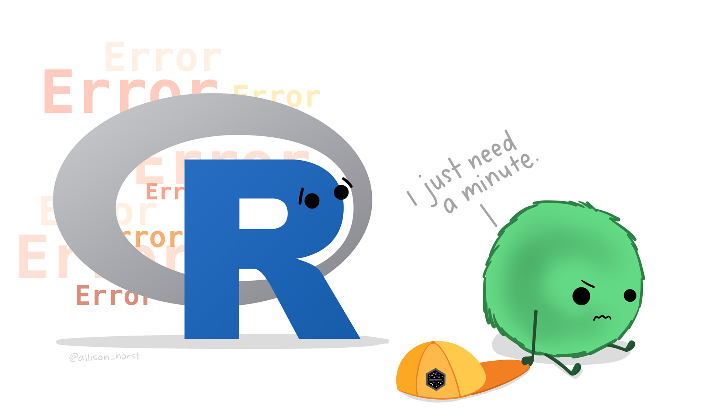

```{r, echo = FALSE, message = FALSE, results='hide'}
library(knitr)
opts_chunk$set(comment = "")
library(readr)
suppressPackageStartupMessages(library(dplyr))
library(tidyverse)
install.packages("emoji", repos='http://cran.us.r-project.org')
library(emoji)
```


## Recap on summarization

- `summary(x)`: quantile information
- `count(x)`: what unique values do you have? 
  - `distinct()`: what are the distinct values?
  - `n_distinct()` with `pull()`: how many distinct values?
- `group_by()`: changes all subsequent functions
  - combine with `summarize()` to get statistics per group
  - combine with `mutate()` to add column
- `summarize()` with `n()` gives the count (NAs included) 

📃[Cheatsheet](https://jhudatascience.org/intro_to_r/modules/cheatsheets/Day-4.pdf)

## Recap on data classes

- There are two types of number class objects: integer and double
- Logic class objects only have `TRUE` or `FALSE` (without quotes)
- `class()` can be used to test the class of an object x
- `as.CLASS_NAME(x)` can be used to change the class of an object x
- Factors are a special character class that has levels - more on that soon!
- tibbles show column classes!
- two dimensional object classes include: data frames, tibbles, matrices, and lists
- Dates can be handled with the `lubridate` package
- Make sure you choose the right function for the way the date is formatted!

    📃[Cheatsheet](https://jhudatascience.org/intro_to_r/modules/cheatsheets/Day-4.pdf)

## Data Cleaning {.emphasized}

In general, data cleaning is a process of investigating your data for
inaccuracies, or recoding it in a way that makes it more manageable.

::: {style="color: red;"}

`r emoji("warning")` MOST IMPORTANT RULE - LOOK `r emoji("eyes")` AT YOUR DATA! `r emoji("warning")`

:::


# Dealing with Missing Data

## Missing data types

One of the most important aspects of data cleaning is missing values.

Types of "missing" data:

-   `NA` - general missing data
-   `NaN` - stands for "**N**ot **a** **N**umber", happens when you do
    0/0.
-   `Inf` and `-Inf` - Infinity, happens when you divide a positive
    number (or negative number) by 0.

## Finding Missing data {.small}

-   `is.na` - looks for `NAN` and `NA`
-   `is.infinite` - looks for Inf or -Inf

```{r, echo=FALSE}
NA_vect<- c(0,NA, -1)
NA_vect <- NA_vect/0
```

```{r}
is.na(NA_vect)
is.infinite(NA_vect)
```


## Useful checking functions

`any()` can help you check if there are any `NA` values in a vector

```{r}
NA_vect
any(is.na(NA_vect))
```


## Finding `NA` values with `count()`{.codesmall}

::: {style="color: red;"}
Check the values for your variables, are they what you expect?
:::

`count()` is a great option because it helps you check if rare values make sense.

```{r, message=FALSE}
library(tidyverse)
bike <- read_csv(file =
    "http://jhudatascience.org/intro_to_r/data/Bike_Lanes.csv")
bike %>% count(subType)
```


## `naniar`

Sometimes you need to look at lots of data though... the [`naniar`
package](https://cran.r-project.org/web/packages/naniar/vignettes/getting-started-w-naniar.html) is a good option.

```{r, error=FALSE}
#install.packages("naniar")
library(naniar)
```

```{r, fig.alt="dplyr", out.width = "60%", echo = FALSE, fig.align='center'}

```
"Artwork by @allison_horst". https://allisonhorst.com/


## naniar: `pct_complete()`{.small}

This can tell you if there are missing values in the dataset.

```{R}
pct_complete(bike)
```

Or for a particular variable:

```{R}
bike%>% select(route) %>%
pct_complete()
```

## naniar:`miss_var_summary()`

To get the percent missing (and counts) for each variable as a table, use this function.

```{r}
miss_var_summary(bike)
```

## `naniar` plots

The `gg_miss_var()` function creates a nice plot about the number of
missing values for each variable, (need a data frame). Using `show_pct = TRUE` shows the percent missing. 

```{r, fig.height=4, warning=FALSE, fig.align='center'}
gg_miss_var(bike, show_pct = TRUE)
```


## Missing Data Issues

Recall that mathematical operations with `NA` often result in `NA`s.

```{r}
sum(c(1,2,3,NA))
mean(c(1,2,3,NA))
median(c(1,2,3,NA))
```


## Missing Data Issues

This is also true for logical data. Recall that `TRUE` is evaluated as 1
and `FALSE` is evaluated as 0.

```{r}
x <- c(TRUE, TRUE, TRUE, TRUE, FALSE, NA)
sum(x)
sum(x, na.rm = TRUE)
```


## filter() and missing data

Be **careful** with missing data using subsetting!

**`filter()` removes missing values by default.** Because R can't tell
for sure if an `NA` value meets the condition. To keep them need to add
`is.na()` conditional.

Think about if this is OK or not - it depends on your data!


## filter() and missing data {.codesmall}

What if NA values represent values that are so low it is undetectable?

Filter will drop them from the data.

```{r}
bike %>% filter(subType == "STCLN")
```

## filter() and missing data 

`is.na()` can help us keep them.

```{r}
bike %>% filter(subType == "STCLN" | is.na(subType))
```

## To remove **rows** with `NA` values for a **variable** use `drop_na()`

A function from the `tidyr` package. (Need a data frame to start!)

Disclaimer: Don't do this unless you have thought about if dropping `NA` values makes sense based on knowing what these values mean in your data. **Also consider if you need those rows for values for other variables.**

```{r}
dim(bike)
bike_drop <- bike %>% drop_na(route)
dim(bike_drop)
```

## Let's take a look

Can still have NAs for other columns

```{r}
bike_drop 
```


## To remove rows with `NA` values for a **data frame** use `drop_na()`

This function of the `tidyr` package drops rows with **any** missing data in **any** column when used on a df.

```{r}
bike_drop <- bike %>% drop_na()
bike_drop
```

## Drop **columns** with any missing values

Use the `miss_var_which()` function from `naniar`

```{r}
miss_var_which(bike)# which columns have missing values
```

## Drop **columns** with any missing values {.codesmall}

`miss_var_which` and  function from `naniar` (need a data frame)

```{r}
bike_drop <- bike %>% select(!miss_var_which(bike))
bike_drop
```


## Change a value to be `NA`{.codesmall}

Let's say we think that all 0 values should be `NA`.

```{r}
count(bike, dateInstalled)
```

## Change a value to be `NA`{.codesmall}

The `na_if()` function of `dplyr` can be helpful for changing all 0 values to `NA`.

```{r}
bike <- bike %>% 
  mutate(dateInstalled = na_if(dateInstalled, 0))
count(bike, dateInstalled)
```


## Change `NA` to be a value {.codesmall}

The `replace_na()` function (part of the `tidyr` package), can do the opposite of `na_if()`.
 (note that you must use numeric values as replacement - we will show how to replace with character strings soon)
```{r}
bike %>% 
  mutate(dateInstalled = replace_na(dateInstalled, 2005)) %>% 
  count(dateInstalled)
```


## Think about `NA`

::: {style="color: red;"}
 THINK ABOUT YOUR DATA FIRST! 
::: 


`r emoji("warning")` Sometimes removing `NA` values leads to distorted math - be careful!

`r emoji("warning")` Think about what your `NA` means for your data (are you sure ?).

- Is an `NA` for values so low they could not be reported? 

- Or is it if it was too low and also if there was a different issue (like no one reported)?

## Think about `NA`

If it is something more like a zero then you might want it included in
your data like a zero instead of an `NA`.

Example: - survey reports `NA` if student has never tried cigarettes -
survey reports 0 if student has tried cigarettes but did not smoke that
week


`r emoji("warning")` You might want to keep the `NA` values so that you know the original sample size. 


## Word of caution {.codesmall}


`r emoji("warning")` Calculating percentages will give you a different result depending on your choice to include NA values.!

This is because the denominator changes.


## Word of caution - Percentages with `NA`


```{r}
count(bike, dateInstalled) %>% mutate(percent = (n/(sum(n)) *100))
```

## Word of caution - Percentages with `NA`

```{r}
bike %>% drop_na(dateInstalled) %>% 
  count(dateInstalled) %>% mutate(percent = (n/(sum(n)) *100))
```

Should you be dividing by the total count with `NA` values included?   
It depends on your data and what `NA` might mean.   
Pay attention to your data and your `NA` values!

## Don't forget about the common issues

- Extra or Missing commas  
- Extra or Missing parentheses   
- Case sensitivity  
- Spelling  

```{r, fig.alt="", out.width = "50%", echo = FALSE, out.extra='style="float:left"'}

```

## GUT CHECK: What function can be used to remove NA values from a full dataframe or for an individual column?

A. `drop_nulls()`

B. `drop_na()`

C. `rem_na()`

## GUT CHECK: How can you keep NA values when using `filter`?

A. include `| is.na()` 

B. include `& is.na()`

## Summary

-   `is.na()`,`any(is.na())`, `count()`, and functions from `naniar` like `gg_miss_var()` and `miss_var_summary` can help determine if we have `NA` values
-   `miss_var_which()` can help you drop columns that have any missing values.
-   `filter()` automatically removes `NA` values - can't confirm or deny
    if condition is met (need `| is.na()` to keep them)
-   `drop_na()` can help you remove `NA` values from a variable or an
    entire data frame
-   `NA` values can change your calculation results
-   think about what `NA` values represent - don't drop them if you shouldn't
-   `na_if()` will make `NA` values for a particular value
-   `replace_na()` will replace `NA` values with a particular value

## Lab Part 1

🏠 [Class Website](https://jhudatascience.org/intro_to_r/)  

💻[Lab](https://jhudatascience.org/intro_to_r/modules/Data_Cleaning/lab/Data_Cleaning_Lab.Rmd)

📃 [Day 5 Cheatsheet](https://jhudatascience.org/intro_to_r/modules/cheatsheets/Day-5.pdf)


# Recoding Variables

## Example of Recoding

```{r}
set.seed(124)
data_ginger_mint <- tibble(Group = rep(c("A", "B", "B"),
                               times = 4), 
                      Treatment = c("Ginger", 
                                  "Ginger",
                                  "Other",
                                  "peppermint", 
                                  "peppermint",
                                  "Ginger", 
                                  "Mint",
                                  "O", 
                                  "Ginger",
                                  "mint",
                                  "Mint",
                                  "O"), 
                    Measurement_start = sample(70:250, size = 12),
                    Measurement_change = sample(-20:40, size = 12))

```


```{r, include = FALSE, echo = FALSE}
#writexl::write_xlsx(data_ginger_mint, here::here("data", "cleaning_data.xlsx"))
```
## Reading in the data if it were an excel sheet
Data is also here: 

http://jhudatascience.org/intro_to_r/data/cleaning_data.xlsx

```{r, eval = FALSE}
library(readxl)
data_ginger_mint<- read_excel(here::here("data", "cleaning_data.xlsx"))
```

## Say we have some data about samples in a study:

```{r}
data_ginger_mint
```

## Oh dear...

This needs lots of recoding.

```{r}
data_ginger_mint %>%
  count(Treatment)
```

## `dplyr` can help!{.codesmall}

Using Excel to find all of the different ways `Treatment` has been coded,
could be hectic! In `dplyr` you can use the `case_when` function.


## Or you can use `case_when()`

The `case_when()` function of `dplyr` can help us to do this as well.

It is more flexible and powerful. 

::: {style="color: red;"}
(need `mutate` here too!)
:::

## Or you can use `case_when()`{.codesmall}

::: {style="color: red;"}
Need quotes for conditions and new values!
:::

```{r}
data_ginger_mint %>% 
  mutate(Treatment_recoded = case_when(
                          Treatment == "O" ~ "Other",
                          Treatment == "Mint" ~ "Peppermint",
                          Treatment == "mint" ~ "Peppermint",
                          Treatment == "peppermint" ~ "Peppermint"))  %>% 
  count(Treatment, Treatment_recoded)

```

## What happened?{.codesmall}

We seem to have `NA` values!

We didn't specify what happens to values that were already `Other` or `Ginger`.

```{r, eval = FALSE}
data_ginger_mint %>% 
  mutate(Treatment = case_when(
                               Treatment == "O" ~ "Other",
                               Treatment == "Mint" ~ "Peppermint",
                               Treatment == "mint" ~ "Peppermint",
                               Treatment == "peppermint" ~ "Peppermint")) 
```


## `case_when()` drops unspecified values

Note that automatically values not reassigned explicitly by
`case_when()` will be `NA` unless otherwise specified. 

::: codeexample
```{r, eval = FALSE}
# General Format - this is not code!
{data_input} %>%
  mutate({variable_to_fix} = case_when({Variable_fixing}   
             /some condition/ ~ {value_for_con},
                          .default = {value_for_not_meeting_condition})

```
:::

{value_for_not_meeting_condition} could be something new 
or it can be the original values of the column

## case_when with .default = original variable name

```{r}
data_ginger_mint %>% 
  mutate(Treatment_recoded = case_when(
                               Treatment == "O" ~ "Other",
                               Treatment == "Mint" ~ "Peppermint",
                               Treatment == "mint" ~ "Peppermint",
                               Treatment == "peppermint" ~ "Peppermint",
                                .default = Treatment)) %>%
  count(Treatment, Treatment_recoded)
```

## Typically it is good practice to include the TRUE statement

You never know if you might be missing something - and if a value already was an NA it will stay that way. 

```{r, eval = FALSE}
data_ginger_mint %>% 
  mutate(Treatment_recoded = case_when(
                               Treatment == "O" ~ "Other",
                               Treatment == "Mint" ~ "Peppermint",
                               Treatment == "mint" ~ "Peppermint",
                               Treatment == "peppermint" ~ "Peppermint",
                               .default =  Treatment)) %>%
  count(Treatment, Treatment_recoded)
```


## case_when() can also overwrite/update a variable

You need to specify what we want in the first part of `mutate`.

```{r}
data_ginger_mint %>% 
  mutate(Treatment = case_when(
                          Treatment == "Mint" ~ "Peppermint",
                          Treatment == "mint" ~ "Peppermint",
                          Treatment == "peppermint" ~ "Peppermint",
                          .default = Treatment)) %>%
  count(Treatment)

```

## More complicated case_when()

`case_when` can do complicated statements and can match many patterns at a time.

```{r}
data_ginger_mint %>% 
  mutate(Treatment_recoded = case_when(
    Treatment %in% 
c("Mint", "mint", "Peppermint", "peppermint") ~ "Peppermint",
    Treatment %in% c("O", "Other") ~ "Other",
   .default = Treatment)) %>%

  count(Treatment, Treatment_recoded)

```

## But maybe we want NA?

Perhaps we want values that are O or Other to actually be NA, then `case_when` can be helpful for this. We could specify everything else and drop `.default = Treatment` or we could specify NA directly with `NA_character_`

```{r}
data_ginger_mint %>% 
  mutate(Treatment_recoded = case_when(
    Treatment %in% 
c("Mint", "mint", "Peppermint", "peppermint") ~ "Peppermint",
    Treatment %in% c("O", "Other") ~ NA_character_,
 .default = Treatment)) %>%

  count(Treatment, Treatment_recoded)
```

## Another reason for `case_when()`

`case_when` can do very sophisticated comparisons!

Here we create a new variable called `Effect`.

```{r}

data_ginger_mint <- data_ginger_mint  %>% 
      mutate(Effect = case_when(Measurement_change > 0 ~ "Increase",
                                Measurement_change == 0 ~ "Same",
                                Measurement_change < 0 ~ "Decrease"))

head(data_ginger_mint)

```

## Now it is easier to see what is happening

```{r}
data_ginger_mint %>% 
  count(Group, Effect)
```

## GUT CHECK: If we want all unspecified values to remain the same with `case_when()`, how should we complete the `.default =` statement?

A. With the name of the variable we are modifying or using as source

B. With the word "same"


## Other Functions/Arguments you might see

`.default = ` used to be `TRUE ~`

```{r}
data_ginger_mint %>% 
  mutate(Treatment_recoded = case_when(
    Treatment %in% 
     c("Mint", "mint", "Peppermint", "peppermint") ~ "Peppermint",
    Treatment %in% c("O", "Other") ~ NA_character_,
 TRUE ~ Treatment)) %>%
```

# Working with strings

## Strings in R

-   R can do much more than find exact matches for a whole string!

```{r, echo = FALSE, out.width="30%", fig.align = "center"}
include_graphics("https://swag.rstudio.com/uploads/1/3/1/3/131335021/s815253891256106552_p45_i1_w935.png")
```

## The `stringr` package

The `stringr` package:

-   Modifying or finding **part** or all of a character string
-   We will not cover `grep` or `gsub` - base R functions
    -   are used on forums for answers
-   Almost all functions start with `str_*`

## `stringr`

`str_detect`, and `str_replace` search for matches to argument pattern
within each element of a **character vector** (not data frame or tibble!).

-   `str_detect` - returns `TRUE` if `pattern` is found
-   `str_replace` - replaces `pattern` with `replacement`


## `str_detect()`

The `string` argument specifies what to check    
The `pattern` argument specifies what to check for (case sensitive)  

```{r}

Effect <- pull(data_ginger_mint) %>% head(n = 6)
Effect
str_detect(string = Effect, pattern = "d")
str_detect(string = Effect, pattern = "D")
```

## `str_replace()`

The `string` argument specifies what to check    
The `pattern` argument specifies what to check for    
The `replacement` argument specifies what to replace the pattern with    
```{r}
str_replace(string = Effect, pattern = "D", replacement = "d")
```

## `st_replace()` only replaces the first instance of the pattern in each value 

`str_replace_all()` can be used to replace all instances within each value

```{r}
str_replace(string = Effect, pattern = "e", replacement = "E")
```

```{r}
str_replace_all(string = Effect, pattern = "e", replacement = "E")

```


## Subsetting part of a string

`str_sub()` allows you to subset part of a string   
The `string` argument specifies what strings to work with     
The `start` argument specifies position of where to start    
The `end` argument specifies position of where to end    

```{r}
str_sub(string = Effect, start = 1, end = 3)
```

## `filter` and `stringr` functions

```{r}
head(data_ginger_mint, n = 4)
data_ginger_mint %>% 
  filter(str_detect(string = Treatment,
                    pattern = "int"))
```

## OK back to our original problem
```{r}
count(data_ginger_mint, Treatment)
```

## `case_when()` made an improvement

But we still might miss a strange value

```{r, eval = FALSE}
data_ginger_mint %>% 
  mutate(Treatment_recoded = case_when(
    Treatment %in% c("G", "g", "Ginger", "ginger") ~ "Ginger",
    Treatment %in% 
     c("Mint", "mint", "Peppermint", "peppermint") ~ "Peppermint",
    Treatment %in% c("O", "Other") ~ "Other",
    .default = Treatment))
```

## `case_when()` improved with `stringr`


```{r}
data_ginger_mint %>% 
  mutate(Treatment_recoded = case_when(
    str_detect(string = Treatment, pattern = "int") ~ "Peppermint",
    str_detect(string = Treatment, pattern = "o|O") ~ "Other",
    .default = Treatment)) %>%
  count(Treatment, Treatment_recoded)
```

This is a more robust solution! It will catch typos as long as the first letter is correct or there is part of the word mint.

## That's better!

```{r, echo = FALSE, fig.align='center', out.width= "30%"}
knitr::include_graphics("https://media1.giphy.com/media/S9ZK4mmi3u3jdc5dek/200w.webp?cid=ecf05e47h7myga959jwvek6s9x1tkog135g7pxu8vvjz2yqb&rid=200w.webp&ct=g")
```


## GUT CHECK: What `stringr` function helps us find a string pattern?

A. `str_replace()`

B. `str_find()`

C. `str_detect()`

## Things you might see

`^` indicates the beginning of a character string (placed before)
`$` indicates the end (placed after)

```{r}
data_ginger_mint %>% 
  mutate(Treatment_recoded = case_when(
    str_detect(string = Treatment, pattern = "t$") ~ "Peppermint",
    .default = Treatment)) %>%
  count(Treatment, Treatment_recoded)

data_ginger_mint %>% 
  mutate(Treatment_recoded = case_when(
 str_detect(string = Treatment, pattern = "^m") ~ "Mint Tea",
    .default = Treatment)) %>%
  count(Treatment, Treatment_recoded)

```

# Separating and uniting data

## Uniting columns 

The `unite()` function can help combine columns  
The `col` argument specifies new column name    
The `sep` argument specifies what separator to use when combining -default is "_"
The `remove` argument specifies if you want to drop the old columns

```{r}
data_comb <- data_ginger_mint %>% 
  unite(Group, Effect, col = "change", remove = TRUE)
```

```{r}
data_comb
```


# General Format - this is not code!
{data_input} %>%
  mutate({variable_to_fix_or_new} = recode({Variable_fixing}, {old_value} = {new_value},
                                       {another_old_value} = {new_value}))

```
:::

## recode() function

::: {style="color: red;"}
Need quotes for new values! Tolerates quotes for old values.
:::

```{r, eval = FALSE}

data_ginger_mint %>% 
  mutate(Treatment_recoded = recode(Treatment,  
                                       O = "Other",
                                    Mint = "Peppermint",
                                    mint = "Peppermint",
                              peppermint = "Peppermint")) %>%
  count(Treatment, Treatment_recoded)
```

## `recode()`

```{r, eval = TRUE}

data_ginger_mint %>% 
  mutate(Treatment_recoded = recode(Treatment,
                                       O = "Other",
                                    Mint = "Peppermint",
                                    mint = "Peppermint",
                              peppermint = "Peppermint")) %>%
  count(Treatment, Treatment_recoded)
```

## Can update or overwrite variables with recode too!

Just use the same variable name to change the variable within mutate.

```{r, eval = TRUE}

data_ginger_mint %>% 
  mutate(Treatment= recode(Treatment,
                                       O = "Other",
                                    Mint = "Peppermint",
                                    mint = "Peppermint",
                              peppermint = "Peppermint")) %>%
  count(Treatment)
```


## String Splitting

-   `str_split(string, pattern)` - splits strings up - returns list!

```{r str_split_orig}
x <- c("I really like writing R code")
df <- tibble(x = c("I really", "like writing", "R code programs"))
y <- unlist(str_split(x, " "))
y
length(y)
```

## A bit on Regular Expressions

-   <http://www.regular-expressions.info/reference.html>
-   They can use to match a large number of strings in one statement
-   `.` matches any single character
-   `*` means repeat as many (even if 0) more times the last character
-   `?` makes the last thing optional
-   `^` matches start of vector `^a` - starts with "a"
-   `$` matches end of vector `b$` - ends with "b"

## Let's look at modifiers for `stringr`

`?modifiers`

-   `fixed` - match everything exactly
    <!-- * `regex` - default - uses **reg**ular **exp**ressions -->
-   `ignore_case` is an option to not have to use `tolower`

## Using a fixed expression

One example case is when you want to split on a period "`.`". In regular
expressions `.` means **ANY** character, so we need to specify that we
want R to interpret "." as simply a period.

```{r}
str_split("I.like.strings", ".")
str_split("I.like.strings", fixed("."))
str_split("I.like.strings", "\\.")
```


## Pasting strings with `paste` and `paste0`

Paste can be very useful for joining vectors together:

```{r Paste}
paste("Visit", 1:5, sep = "_")
paste("Visit", 1:5, sep = "_", collapse = "_")
# and paste0 can be even simpler see ?paste0 
paste0("Visit",1:5) # no space!
```


# Comparison of `stringr` to base R - not covered

# Splitting Strings

## Substringing

`stringr`

<!-- * `str_sub(x, start, end)` - substrings from position start to position end -->

-   `str_split(string, pattern)` - splits strings up - returns list!

## Splitting String:

In `stringr`, `str_split` splits a vector on a string into a `list`

```{r}
library(stringr)
x <- c("I really", "like writing", "R code programs")
y <- str_split(x, pattern =  " ") # returns a list
y
```


## 'Find' functions: stringr compared to base R

Base R does not use these functions. Here is a "translator" of the
`stringr` function to base R functions

-   `str_detect` - similar to `grepl` (return logical)
-   `grep(value = FALSE)` is similar to `which(str_detect())`
-   `str_subset` - similar to `grep(value = TRUE)` - return value of
    matched
-   `str_replace` - similar to `sub` - replace one time
-   `str_replace_all` - similar to `gsub` - replace many times

## Important Comparisons

Base R:

-   Argument order is `(pattern, x)`
-   Uses option `(fixed = TRUE)`

`stringr`

-   Argument order is `(string, pattern)` aka `(x, pattern)`
-   Uses function `fixed(pattern)`


## some data to work with

```{r readSal, echo = TRUE, eval = TRUE, message=FALSE, warning=FALSE}
Sal <- read_csv("https://jhudatascience.org/intro_to_r/data/Baltimore_City_Employee_Salaries_FY2015.csv") # or
```

## Showing difference in `str_extract`

`str_extract` extracts just the matched string

```{r}
ss <- str_extract(Sal$Name, "Rawling")
head(ss)
ss[ !is.na(ss)]
```

## Showing difference in `str_extract` and `str_extract_all`

`str_extract_all` extracts all the matched strings

```{r}
head(str_extract(Sal$AgencyID, "\\d"))
head(str_extract_all(Sal$AgencyID, "\\d"), 2)
```

## Using Regular Expressions

-   Look for any name that starts with:
    -   Payne at the beginning,
    -   Leonard and then an S
    -   Spence then capital C

```{r}
head(grep("^Payne.*", x = Sal$name, value = TRUE), 3)
```

```{r}
head(grep("Leonard.?S", x = Sal$name, value = TRUE))
head(grep("Spence.*C.*", x = Sal$name, value = TRUE))
```

## Using Regular Expressions: `stringr`

```{r}
head(str_subset( Sal$name, "^Payne.*"), 3)
```

```{r}
head(str_subset( Sal$name, "Leonard.?S"))
head(str_subset( Sal$name, "Spence.*C.*"))
```

## Replace

Let's say we wanted to sort the data set by Annual Salary:

```{r}
class(Sal$AnnualSalary)
```

```{r}
sort(c("1", "2", "10")) #  not sort correctly (order simply ranks the data)
order(c("1", "2", "10"))
```

## Replace

So we must change the annual pay into a numeric:

```{r}
head(Sal$AnnualSalary, 4)
head(as.numeric(Sal$AnnualSalary), 4)
```

R didn't like the `$` so it thought turned them all to `NA`.

`sub()` and `gsub()` can do the replacing part in base R.

## Replacing and subbing

Now we can replace the `$` with nothing (used `fixed=TRUE` because `$`
means ending):

```{r}
Sal$AnnualSalary <- as.numeric(gsub(pattern = "$", replacement="", 
                              Sal$AnnualSalary, fixed=TRUE))
Sal <- Sal[order(Sal$AnnualSalary, decreasing=TRUE), ] 
Sal[1:5, c("name", "AnnualSalary", "JobTitle")]
```

## Replacing and subbing: `stringr`

We can do the same thing (with 2 piping operations!) in dplyr

```{r}
dplyr_sal = Sal
dplyr_sal = dplyr_sal %>% mutate( 
  AnnualSalary = AnnualSalary %>%
    str_replace(
      fixed("$"), 
      "") %>%
    as.numeric) %>%
  arrange(desc(AnnualSalary))
check_Sal = Sal
rownames(check_Sal) = NULL
all.equal(check_Sal, dplyr_sal)
```


## Creating Two-way Tables

A two-way table. If you pass in 2 vectors, `table` creates a
2-dimensional table.

```{r}
tab <- table(c(0, 1, 2, 3, 2, 3, 3, 2,2, 3),
             c(0, 1, 2, 3, 2, 3, 3, 4, 4, 3),
              useNA = "always")
tab
```

## Creating Two-way Tables

```{r}
tab_df = tibble(x = c(0, 1, 2, 3, 2, 3, 3, 2,2, 3),
             y = c(0, 1, 2, 3, 2, 3, 3, 4, 4, 3))
tab_df %>% count(x, y)
```

## Creating Two-way Tables

```{r}
tab_df %>% 
  count(x, y) %>% 
  group_by(x) %>% mutate(pct_x = n / sum(n))
```

## Creating Two-way Tables

```{r, message = FALSE}
library(scales)
tab_df %>% 
  count(x, y) %>% 
  group_by(x) %>% mutate(pct_x = percent(n / sum(n)))
```


## Removing columns with threshold of percent missing values{.codesmall}

```{r}
is.na(df) %>% head(n = 3)
colMeans(is.na(df))#TRUE and FALSE treated like 0 and 1
which(colMeans(is.na(df)) < 0.2) #the location of the columns <.2
df %>% select(which(colMeans(is.na(df)) < 0.2))# remove if over 20% missing
```


