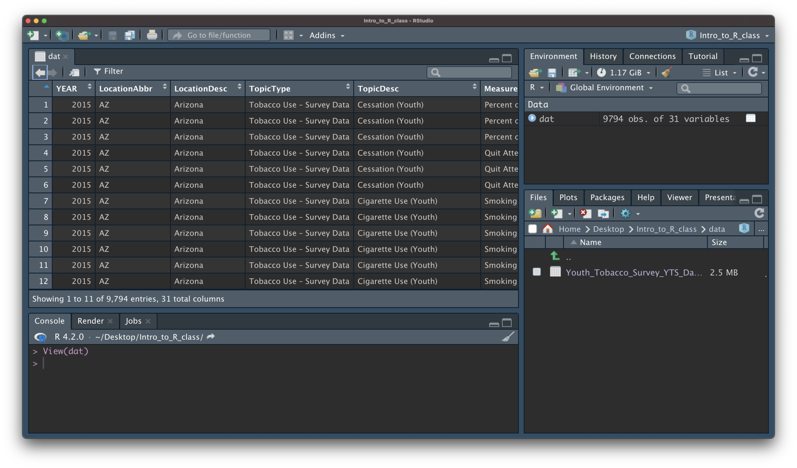
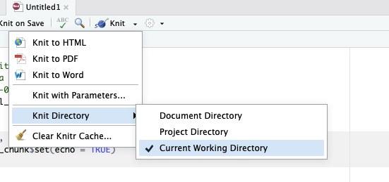

```{r, echo = FALSE}
library(knitr)
library(readr)
opts_chunk$set(comment = "")
```

<style type="text/css">
pre { /* Code block - slightly smaller in this lecture */
    font-size: 20px;
}
</style>


## R Projects

R Projects are a feature of RStudio that can help you stay organized. They are pretty straightforward to set up, but are not required. You can learn more about R Projects here:

https://jhudatascience.org/intro_to_r/resources/R_Projects.html


# Getting data into R (manual/point and click)


## Data Input

* 'Reading in' data is the first step of any real project/analysis
* R can read almost any file format, especially via add-on packages
* We are going to focus on simple delimited files first
    * comma separated (e.g. '.csv')
    * tab delimited (e.g. '.txt')
    * Microsoft Excel (e.g. '.xlsx')


## Note: data for demonstration

* We have added functionality to load some datasets directly in the `jhur` package


## Data Input

Youth Tobacco Survey (YTS) dataset:

"The YTS was developed to provide states with comprehensive data on both middle school and high school students regarding tobacco use, exposure to environmental tobacco smoke, smoking cessation, school curriculum, minors' ability to purchase or otherwise obtain tobacco products, knowledge and attitudes about tobacco, and familiarity with pro-tobacco and anti-tobacco media messages."

* Check out the data at: https://catalog.data.gov/dataset/youth-tobacco-survey-yts-data


## Import Dataset

-  `>` File
-  `>` Import Dataset
-  `>` From Text (`readr`)
-  `>` paste the url (http://jhudatascience.org/intro_to_r/data/Youth_Tobacco_Survey_YTS_Data.csv)
-  `>` click "Update" and "Import"


## What Just Happened?

You see a preview of the data on the top left pane.

```{r, fig.alt="The image shows the data in preview form. It is organized like a spreadsheet one might see in Excel.", out.width = "80%", echo = FALSE, align = "center"}
knitr::include_graphics("images/Data_Input_data_imported.png")
```


## What Just Happened?

You see a new object called `Youth_Tobacco_Survey_YTS_Data` in your environment pane (top right). The table button opens the data for you to view.

```{r, fig.alt="The image shows the data in preview form. It is organized like a spreadsheet one might see in Excel.", out.width = "80%", echo = FALSE, align = "center"}
knitr::include_graphics("images/Data_Input_data_imported.png")
```


## What Just Happened?

R ran some code in the console (bottom left).

```{r, fig.alt="The image highlights the code that was ran int the console to import the data.", out.width = "80%", echo = FALSE, align = "center"}
knitr::include_graphics("images/Data_Input_code_ran.png")
```


## Browsing for Data on Your Machine

```{r, fig.alt="The image highlights the Browse button that can be used for importing data from your machine.", out.width = "80%", echo = FALSE, align = "center"}
knitr::include_graphics("images/Data_Input_browse.png")
```


## Import Dataset

```{r, fig.alt="Gif showing the process of importing a dataset via readr.", out.width = "100%", echo = FALSE, align = "center"}
knitr::include_graphics("images/Data_Input_import_dataset.gif")
```


## Manual Import: Pros and Cons

Pros: easy!!

Cons: obscures some of what's happening, others will have difficulty running your code


# Getting data into R (directly)


## Data Input: Read in Directly 

```{r message = FALSE}
# load library `readr` that contains function `read_csv`
library(readr)
dat <- read_csv(
  file = "http://jhudatascience.org/intro_to_r/data/Youth_Tobacco_Survey_YTS_Data.csv"
)

# `head` displays first few rows of a data frame. `tail()` works the same way.
head(dat, n = 5)
```


## Data Input: Declaring Arguments

```{r message = FALSE}
dat <- read_csv(
  file = "http://jhudatascience.org/intro_to_r/data/Youth_Tobacco_Survey_YTS_Data.csv"
)
# EQUIVALENT TO
dat <- read_csv(
  "http://jhudatascience.org/intro_to_r/data/Youth_Tobacco_Survey_YTS_Data.csv"
)
```


## Data Input: Read in Directly 

`read_csv()` needs an argument `file =`.

-  `file` is the path to your file, **in quotation marks**
-  can be path to a file on a website (URL)
-  can be **path** in your local computer -- absolute file path or relative file path 

```{r, eval = FALSE}
# Examples

dat <- read_csv(file = "www.someurl.com/table1.csv")

dat <- read_csv(file = "/Users/avahoffman/Downloads/Youth_Tobacco_Survey_YTS_Data.csv")

dat <- read_csv(file = "Youth_Tobacco_Survey_YTS_Data.csv")
```


## Data Input: File paths

What is a file path ????

```{r, fig.alt="GIF with text. PC: *autosaves file* Me: Cool, so where did the file save? PC: shows image of Power Rangers shrugging.", out.width = "40%", echo = FALSE, align = "center"}
knitr::include_graphics("images/Data_Input_where_are_the_files.gif")
```


## The working directory

When we work in R, we automatically have a **working directory**.

Working directory is a folder (directory) that RStudio assumes "you are working in". 

It's where R looks for files.

```{r, fig.alt="The files are in the computer text overlaid on still shot of the movie Zoolander.", out.width = "30%", echo = FALSE, align = "center"}
knitr::include_graphics("images/files.jpg")
```


## Getting the working directory

Run the `getwd()` function to determine your working directory.

```{r eval=FALSE}
# Get the working directory
getwd()
```


## Relative path

Let's say my data is in a folder called "data" in my working directory. 

`data/my_data.csv` would be the **relative path**. It's relative to the working directory.

The whole address, for example `/Users/avahoffman/Downloads/data/my_data.csv` is the **absolute path**.


## Setting the working directory

You can set the working directory manually with the `setwd()` function:

```{r eval=FALSE}
# set the working directory
setwd("/Users/avahoffman/Desktop")
```


# Now what? Checking data & Other formats


## Data Input: Checking the data

- the `View()` function shows your data in a new tab, in spreadsheet format
- be careful if your data is big!

```{r eval = FALSE}
View(dat)
```

```{r, fig.alt="Screenshot of the RStudio console. 'View(dat)' has been typed and the data appears in table format.", out.width = "80%", echo = FALSE, align = "center"}

```


## Data Input: Other delimiters with `read_delim()`

`read_csv()` is a special case of `read_delim()` -- a general function to read a delimited file into a data frame  

`read_delim()` needs path to your file and **file's delimiter**, will return a tibble

-  `file` is the path to your file, in quotes 
-  `delim` is what separates the fields within a record 

```{r, eval = FALSE}
## Examples
dat <- read_delim(file = "www.someurl.com/table1.tsv", delim = "\t")

dat <- read_delim(file = "data.txt", delim = "|")
```


## Data Input: Excel files

- You **cannot** read in an excel file from a URL.
- Need to load the `readxl` package with `library()`.
- The argument is `path` (not `file`).

```{r, eval=FALSE}
library(readxl)

read_excel(path = "asthma.xlsx")
```


## Data input: other file types

* `haven` package has functions to read SAS, SPSS, Stata formats

* There are also resources for REDCap : [`REDCapR`](https://cran.r-project.org/web/packages/REDCapR/vignettes/BasicREDCapROperations.html)


## WARNING! `read.csv` is * base R *

There are also data importing functions provided in base R (rather than the `readr` package), like `read.delim()` and `read.csv()`. 

These functions have slightly different syntax for reading in data (e.g. `header` argument). 

However, while many online resources use the base R tools, the latest version of RStudio switched to use these new `readr` data import tools, so we will use them in the class for slides. They are also up to two times faster for reading in large datasets, and have a progress bar which is nice. 


## TROUBLESHOOTING: Setting the working directory

If you are trying to knit your work, it might help to set the knit directory to the "Current Working Directory":

```{r, fig.alt="Screenshot of the Knit menu, with Knit directory open, and Current Working Directory selected.", out.width = "60%", echo = FALSE, align = "center"}

```


## Other Useful Functions

- The `str()` function can tell you about data/objects. 
- We will also discuss the `glimpse()` function later, which does something very similar.
- `head()` shows first few rows
- `tail()` shows the last few rows


## Summary

**R Projects** can make it easier to find files. Check out [this resource](https://jhudatascience.org/intro_to_r/resources/R_Projects.html).

Importing data manually:

-  File `>` Import Dataset `>` From Text (`readr`)
-  Paste the url (http://jhudatascience.org/intro_to_r/data/Youth_Tobacco_Survey_YTS_Data.csv)
-  Click "Update" and "Import"
-  Review the process: [`https://youtu.be/LEkNfJgpunQ`](https://youtu.be/LEkNfJgpunQ)

Importing data programmatically:

- `read_csv()` function from `readr` package
- Use `getwd()` to check your working directory, where R looks for your data files


## Summary - Part 2

Look at your data!

- Check the environment for a data object
- `View()` gives you a preview of the data in a new tab

Other file types

- `readr` package: `read_delim()` for general delimited files 
- `readxl` package: `read_excel()` for Excel files

Don't forget to use `<-` to assign your data to an object!


## Lab

🏠 [Class Website](https://jhudatascience.org/intro_to_r/)

💻 [Data Input Lab](https://jhudatascience.org/intro_to_r/modules/Data_Input/lab/Data_Input_Lab.Rmd)


```{r, fig.alt="The End", out.width = "50%", echo = FALSE, fig.align='center'}
knitr::include_graphics(here::here("images/the-end-g23b994289_1280.jpg"))
```

Image by <a href="https://pixabay.com/users/geralt-9301/?utm_source=link-attribution&amp;utm_medium=referral&amp;utm_campaign=image&amp;utm_content=812226">Gerd Altmann</a> from <a href="https://pixabay.com//?utm_source=link-attribution&amp;utm_medium=referral&amp;utm_campaign=image&amp;utm_content=812226">Pixabay</a>
