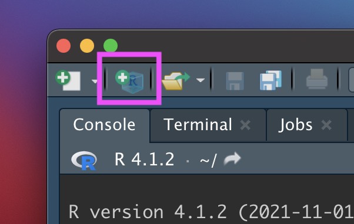
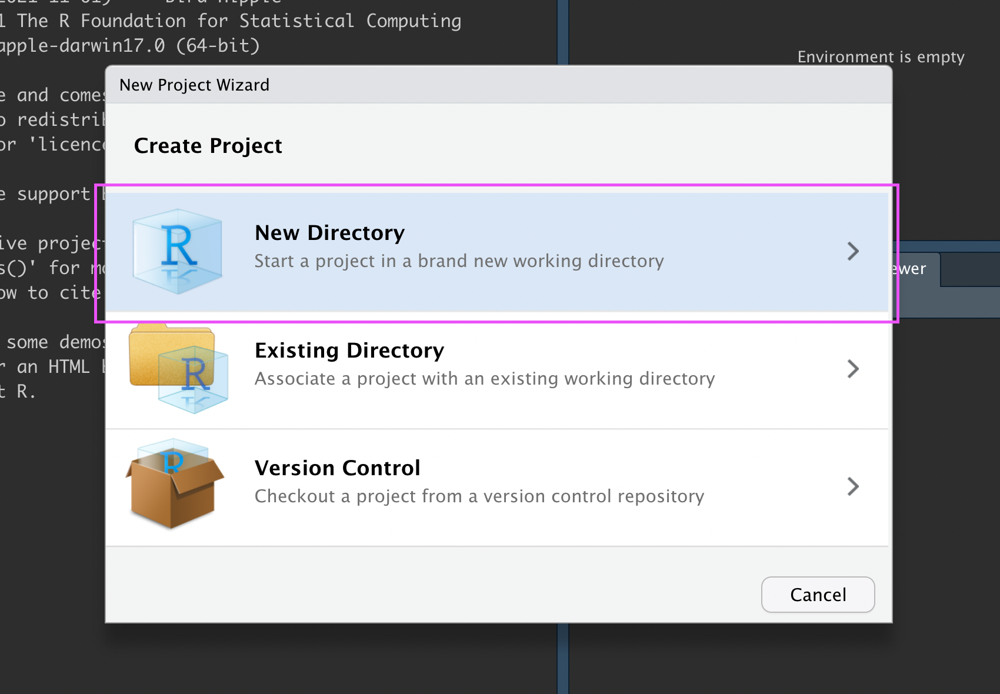
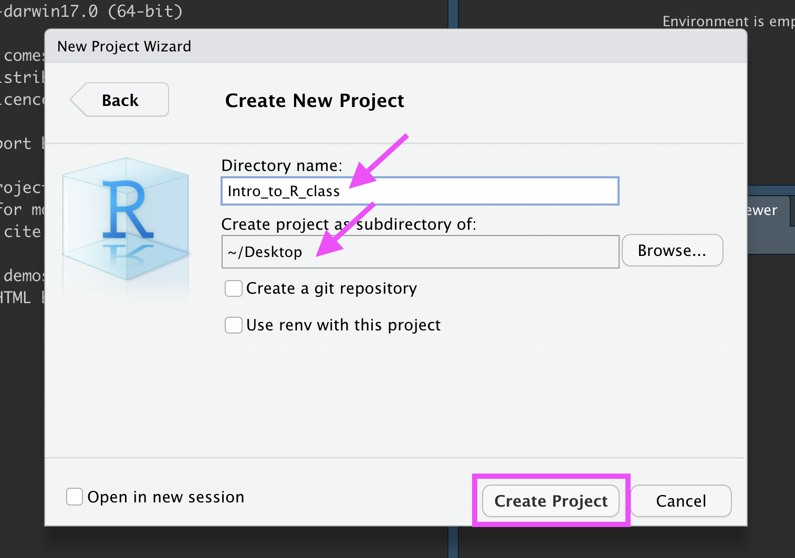
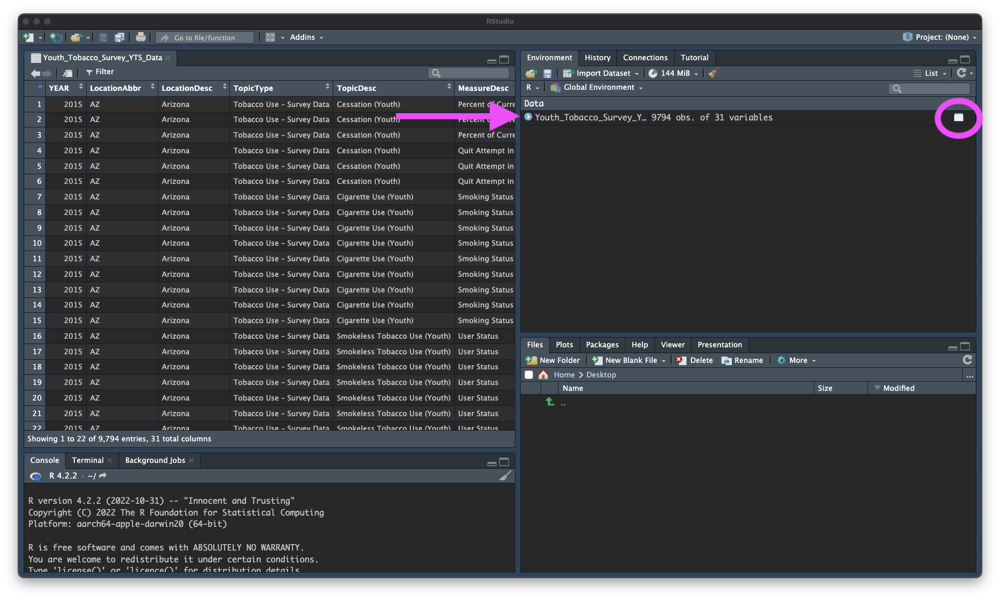
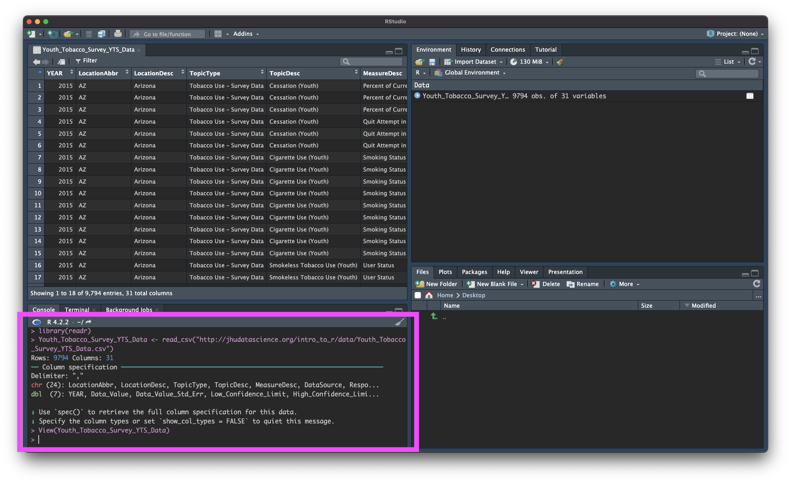
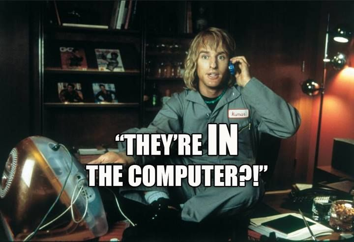
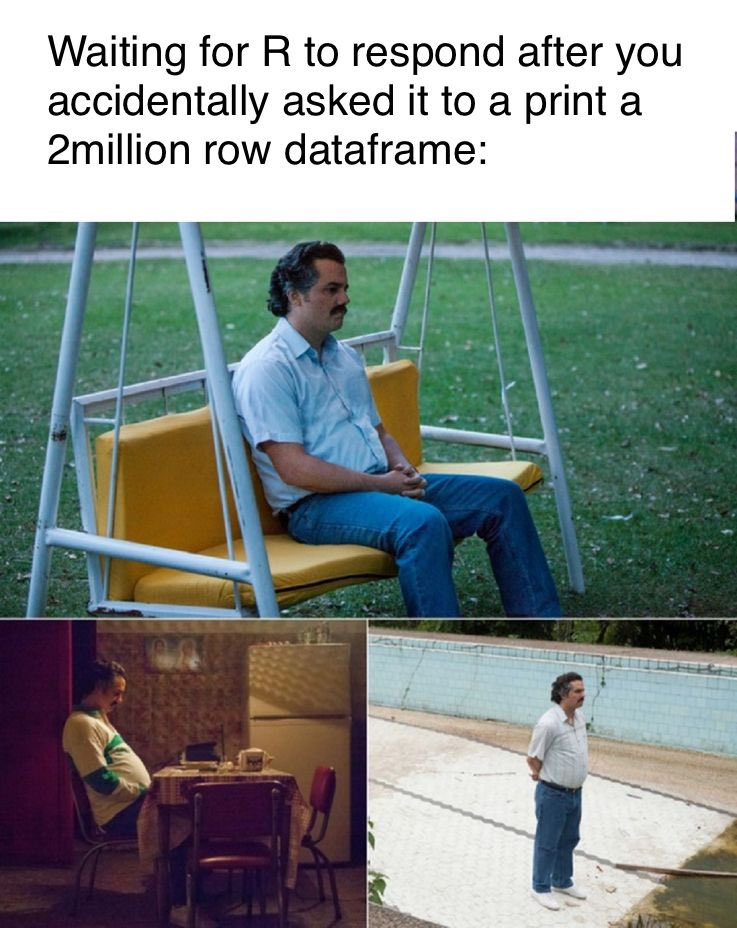

```{r, echo = FALSE}
library(knitr)
library(readr)
opts_chunk$set(comment = "")
```

<style type="text/css">
pre { /* Code block - slightly smaller in this lecture */
    font-size: 20px;
}
</style>

## Quick reminder - Getting files from downloads

This course will involve moving files around on your computer and downloading files.

If you are new to this - check out the videos on the resource page of the website.

# R Projects

## R Projects

R Projects are a super helpful feature of RStudio. They help you:

- **Stay organized.** R Projects help in organizing your work into self-contained directories (folders), where all related scripts, data, and outputs are stored together. This organization simplifies file management and makes it easier to locate and manage files associated with your analysis or project.

- **Find the right files.** When you open an R Project, RStudio automatically sets the working directory to the project's directory. This is where RStudio "looks" for files. Because it's always the Project folder, it can help avoid common issues with file paths.

- **Be more reproducible.** You can share the entire project directory with others, and they can replicate your environment and analysis without much hassle.

## Why projects?

"The chance of the `setwd()` command having the desired effect – making the file paths work – for anyone besides its author is 0%. It’s also unlikely to work for the author one or two years or computers from now. The project is not self-contained and portable."

- [Jenny Bryan](https://www.tidyverse.org/blog/2017/12/workflow-vs-script/)

**Let's go over how to create and use an R Project!**

## New R Project

Let's make an R Project so we can stay organized in the next steps. Click the new R Project button at the top left of RStudio:

```{r, fig.alt="The New R Project button is highlighted.", out.width = "40%", echo = FALSE, align = "center"}

```

## New R Project

In the New Project Wizard, click "New Directory":

```{r, fig.alt="In the New Project Wizard, the 'New Directory' option is highlighted.", out.width = "60%", echo = FALSE, align = "center"}

```

## New R Project

Click "New Project":

```{r, fig.alt="In the New Project Wizard, the 'New Project' option is highlighted.", out.width = "60%", echo = FALSE, align = "center"}
knitr::include_graphics("images/Data_Input_new_project.png")
```

## New R Project

Type in a name for your new folder.

Store it somewhere easy to find, such as your Desktop:

```{r, fig.alt="In the New Project Wizard, the new project has been given a name and is going to be stored in the Desktop directory. The 'Create Project' button is highlighted.", out.width = "60%", echo = FALSE, align = "center"}

```

## New R Project

You now have a new R Project folder on your Desktop! 

Make sure you add any scripts or data files to this folder as you go through your Intro to R lessons, or work on a new project. This will make sure R is able to "find" your files.

```{r, fig.alt="The image shows an image of an arrow pointing to the newly created R project repository.", out.width = "60%", echo = FALSE, align = "center"}
knitr::include_graphics("images/Data_Input_new_desktop.png")
```

## See and change projects

You can see what project you have open in the top right corner.

```{r, fig.alt="The image shows an image of an arrow pointing to the newly created R project in RStudio.", out.width = "80%", echo = FALSE, align = "right"}
knitr::include_graphics("images/Data_Input_Rproj_file.png")
```

# Getting data into R (manual/point and click)

## Data Input

* 'Reading in' data is the first step of any real project/analysis
* R can read almost any file format, especially via add-on packages
* We are going to focus on simple delimited files first
    * comma separated (e.g. '.csv')
    * tab delimited (e.g. '.txt')
    
<br>
<br>
**delimiters** are symbols that separate cells in a simple-text file.

## Data Input

Youth Tobacco Survey (YTS) dataset:

"The YTS was developed to provide states with comprehensive data on both middle school and high school students regarding tobacco use, exposure to environmental tobacco smoke, smoking cessation, school curriculum, minors' ability to purchase or otherwise obtain tobacco products, knowledge and attitudes about tobacco, and familiarity with pro-tobacco and anti-tobacco media messages."

* Check out info about the data at:
https://www.cdc.gov/tobacco/about-data/surveys/national-youth-tobacco-survey.html


## Import Dataset (URL)

-  `>` File
-  `>` Import Dataset
-  `>` From Text (`readr`)
-  `>` paste the url (http://jhudatascience.org/intro_to_r/data/Youth_Tobacco_Survey_YTS_Data.csv)
-  `>` click "Update" and "Import"

*Saves data in memory, not to hard drive*

## What Just Happened?

You see a preview of the data on the top left pane.

```{r, fig.alt="The image shows the data in preview form. It is organized like a spreadsheet one might see in Excel.", out.width = "80%", echo = FALSE, align = "center"}
knitr::include_graphics("images/Data_Input_data_imported.png")
```

## What Just Happened?

You see a new object called `Youth_Tobacco_Survey_YTS_Data` in your environment pane (top right). The table button opens the data for you to view.

```{r, fig.alt="The image shows the data in preview form. It is organized like a spreadsheet one might see in Excel.", out.width = "80%", echo = FALSE, align = "center"}

```

## What Just Happened?

R ran some code in the console (bottom left).

```{r, fig.alt="The image highlights the code that was ran int the console to import the data.", out.width = "80%", echo = FALSE, align = "center"}

```

## Import Dataset

```{r, fig.alt="Gif showing the process of importing a dataset via readr.", out.width = "100%", echo = FALSE, align = "center"}
knitr::include_graphics("images/Data_Input_import_dataset.gif")
```

## Import Dataset (file)

-  `>` *Download the data*
-  `>` *Put data in the project folder*
-  `>` File, Import Dataset, From Text (`readr`)
-  `>` browse for the file
-  `>` click "Update" and "Import"

## GUT CHECK!

How can we get data into R?

A. From a URL

B. From a file we downloaded

C. Both of these!

## Lab - Part 1

🏠 [Class Website](https://jhudatascience.org/intro_to_r)

💻 [Data Input Lab](https://jhudatascience.org/intro_to_r/modules/Data_Input/lab/Data_Input_Lab.Rmd)

## Manual Import: Pros and Cons

Pros: easy!!

Cons: obscures some of what's happening, others will have difficulty running your code

# Getting data into R (directly)

## Data Input: Read in Directly

The `tidyverse` contains a package `readr` that is handy for importing data.

```{r message = FALSE}
library(tidyverse)
dat <- read_csv(
  file = "http://jhudatascience.org/intro_to_r/data/Youth_Tobacco_Survey_YTS_Data.csv"
)

# `head` displays first few rows of a data frame. `tail()` works the same way.
head(dat, n = 5)
```

## Data Input: Declaring Arguments

```{r message = FALSE}
dat <- read_csv(
  file = "http://jhudatascience.org/intro_to_r/data/Youth_Tobacco_Survey_YTS_Data.csv"
)
# EQUIVALENT TO
dat <- read_csv(
  "http://jhudatascience.org/intro_to_r/data/Youth_Tobacco_Survey_YTS_Data.csv"
)
```

## Data Input: Read in Directly

`read_csv()` needs an argument `file =` **in quotation marks**.

-  can be path to a file on a website (URL)
-  can be **path** in your local computer -- absolute file path or relative file path

```{r, eval = FALSE}
# URL
dat <- 
  read_csv("http://jhudatascience.org/intro_to_r/data/Youth_Tobacco_Survey_YTS_Data.csv")

# In project folder
dat <- 
  read_csv("Youth_Tobacco_Survey_YTS_Data.csv")
```

## The working directory

When we work in an R Project, our project folder is our **working directory**.

Working directory is a folder (directory) that RStudio will use to find files.

```{r, fig.alt="The files are in the computer text overlaid on still shot of the movie Zoolander.", out.width = "30%", echo = FALSE, align = "center"}

```

## Checking the working directory

Run the `getwd()` function to determine your working directory.

```{r eval=FALSE}
# Get the working directory
getwd()
```

## Setting the working directory

You can set the working directory manually with the `setwd()` function. But it's easier to set up a project :)

```{r eval=FALSE}
# set the working directory
setwd("/Users/avahoffman/Desktop")
```

# Now what? Checking data & Other formats

## Data Input: Checking the data

- the `View()` function shows your data in a new tab, in spreadsheet format
- be careful if your data is big!

```{r eval = FALSE}
View(dat)
```

```{r, fig.alt="Stills of a lonely Pablo Escobar meme waiting for R to respond after printing a large dataset.", out.width = "30%", echo = FALSE, align = "center"}

```

## Data Input: Other delimiters

`read_tsv()` can read tab delimited (separated) files.

`read_delim()` can be used to specify the delimiter.

-  `file` is the path to your file, in quotes
-  `delim` is what separates the fields within a record

```{r, eval = FALSE}
## Examples
dat2 <- read_tsv(file = "table1.tsv", delim = "\t")

dat3 <- read_delim(file = "data.txt", delim = ":")
```

## Data input: other file types

* `readxl` package can read excel files

* `haven` package has functions to read SAS, SPSS, Stata formats

* There are also resources for REDCap : [`REDCapR`](https://cran.r-project.org/web/packages/REDCapR/vignettes/BasicREDCapROperations.html)

## WARNING! `read.csv` is * base R *

There are also data importing functions provided in base R (rather than the `readr` package), like `read.delim()` and `read.csv()`.

These functions have slightly different syntax for reading in data (e.g. `header` argument).

However, while many online resources use the base R tools, the latest version of RStudio switched to use these new `readr` data import tools, so we will use them in the class for slides. They are also up to two times faster for reading in large datasets, and have a progress bar which is nice.

## Other Useful Functions

- The `str()` function can tell you about data/objects.
- We will also discuss the `glimpse()` function later, which does something very similar.
- `head()` shows first few rows
- `tail()` shows the last few rows

## Summary

**R Projects** can make it easier to find files.

Importing data manually:

-  File `>` Import Dataset `>` From Text (`readr`)
-  Paste the url / browse
-  Click "Update" and "Import"
-  Review the process: [`https://youtu.be/LEkNfJgpunQ`](https://youtu.be/LEkNfJgpunQ)

Importing data programmatically:

- `read_csv()` function from tidyverse (`readr`) package
- Use `getwd()` to check your working directory, where R looks for your data files

## Summary - Part 2

Look at your data!

- Check the environment for a data object
- `View()` gives you a preview of the data in a new tab

Other file types

- `readr` package: `read_delim()` for general delimited files
-  other packages for more complicated files.

Don't forget to use `<-` to assign your data to an object!

## Lab - Part 2

🏠 [Class Website](https://jhudatascience.org/intro_to_r/)

💻 [Data Input Lab](https://jhudatascience.org/intro_to_r/modules/Data_Input/lab/Data_Input_Lab.Rmd)

📃 [Posit's Data Import Cheatsheet](https://rstudio.github.io/cheatsheets/data-import.pdf)

📃 [Day 2 Cheatsheet](https://jhudatascience.org/intro_to_r/modules/cheatsheets/Day-2.pdf)

```{r, fig.alt="The End", out.width = "50%", echo = FALSE, fig.align='center'}
knitr::include_graphics(here::here("images/the-end-g23b994289_1280.jpg"))
```

Image by <a href="https://pixabay.com/users/geralt-9301/?utm_source=link-attribution&amp;utm_medium=referral&amp;utm_campaign=image&amp;utm_content=812226">Gerd Altmann</a> from <a href="https://pixabay.com//?utm_source=link-attribution&amp;utm_medium=referral&amp;utm_campaign=image&amp;utm_content=812226">Pixabay</a>
