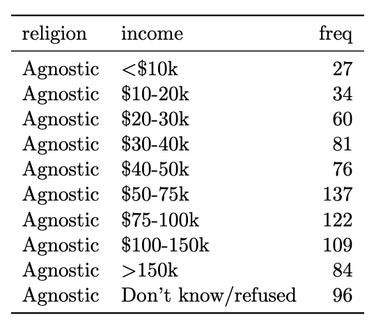
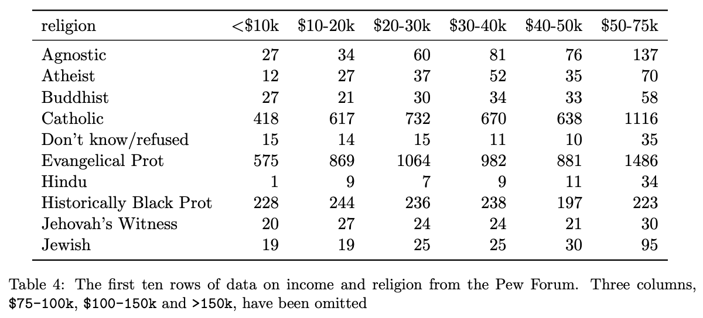

```{r knit-setup, echo=FALSE, include = FALSE}
library(knitr)
opts_chunk$set(echo = TRUE, 
               message = FALSE, 
               warning = FALSE,
               fig.height = 4,
               fig.width = 7, 
               comment = "")
library(tidyverse)
library(jhur)
```


## `esquisse` and `ggplot2`

```{r, fig.alt="esquisse", out.width = "28%", echo = FALSE, fig.show='hold',fig.align='center'}
knitr::include_graphics("https://pbs.twimg.com/media/DoaBCAwWsAEaz-y.png")
```

```{r, fig.alt="ggplot2", out.width = "19%", echo = FALSE, fig.show='hold',fig.align='center'}
knitr::include_graphics("https://d33wubrfki0l68.cloudfront.net/2c6239d311be6d037c251c71c3902792f8c4ddd2/12f67/css/images/hex/ggplot2.png")

```


## Why learn ggplot2?

More customization:

- branding
- making plots interactive
- combining plots

Easier plot automation (creating plots in scripts)

Faster (eventually)

## ggplot2

- A package for producing graphics - gg = *Grammar of Graphics*

- Created by Hadley Wickham in 2005

- Belongs to "Tidyverse" family of packages

- *"Make a ggplot"* = Make a plot with the use of ggplot2 package

Resources:

- https://ggplot2-book.org/

- https://www.opencasestudies.org/

## ggplot2

Based on the idea of:

:::{style="color: red;"}
layering
:::
plot objects are placed on top of each other with `+`

```{r, echo = FALSE}
set.seed(456)
emo::ji("graph")  
emo::ji("plus") 
emo::ji("graph")

```


## ggplot2

- Pros: extremely powerful/flexible -- allows combining multiple plot elements together, allows high customization of a look, many resources online

- Cons: ggplot2-specific "grammar of graphic" of constructing a plot

- [ggplot2 gallery](https://www.r-graph-gallery.com/ggplot2-package.html)


## Tidy data 

To make graphics using `ggplot2`, our data needs to be in a **tidy** format

**Tidy data**:

1. Each variable forms a column.
2. Each observation forms a row.

Messy data: 

* Column headers are values, not variable names.
* Multiple variables are stored in one column.
* Variables are stored in both rows and columns.

## Tidy data: example 

Each variable forms a column. Each observation forms a row.

```{r, echo = FALSE, fig.align='center'}

```


## Messy data: example 

Column headers are values, not variable names

```{r, echo = FALSE, fig.align='center', out.width="80%"}

```


Read more about tidy data and see other examples: [Tidy Data](https://vita.had.co.nz/papers/tidy-data.pdf) tutorial by Hadley Wickham

 It's also helpful to have data in long format!!!
 
 
## Making data to plot
```{r seed }
set.seed(3) 
var_1 <- seq(from = 1, to = 30)
var_2 <- rnorm(30)
my_data = tibble(var_1, var_2)
my_data
```

# First plot with `ggplot2` package 


## First layer of code with `ggplot2` package

Will set up the plot - it will be empty!

* **Aesthetic mapping** `(mapping= aes(x= , y =))` describes how variables in our data are mapped to elements of the plot 

<div class = "codeexample">
```{r, eval = FALSE, class.source = "codeexample"}
library(ggplot2) # don't forget to load ggplot2
# This is not code but shows the general format
ggplot({data_to plot},  mapping = aes(x = {var in data to plot},
                                      y = {var in data to plot}))
```
</div>

```{r, fig.width=3, fig.height=2.5, fig.align='center', class.source = "codereg"}
ggplot(my_data, mapping = aes(x = var_1, y = var_2))
```

## Next layer code with `ggplot2` package 

There are many to choose from, to list just a few:  

- `geom_point()` -- points (we have seen)
- `geom_line()` -- lines to connect observations 
- `geom_boxplot()`
- `geom_histogram()`
- `geom_bar()`
- `geom_col()`
- `geom_errorbar()`
- `geom_density()`
- `geom_tile()` -- blocks filled with color

## Next layer code with `ggplot2` package 

Need the `+` sign to add the next layer to specify the type of plot
<div class = "codeexample">
```{r, eval = FALSE, class.source = "codeexample"}

ggplot({data_to plot},  mapping = aes(x = {var in data to plot},
                                      y = {var in data to plot})) +
  geom_{type of plot}</div>
```
</div>

```{r, fig.width=4, fig.height=3, fig.align='center'}

ggplot(my_data, mapping = aes(x = var_1, y = var_2)) + 
  geom_point() 
```

Read as: *add points to the plot (use data as provided by the aesthetic mapping)*
    

## Specifying plot layers: examples{.mall}

```{r, fig.width=3, fig.height=2.5}
plt1 <- 
  ggplot(my_data, aes(x = var_1, y = var_2)) + 
  geom_point()

plt2 <- 
  ggplot(my_data, aes(x = var_1, y = var_2)) + 
  geom_line()

plt1; plt2 # to have 2 plots printed next to each other on a slide
```

Also check out the [`patchwork` package](https://patchwork.data-imaginist.com/)

<!-- ## Specifying plot layers: combining multiple layers -->

<!-- ```{r, fig.width=4, fig.height=3} -->
<!-- plt3 <-  -->
<!--   ggplot(my_data, aes(y = var_2)) +  -->
<!--   geom_boxplot() -->

<!-- plt4 <-  -->
<!--   ggplot(my_data, aes(x = var_2)) +  -->
<!--   geom_histogram() -->

<!-- ``` -->

## Specifying plot layers: combining multiple layers

Layer a plot on top of another plot with `+`

```{r, fig.width=4, fig.height=3, fig.align='center'}
ggplot(my_data, aes(x = var_1, y = var_2)) + 
  geom_point() + 
  geom_line()
```

## Customize the look of the plot

You can change look of each layer separately. 

```{r, fig.width=5, fig.height=3, fig.align='center'}
ggplot(my_data, aes(x = var_1, y = var_2)) + 
  geom_point(size = 5, color = "red", alpha = 0.5) + 
  geom_line(size = 0.8, color = "black", linetype = 2)
```

## Customize the look of the plot{.codesmall}

 You can change the look of whole plot using [`theme_*()` functions](https://ggplot2.tidyverse.org/reference/ggtheme.html). 

```{r, fig.width=5, fig.height=3, fig.align='center'}
ggplot(my_data, aes(x = var_1, y = var_2)) + 
  geom_point(size = 5, color = "red", alpha = 0.5) + 
  geom_line(size = 0.8, color = "brown", linetype = 2) + 
  theme_dark()
```

## Customize the look of the plot

You can change the look of whole plot - **specific elements, too** - like changing [font](http://www.cookbook-r.com/Graphs/Fonts/) and font size - or even more [fonts](https://blog.revolutionanalytics.com/2012/09/how-to-use-your-favorite-fonts-in-r-charts.html)

```{r, fig.width=5, fig.height=3, fig.align='center'}
ggplot(my_data, aes(x = var_1, y = var_2)) + 
  geom_point(size = 5, color = "red", alpha = 0.5) + 
  geom_line(size = 0.8, color = "brown", linetype = 2) + 
  theme_bw(base_size = 20, base_family = "Comic Sans MS")
```

## Adding labels

The `labs()` function can help you add or modify titles on your plot.

```{r, fig.width=5, fig.height=3, fig.align='center'}
ggplot(my_data, aes(x = var_1, y = var_2)) + 
  geom_point(size = 5, color = "red", alpha = 0.5) + 
  geom_line(size = 0.8, color = "brown", linetype = 2) + 
  labs(title = "My plot of var1 vs var2",
           x = "Variable 1",
           y = "Variable 2")
```

## Changing axis
`xlim()` and `ylim()` can specify the limits for each axis
```{r, fig.width=5, fig.height=3, fig.align='center'}

ggplot(my_data, aes(x = var_1, y = var_2)) + 
  geom_point(size = 5, color = "red", alpha = 0.5) + 
  geom_line(size = 0.8, color = "brown", linetype = 2) + 
  labs(title = "My plot of var1 vs var2") + 
  xlim(0,40)
  
```


## Changing axis{.small}

`scale_x_continuous()` and `scale_y_continuous()` can change how the axis is plotted. Can use the `breaks` argument to specify how you want the axis ticks to be.
```{r, fig.width=5, fig.height=3, fig.align='center'}
seq(from = 0, to = 30, by = 5)
ggplot(my_data, aes(x = var_1, y = var_2)) + 
  geom_point(size = 5, color = "red", alpha = 0.5) + 
  geom_line(size = 0.8, color = "brown", linetype = 2) + 
  scale_x_continuous(breaks = seq(from = 0, to = 30, by = 5))
```

## Lab 1

[Lab document](http://jhudatascience.org//intro_to_r/Data_Visualization/lab/Data_Visualization_Lab.Rmd)


## theme() function 

The `theme()` function can help you modify various elements of your plot.
Here we will adjust the horizontal justification (`hjust`) of the plot title.

```{r, fig.width=5, fig.height=3, fig.align='center'}
ggplot(my_data, aes(x = var_1, y = var_2)) + 
  geom_point(size = 5, color = "red", alpha = 0.5) + 
  geom_line(size = 0.8, color = "brown", linetype = 2) + 
  labs(title = "My plot of var1 vs var2") + 
  theme(plot.title = element_text(hjust = 0.5, size = 20))

```

## theme() function 

The `theme()` function always takes:

1. an object to change (use `?theme()` to see - `plot.title`, `axis.title`, `axis.ticks` etc.)
2. the aspect you are changing about this: `element_text()`, `element_line()`, `element_rect()`, `element_blank()`
3. what you are changing:
      * text: `size`, `color`, `fill`, `face`, `alpha`, `angle` 
      * position: `"top"`, `"bottom"`, `"right"`, `"left"`, `"none"`
      * rectangle: `size`, `color`, `fill`, `linetype`
      * line:  `size`, `color`, `linetype`

## theme() function

```{r, fig.width=5, fig.height=3, fig.align='center'}
ggplot(my_data, aes(x = var_1, y = var_2)) + 
  geom_point(size = 5, color = "red", alpha = 0.5) + 
  labs(title = "My plot of var1 vs var2", x = "Variable 1") +
  theme(plot.title = element_text(hjust = 0.5, size = 20),
        axis.title.x = element_text(size = 16))
```


## theme() function{.codesmall} 

```{r}
head(Orange, 3)
```

If specifying position - use: "top", "bottom", "right", "left", "none"

```{r, fig.width=3.5, fig.height=2.5, fig.align='center'}
ggplot(Orange, aes(x = Tree, y = circumference, fill = Tree)) + 
  geom_boxplot() +
  theme(legend.position = "none")
```

## Can make your own theme to use on plots!

Guide on how to: https://rpubs.com/mclaire19/ggplot2-custom-themes 


## Group and/or color by variable's values 

First, we will generate some data frame for the purpose of demonstration. 

- 2 different categories (e.g. pasta, rice)
- 4 different items (e.g. 2 of each category) 
- 10 price values changes collected over time for each item 

```{r}
# create 4 vectors: 2x character class and 2x numeric class
item_categ <- rep(c("pasta", "rice"),each = 20)
item_ID  <- rep(seq(from = 1, to = 4), each = 10)
item_ID <- paste0("ID_", item_ID)
observation_time  <- rep(seq(from = 1, to = 10), times = 4)
item_price_change <- c(sample(0.5:2.5, size = 10, replace = TRUE),
                       sample(0:1, size = 10, replace = TRUE),
                       sample(2:5, size = 10, replace = TRUE),
                       sample(6:9, size = 10, replace = TRUE))
# use 4 vectors to create data frame with 4 columns
food  <- tibble(item_ID, item_categ, observation_time, item_price_change) 
```

## Group and/or color by variable's values 

```{r}
food
```

## Starting a plot


```{r, fig.width=5, fig.height=3, fig.align='center'}

ggplot(food, aes(x = observation_time, 
                 y = item_price_change)) + 
  geom_line() 
```

## Using `group` in plots

You can use `group` element in a mapping to indicate that each `item_ID` will have a separate price line.

```{r, fig.width=5, fig.height=3, fig.align='center'}
ggplot(food, aes(x = observation_time, 
                 y = item_price_change, 
                 group = item_ID)) + 
  geom_line() 
```

## Adding color will automatically group the data

```{r, fig.width=5, fig.height=3, fig.align='center'}
ggplot(food, aes(x = observation_time, 
                 y = item_price_change,
                color = item_ID)) + 
  geom_line() 
```

## Adding color will automatically group the data

```{r, fig.width=5, fig.height=3, fig.align='center'}
ggplot(food, aes(x = observation_time, 
                 y = item_price_change,
                color = item_categ)) + 
  geom_line() 
```

## Sometimes you need group and color

```{r, fig.width=5, fig.height=3, fig.align='center'}
ggplot(food, aes(x = observation_time, 
                 y = item_price_change,
                 group = item_ID,
                color = item_categ)) + 
            geom_line() 

```

## Adding a facet can help make it easier to see what is happening

Two options:
`facet_grid()`- creates a grid shape
`facet_wrap()` -more flexible

Need to specify how you are faceting with the `~` sign.

```{r, fig.width=4, fig.height=3, fig.align='center'}
ggplot(food, aes(x = observation_time, 
                 y = item_price_change,
                 color = item_ID)) + 
  geom_line() +
  facet_grid( ~ item_categ)
```

## facet_wrap(){.codesmall}

  - more flexible - arguments `ncol` and `nrow` can specify layout
  - can have different scales for axes using 
              `scales = "free_x"`, `scales = "free_y"`, or `scales = "free"`

```{r, fig.width=4, fig.height=2.7, fig.align='center'}
rp_fac_plot <- ggplot(food, aes(x = observation_time, 
                                y = item_price_change,
                                color = item_ID)) + 
                  geom_line()  +
                  geom_point() +
                  facet_wrap( ~ item_categ, ncol = 1, scales = "free")

rp_fac_plot
```


## Tips - Color vs Fill{.codesmall}

NOTE: color is needed for points and lines, fill generally needed for boxes and bars

```{r, fig.width=5 , fig.height=3, fig.align='center'}
ggplot(food, aes(x = item_ID, 
                 y = item_price_change, 
                 color = item_categ)) + 
  geom_boxplot() 
```

## Tips - Color vs Fill{.codesmall}

NOTE: color is needed for points and lines, fill generally needed for boxes and bars
```{r, fig.width=5 , fig.height=3, fig.align='center'}
ggplot(food, aes(x = item_ID, 
                 y = item_price_change, 
                 fill = item_categ)) + 
  geom_boxplot() 
```


## Tips - plus sign `+` can't come at start of a new line

This will not work! Also don't use pipes instead of `+`!

```{r, fig.width=6 , fig.height=4 * 0.8, eval = FALSE}
ggplot(food, aes(x = item_ID, 
                 y = item_price_change, 
                 fill = item_categ))  
 + geom_boxplot()
```

## Tip - Good idea to add jitter to top of box plots

Can add `width` argument to make the jitter more narrow.

```{r, fig.width=5 , fig.height=3, fig.align='center'}
ggplot(food, aes(x = item_ID, 
                 y = item_price_change, 
                 fill = item_categ)) + 
  geom_boxplot() +
  geom_jitter(width = .06)
```

## Tip - be careful about colors for color blindness

`scale_fill_viridis_d()` for discrete /categorical data
`scale_fill_viridis_c()` for continuous data

```{r, fig.width=5 , fig.height=3, fig.align='center'}
ggplot(food, aes(x = item_ID, 
                 y = item_price_change, 
                 fill = item_categ)) + 
  geom_boxplot() +
  geom_jitter(width = .06) +
  scale_fill_viridis_d()
```


## Tip - can pipe data after wrangling into ggplot()

```{r, fig.width=5 , fig.height=3, fig.align='center'}

food_bar <-food %>% 
  group_by(item_categ) %>%
  summarize("max_price_change" = max(item_price_change)) %>%
  ggplot(aes(x = item_categ, 
             y = max_price_change,
             fill = item_categ)) + 
  scale_fill_viridis_d()+
  geom_col() +
  theme(legend.position = "none")

food_bar
```


## Tip -  color outside of `aes()`

Can be used to add an outline around column/bar plots.

```{r, fig.width=5 , fig.height=3, fig.align='center'}
food_bar +
   geom_col(color = "black") 
```

## Tip - col vs bar{.codesmall}

`geom_bar()` can only one `aes` mapping & `geom_col()` can have two

`r emo::ji("eyes")`May not be plotting what you think you are...

```{r, fig.width=5 , fig.height=3, fig.align='center'}
ggplot(food, aes(x = item_ID, 
                 y = item_price_change, 
                 fill = item_categ)) + 
  geom_col()
```

## What did we plot?

```{r}
head(food)

food %>% group_by(item_ID) %>%
  summarize(sum = sum(item_price_change))
```

## Tip - make sure labels aren't too small

```{r, fig.width=5 , fig.height=3, fig.align='center'}
food_bar +
  theme(text = element_text(size = 20))

```

# Extensions

## `directlabels` package

Great for adding labels directly onto plots

https://www.opencasestudies.org/ocs-bp-co2-emissions/ 

```{r}
#install.packages("directlabels")
library(directlabels)
direct.label(rp_fac_plot, method = list("angled.boxes"))
```

## plotly

```{r}
#install.packages("plotly")
library("plotly")
ggplotly(rp_fac_plot)
```

Also check out the [`ggiraph` package](https://www.rdocumentation.org/packages/ggiraph/versions/0.6.1)

## Saving a ggplot to file 

A few options: 

- RStudio > Plots > Export > Save as image / Save as PDF
- RStudio > Plots > Zoom > [right mouse click on the plot] > Save image as
- In the code

```{r, eval = FALSE}
ggsave(filename = "saved_plot.png",  # will save in working directory
       plot = rp_fac_plot, 
       width = 6, height = 3.5)               # by default in inch
```

## Lab 2
[Lab document](http://jhudatascience.org//intro_to_r/Data_Visualization/lab/Data_Visualization_Lab.Rmd)
