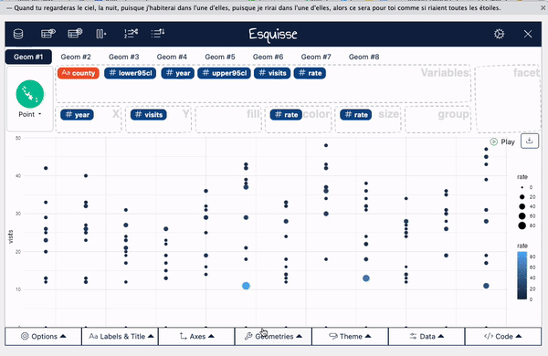
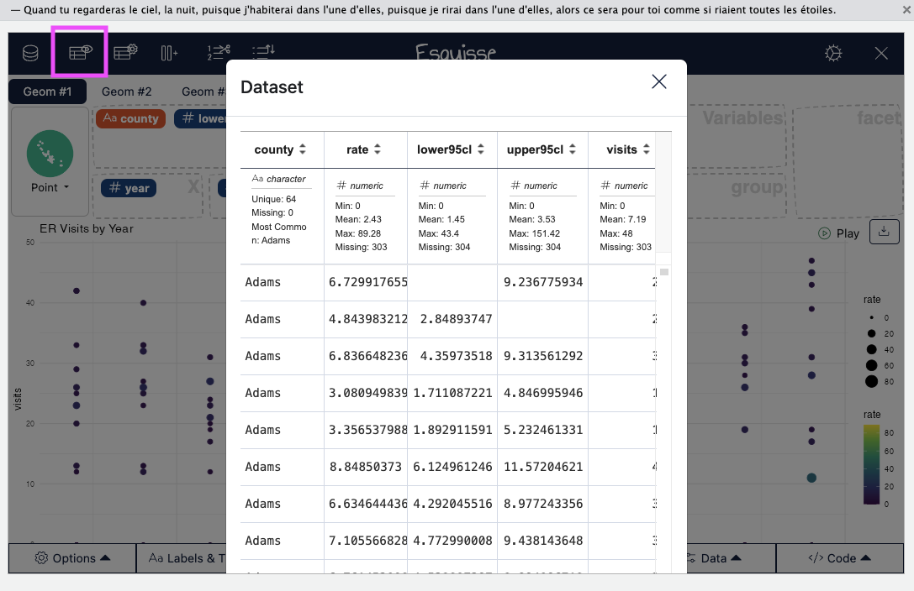
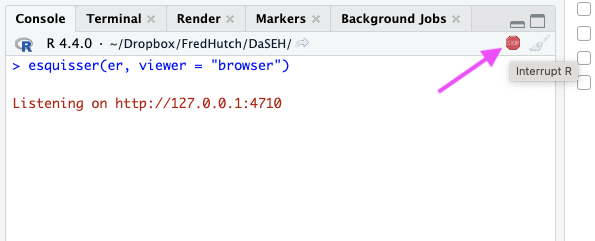

```{r setup, include=FALSE}
knitr::opts_chunk$set(echo = TRUE)
library(tidyverse)
```

## Esquisse Package

```{r esquisse}
# install.packages("esquisse")
library(esquisse)
```

## Esquisse Package

The [`esquisse` package](https://cran.r-project.org/web/packages/esquisse/vignettes/get-started.html) is helpful for getting used to creating plots in R.

It is an interactive tool to help you in RStudio.

It's super **nifty**!
```{r, fig.alt="starting a plot", out.width = "50%", echo = FALSE, fig.align='center'}
knitr::include_graphics("https://c.tenor.com/DNUSO9MjrTEAAAAC/bob-ross.gif")
```

## First, get some data..  {.codesmall}

We can use the CO heat-related ER visits dataset. This dataset contains information about the number and rate of visits for heat-related illness to Emergency rooms in Colorado from 2011-2022, adjusted for age.

```{r message=FALSE}
er <-
  read_csv("https://jhudatascience.org/intro_to_r/data/CO_ER_heat_visits.csv")

head(er)
```

## Starting a plot

Using the `esquisser()` function you can start creating a plot for a `data.frame` or `tibble`. That's it!

```{r, eval = FALSE}
esquisser(er)
```

```{r, fig.alt="starting a plot", out.width = "90%", echo = FALSE, fig.align='center'}

```

## Show the plot in the browser

```{r, eval = FALSE}
esquisse::esquisser(er, viewer = "browser")
```

## Select Variables

To select variables you can drag and drop variables to the respective axis that you would like the variable to be plotted on.

```{r, fig.alt="select variables", out.width = "70%", echo = FALSE, fig.align='center'}

```

## Find code

To select variables you can drag and drop variables to the respective axis that you would like the variable to be plotted on.

```{r, fig.alt="select variables", out.width = "70%", echo = FALSE, fig.align='center'}

```

## Change plot type

`esquisse` automatically assumes a plot type, but you might want to change this.

```{r, fig.alt="change plot type", out.width = "70%", echo = FALSE, fig.align='center'}

```

## Add Facets

Facets create multiple plots based on the different values of a variable.

```{r, fig.alt="add facets", out.width = "70%", echo = FALSE, fig.align='center'}

```

## Add size

Sometimes it is useful to change the way points are plotted so that size represents a variable. This can especially be helpful if you need your plot to be black and white.

```{r, fig.alt="add color", out.width = "70%", echo = FALSE, fig.align='center'}

```

## Add color

For plots with points use the color region to change coloring according to a variable.
(use "fill" for bar plots)

```{r, fig.alt="add color", out.width = "70%", echo = FALSE, fig.align='center'}

```

## Appearance

You can change the overall appearance with "Geometries" and "Theme".

```{r, fig.alt="change overall appearance", out.width = "70%", echo = FALSE, fig.align='center'}

```

## Change titles

To change titles on your plot, use the "Labels & Titles" tab.

```{r, fig.alt="change titles", out.width = "70%", echo = FALSE, fig.align='center'}

```

## View data

You can also easily view data

```{r, fig.alt="Click on the table button to view a table of your data.", out.width = "100%", echo = FALSE, fig.align='center'}

```

## Interrupting Esquisse

You'll need to "interrupt" Esquisse to launch it with a new dataset.

Use the stop button or press ctrl+c to stop the Esquisse app.

_If you don't see the stop button, you need to resize your window._

```{r, fig.alt="Click the stop button to interrupt the Esquisse app.", out.width = "50%", echo = FALSE, fig.align='center'}

```

## Wide & Long Data ? {.codesmall}

Let's look at why we might want long data using Esquisse.

```{r message=FALSE}
library(tidyverse)
er <- read_csv(file =
    "https://jhudatascience.org/intro_to_r/data/CO_ER_heat_visits.csv")
long_er <- er %>% 
  filter(county == c("Denver", "Boulder")) %>% 
  select(c("county", "year", "visits"))
glimpse(long_er)
```

## Wide Data

As a comparison, let's also load a wide version of this dataset.  {.codesmall}

```{r}

wide_er <- read_csv(file =
    "https://jhudatascience.org/intro_to_r/data/CO_heat_er_visits_DenverBoulder_wide.csv")
```

## Wide vs Long Data: Which is better for plotting?

```{r}
head(long_er)
head(wide_er)
```

## Make a plot of visit rates by year for different counties

```{r, eval = FALSE}
esquisser(wide_er) # county as x...? Tricky!
esquisser(long_er) #county as x, visit rate as y, year as fill
```

## GUT CHECK!

Why use Esquisse?

A. Explore your data

B. Get a "head start" on your code

C. Both of these!

## Some Alternatives to `esquisse`

* `ggquickeda`: https://smouksassi.github.io/ggquickeda/
* `ggraptR`: https://github.com/cargomoose/ggraptR/
* `autoplot` can be helpful for some packages (see [this blog post](http://www.sthda.com/english/wiki/ggfortify-extension-to-ggplot2-to-handle-some-popular-packages-r-software-and-data-visualization))

## Summary

* Use Esquisse:  
    * `library(esquisse)`  
    * `esquisser()` function on a dataset  
* Use the `viewer = "browser"` argument to launch in your browser.
* Code from Esquisse can copied into code chunks to be generated in the "Plots" pane
* It's easier if your code is in "long" form!

## Lab

🏠 [Class Website](https://jhudatascience.org/intro_to_r/)

💻 [Lab](https://jhudatascience.org/intro_to_r/modules/Esquisse_Data_Visualization/lab/Esquisse_Data_Visualization_Lab.Rmd)

📃 [Day 6 Cheatsheet](https://jhudatascience.org/intro_to_r/modules/cheatsheets/Day-6.pdf)

```{r, fig.alt="The End", out.width = "40%", echo = FALSE, fig.align='center'}
knitr::include_graphics(here::here("images/the-end-g23b994289_1280.jpg"))
```

Image by <a href="https://pixabay.com/users/geralt-9301/?utm_source=link-attribution&amp;utm_medium=referral&amp;utm_campaign=image&amp;utm_content=812226">Gerd Altmann</a> from <a href="https://pixabay.com//?utm_source=link-attribution&amp;utm_medium=referral&amp;utm_campaign=image&amp;utm_content=812226">Pixabay</a>


