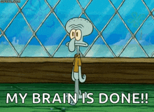
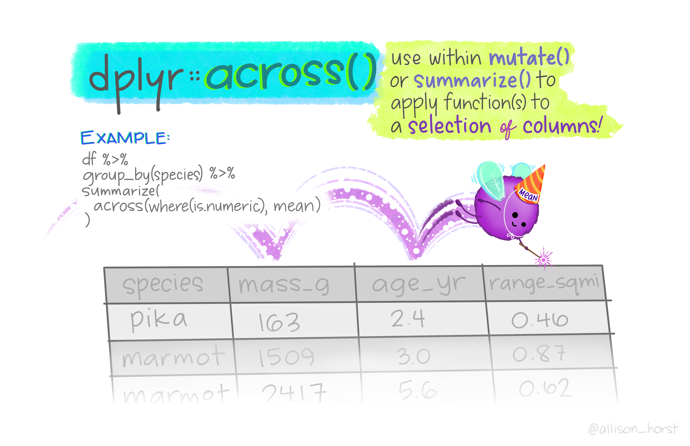

```{r, echo = FALSE, message = FALSE}
knitr::opts_chunk$set(comment = "")
library(tidyverse)
library(emo)
```

## An advanced subject: functions

```{r, fig.alt="session info", out.width = "50%", echo = FALSE, fig.align='center'}

```

## Writing your own functions

So far we've seen many functions, like `c()`, `class()`, `filter()`, `dim()` ...

**Why create your own functions?**

- Cut down on repetitive code (easier to fix things!)
- Organize code into manageable chunks
- Avoid running code unintentionally
- Use names that make sense to you

## A practical example: summarization {.smaller}

There may be code that you use multiple times. Creating a function can help cut down on repetitive code (and the chance for copy/paste errors).

```{r}
data_insights <- function(x, column1, column2) {
    x_insight <- x %>%
      group_by({{column1}}) %>%
      summarize(mean = mean({{column2}}, na.rm = TRUE))
    return(x_insight)
}

data_insights(x = mtcars, column1 = cyl, column2 = hp)
data_insights(x = mtcars, column1 = cyl, column2 = disp)
```

## A practical example: plotting {.smaller}

You may have a similar plot that you want to examine across columns of data.

```{r}
simple_plots <- function(x, column1, column2) {
    box_plot <- ggplot(data = x, aes(x = {{column1}}, y = {{column2}}, group = {{column1}})) +
      geom_boxplot() +
    return(box_plot)
}

simple_plots(x = mtcars, column1 = cyl, column2 = hp)
simple_plots(x = mtcars, column1 = cyl, column2 = disp)
```

## Writing your own functions

The general syntax for a function is: 

```
function_name <- function(arg1, arg2, ...) {
 <function body>
}
```


## Writing your own functions

Here we will write a function that multiplies some number `x` by 2:

```{r}
times_2 <- function(x) x * 2
```

When you run the line of code above, you make it ready to use (no output yet!). Let's test it!

```{r comment=""}
times_2(x = 10)
```


## Writing your own functions: `{ }`

Adding the curly brackets - `{}` - allows you to use functions spanning multiple lines:

```{r comment=""}
times_2 <- function(x) {
  x * 2
}
times_2(x = 10)

is_even <- function(x) {
  x %% 2 == 0
}
is_even(x = 11)
is_even(x = times_2(x = 10))
```


## Writing your own functions: `return`

If we want something specific for the function's output, we use `return()`:

```{r comment=""}
times_2_plus_4 <- function(x) {
  output_int <- x * 2
  output <- output_int + 4
  return(output)
}
times_2_plus_4(x = 10)
```

## Writing your own functions: print intermediate steps

 - printed results do not stay around but can show what a function is doing
 - returned results stay around
 - can only return one result but can print many
 - if `return` not called, last evaluated expression is returned
 - `return` should be the last step (steps after may be skipped)

## Adding print

```{r comment=""}
times_2_plus_4 <- function(x) {
  output_int <- x * 2
  output <- output_int + 4
  print(paste("times2 result = ", output_int))
  return(output)
}

result <- times_2_plus_4(x = 10)
result
```


## Writing your own functions: multiple inputs

Functions can take multiple inputs:

```{r comment=""}
times_2_plus_y <- function(x, y) x * 2 + y
times_2_plus_y(x = 10, y = 3)
```


## Writing your own functions: multiple outputs

Functions can have one returned result with multiple outputs.

```{r comment=""}
x_and_y_plus_2 <- function(x, y) {
  output1 <- x + 2
  output2 <- y + 2

  return(c(output1, output2))
}
result <- x_and_y_plus_2(x = 10, y = 3)
result
```


## Writing your own functions: defaults

Functions can have "default" arguments. This lets us use the function without using an argument later:

```{r comment=""}
times_2_plus_y <- function(x = 10, y = 3) x * 2 + y
times_2_plus_y()
times_2_plus_y(x = 11, y = 4)
```


## Writing another simple function

Let's write a function, `sqdif`, that:

1. takes two numbers `x` and `y` with default values of 2 and 3.
2. takes the difference
3. squares this difference
4. then returns the final value

## Writing your own functions: characters

Functions can have any kind of input. Here is a function with characters:

```{r comment=""}
loud <- function(word) {
  output <- rep(toupper(word), 5)
  return(output)
}
loud(word = "hooray!")
```

## Functions for tibbles

`select(n)` will choose column `n`:

```{r message=FALSE}
get_index <- function(dat, row, col) {
  dat %>%
    filter(row_number() == row) %>%
    select(all_of(col))
}

get_index(dat = iris, row = 10, col = 5)
```


## Functions for tibbles

Including default values for arguments:

```{r message=FALSE}
get_top <- function(dat, row = 1, col = 1) {
  dat %>%
    filter(row_number() == row) %>%
    select(all_of(col))
}

get_top(dat = iris)
```

## Functions for tibbles - curly braces

Can create function with an argument that allows inputting a column name for `select` or other `dplyr` operation:

```{r}
clean_dataset <- function(dataset, col_name) {
  my_data_out <- dataset %>% select({{col_name}}) # Note the curly braces {{}}
  write_csv(my_data_out, "clean_data.csv")
  return(my_data_out)
}

clean_dataset(dataset = mtcars, col_name = "cyl")
```

## Functions for tibbles - curly braces

```{r}
# Another example: get means and missing for a specific column
get_summary <- function(dataset, col_name) {
    dataset %>%  
    summarise(mean = mean({{col_name}}, na.rm = TRUE),
              na_count = sum(is.na({{col_name}})))
}

get_summary(mtcars, hp)
```


## Summary

- Simple functions take the form:
  - `NEW_FUNCTION <- function(x, y){x + y}`
  - Can specify defaults like `function(x = 1, y = 2){x + y}`
  -`return` will provide a value as output
  - `print` will simply print the value on the screen but not save it
- Specify a column (from a tibble) inside a function using `{{double curly braces}}`


## Lab Part 1

🏠 [Class Website](https://jhudatascience.org/intro_to_r/)  

💻 [Lab](https://jhudatascience.org/intro_to_r/modules/Functions/lab/Functions_Lab.Rmd)


# Functions on multiple columns

## Using your custom functions: `sapply()`- a base R function

Now that you've made a function... you can "apply" functions easily with `sapply()`!

These functions take the form:

```   
sapply(<a vector, list, data frame>, some_function)
```


## Using your custom functions: `sapply()`

`r emo::ji("rotating_light")` There are no parentheses on the functions! `r emo::ji("rotating_light")`

You can also pipe into your function.

```{r comment=""}
head(iris, n = 2)
sapply(iris, class)
iris %>% sapply(class)
```


## Using your custom functions: `sapply()`

```{r}
select(cars, VehYear:VehicleAge) %>% head()
select(cars, VehYear:VehicleAge) %>%
  sapply(times_2) %>%
  head()
```


## Using your custom functions "on the fly" to iterate

Also called an "anonymous function".

```{r comment=""}
select(cars, VehYear:VehicleAge) %>%
  sapply(function(x) x / 1000) %>%
  head()
```

## Anonymous functions: alternative syntax

```{r comment=""}
select(cars, VehYear:VehicleAge) %>%
  sapply(\(x) x / 1000) %>%
  head()
```

# across

## Using functions in `mutate()` and `summarize()`

Already know how to use functions to modify columns using `mutate()` or calculate summary statistics using `summarize()`.

```{r}
cars %>%
  mutate(VehOdo_round = round(VehOdo, -3)) %>%
  summarize(max_Odo_round = max(VehOdo_round),
            max_Odo = max(VehOdo))
```

## The `across()` function

```{r, fig.alt="session info", out.width = "70%", echo = FALSE, fig.align='center'}

```

Image by [Allison Horst](https://allisonhorst.com/data-science-art).

## Applying functions with `across` from `dplyr`

`across()` makes it easy to apply the same transformation to multiple columns. Usually used with `summarize()` or `mutate()`.

```
summarize(across( .cols = <columns>, .fns = function)) 
```
or
```
mutate(across(.cols = <columns>, .fns = function))
```

- List columns first: `.cols = `
- List function next: `.fns = `
- If there are arguments to a function (e.g., `na.rm = TRUE`), the function may need to be modified to an anonymous function, e.g., `\(x) mean(x, na.rm = TRUE)`


## Applying functions with `across` from `dplyr`

Combining with `summarize()`

```{r warning=FALSE}
cars_dbl <- cars %>% select(Make, starts_with("Veh"))

cars_dbl %>%
  summarize(across(.cols = everything(), .fns = mean)) # no parentheses
```


## Applying functions with `across` from `dplyr`

Can use with other tidyverse functions like `group_by`!

```{r}
cars_dbl %>%
  group_by(Make) %>%
  summarize(across(.cols = everything(), .fns = mean)) # no parentheses
```


## Applying functions with `across` from `dplyr`

To add arguments to functions, may need to use anonymous function. In this syntax, the shorthand `\(x)` is equivalent to `function(x)`.

```{r warning=FALSE}
cars_dbl %>%
  group_by(Make) %>%
  summarize(across(.cols = everything(), .fns = \(x) mean(x, na.rm = TRUE)))
```


## Applying functions with `across` from `dplyr`

Using different `tidyselect()` options (e.g., `starts_with()`, `ends_with()`, `contains()`)

```{r warning=FALSE}
cars_dbl %>%
  group_by(Make) %>%
  summarize(across(.cols = starts_with("Veh"), .fns = mean))
```


## Applying functions with `across` from `dplyr`

Combining with `mutate()`: rounding to the nearest power of 10 (with negative digits value)

```{r}
cars_dbl %>%
  mutate(across(
    .cols = starts_with("Veh"),
    .fns = round,
    digits = -3
  ))
```


## Applying functions with `across` from `dplyr` {.smaller}

Combining with `mutate()` - the `replace_na` function

```replace_na({data frame}, {list of values})```
or
```replace_na({vector}, {single value})```

```{r warning=FALSE, message=FALSE}
# Child mortality data
mort <- 
  read_csv("https://jhudatascience.org/intro_to_r/data/mortality.csv") %>% 
  rename(country = `...1`)

mort %>%
  select(country, starts_with("194")) %>%
  mutate(across(
    .cols = c(`1943`, `1944`, `1945`),
    .fns = replace_na,
    replace = 0
  ))
```


## Use custom functions within `mutate` and `across`

If your function needs to span more than one line, better to define it first before using inside `mutate()` and `across()`.

```{r}
times1000 <- function(x) x * 1000

airquality %>%
  mutate(across(
    .cols = everything(),
    .fns  = times1000
  )) %>%
  head(n = 2)

airquality %>%
  mutate(across(
    .cols = everything(),
    .fns  = function(x) x * 1000
  )) %>%
  head(n = 2)
```


## GUT CHECK! 

Why use `across()`?

A. Efficiency - faster and less repetitive

B. Calculate the cross product

C. Connect across datasets


## `purrr` package {.small}

Similar to across, `purrr` is a package that allows you to apply a function to multiple columns in a data frame or multiple data objects in a list.

A *list* in R is a generic class of data consisting of an ordered collection of objects. It can include any number of single numeric objects, vectors, or data frames -- can be all the same class of objects or all different.

While we won't get into `purrr` too much in this class, its a handy package for you to know about should you get into a situation where you have an irregular list you need to handle!

# Multiple Data Frames

## Multiple data frames {.smaller}

Lists help us work with multiple data frames

```{r}
AQ_list <- list(AQ1 = airquality, AQ2 = airquality, AQ3 = airquality)
str(AQ_list)
```


## Multiple data frames: `sapply`

```{r}
AQ_list %>% sapply(class)
AQ_list %>% sapply(nrow)
AQ_list %>% sapply(colMeans, na.rm = TRUE)
```


## Summary

- Apply your functions with `sapply(<a vector or list>, some_function)`
- Use `across()` to apply functions across multiple columns of data 
- Need to use `across` within `summarize()` or `mutate()`
- Can use `sapply` or `purrr` to work with multiple data frames within lists simultaneously


## Lab Part 2

🏠 [Class Website](https://jhudatascience.org/intro_to_r/)  

💻 [Lab](https://jhudatascience.org/intro_to_r/modules/Functions/lab/Functions_Lab.Rmd)

📃 [Day 9 Cheatsheet](https://jhudatascience.org/intro_to_r/modules/cheatsheets/Day-9.pdf)

📃 [Posit's `purrr` Cheatsheet](https://rstudio.github.io/cheatsheets/purrr.pdf)

```{r, fig.alt="The End", out.width = "35%", echo = FALSE, fig.align='center'}
knitr::include_graphics(here::here("images/the-end-g23b994289_1280.jpg"))
```

Image by <a href="https://pixabay.com/users/geralt-9301/?utm_source=link-attribution&amp;utm_medium=referral&amp;utm_campaign=image&amp;utm_content=812226">Gerd Altmann</a> from <a href="https://pixabay.com//?utm_source=link-attribution&amp;utm_medium=referral&amp;utm_campaign=image&amp;utm_content=812226">Pixabay</a>

## Good luck and happy coding!

```{r, fig.alt="session info", out.width = "50%", echo = FALSE, fig.align='center'}

```

Image by [Allison Horst](https://allisonhorst.com/data-science-art).
