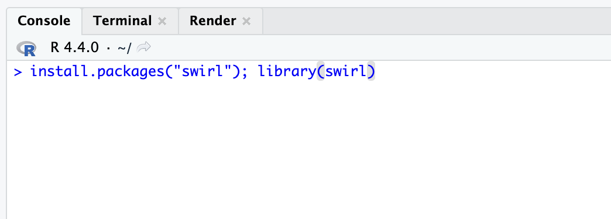
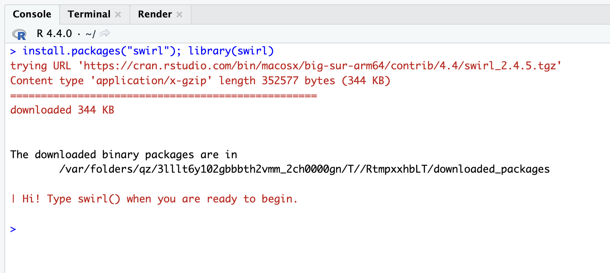
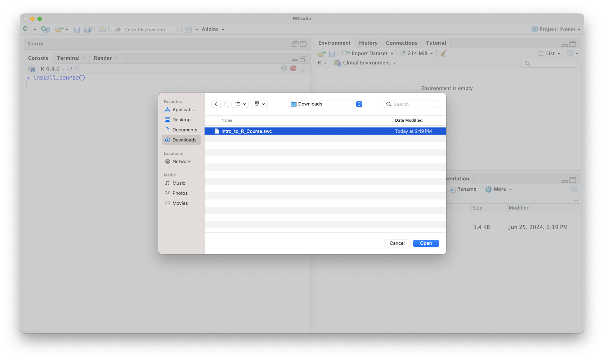
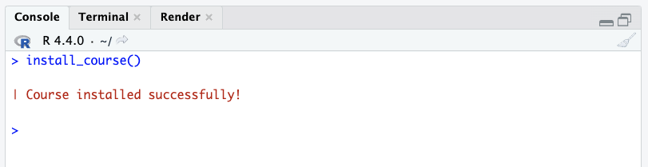
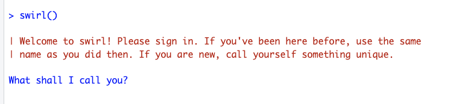

### **Instructions**

Completed homework should be submitted on CoursePlus as a screenshot of the final question in this exercise. Please see the course website for more information about submitting assignments.

All assignments are due at the end of the course. Please see the course website for more information about grading: https://jhudatascience.org/intro_to_r/syllabus.html.

## Download Lesson

Click the following link to download the lesson:

https://github.com/jhudsl/intro_to_r/raw/main/modules/HW/Intro_to_R_Course.swc 

## Install Swirl

Open RStudio. Copy and paste the following code into the console. Press enter to run:

```{r initiatePackages, eval=FALSE}
install.packages("swirl"); library(swirl)
```

{width=65%}

{width=65%}

## Install Lesson in RStudio

After the successful installation, run the following:

```{r, eval=FALSE}
install_course()
```

You should see a popup where you can select the `.swc` file you downloaded earlier. Select it to continue.

{width=80%}

{width=65%}

## Launch swirl

Next, run the following:

```{r, eval=FALSE}
swirl()
```

{width=65%}

## Complete Questions

Follow along with the questions in RStudio's console.

Please save a screenshot of the completion page to upload to CoursePlus Drop Box later.

