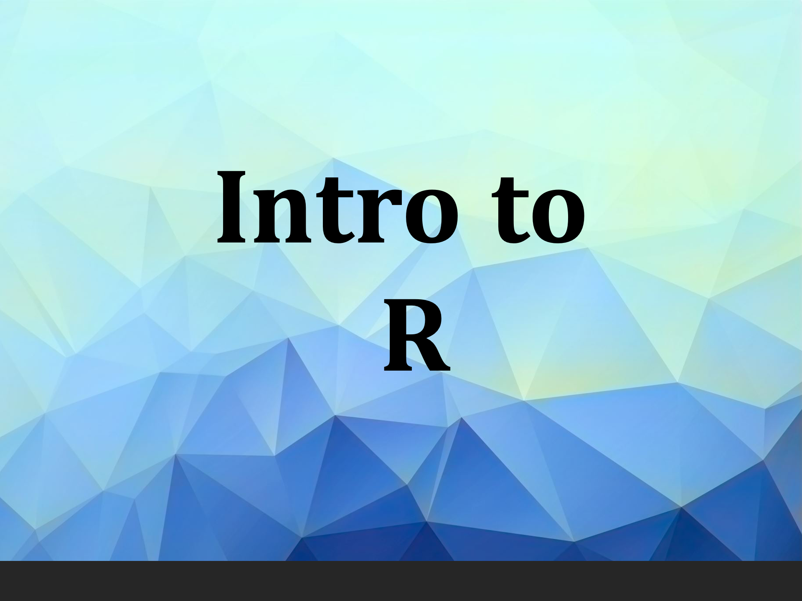
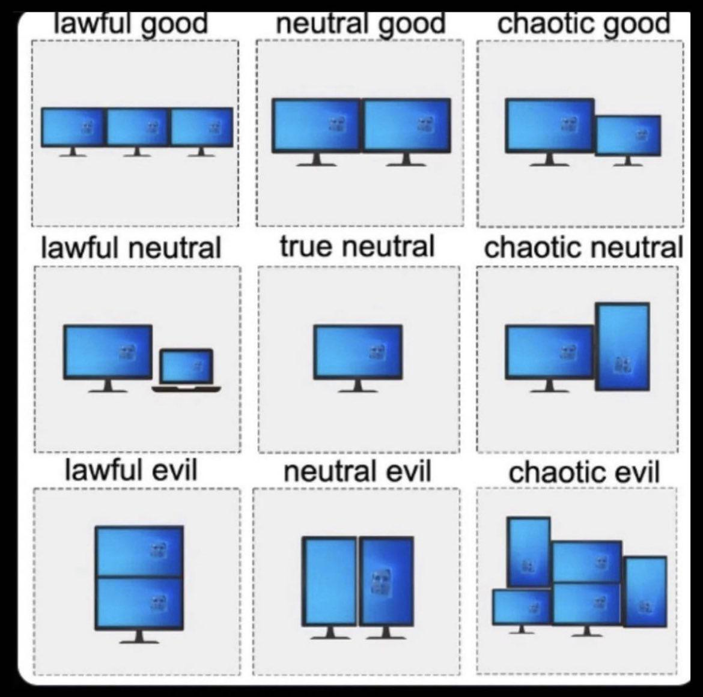
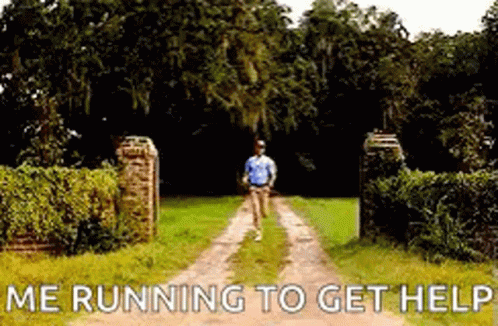

---
title: "Introduction"
output:
  ioslides_presentation:
    css: ../../docs/styles.css
    widescreen: yes
--- 

```{r, echo = FALSE}
library(knitr)
opts_chunk$set(comment = "")
```

## Welcome to class!

1. Introductions
2. Class overview
3. Getting R up and running


```{r, fig.alt="Welcome!", out.width = "60%", echo = FALSE, fig.align='center'}
knitr::include_graphics("images/welcome.jpg")
```


<sub>[Photo by <a href="https://unsplash.com/@bel2000a?utm_source=unsplash&utm_medium=referral&utm_content=creditCopyText">Belinda Fewings</a> on <a href="https://unsplash.com/s/photos/welcome?utm_source=unsplash&utm_medium=referral&utm_content=creditCopyText">Unsplash</a>]</sub>
  
## Before we start ..

Poll: How are you feeling right now?

## About Us

**Carrie Wright (she/her)** 

Senior Staff Scientist, Fred Hutchinson Cancer Center

Associate, Department of Biostatistics, JHSPH

PhD in Biomedical Sciences

Email: cwrigh60@jhu.edu  Web: https://carriewright11.github.io

```{r, fig.alt="Carrie's picture", out.width = "30%", echo = FALSE, fig.align='center'}
# knitr::include_graphics("https://ca.slack-edge.com/T023TPZA8LF-U024F9G49S8-9861ddd543db-192")
knitr::include_graphics(here::here("modules", "Intro", "images", "carrie.png"))
```

## About Us

**Ahmed Sabit (he/him)**

Faculty Research Associate, JHSPH

MS in Statistics

Email: ahmed.sabit@jhu.edu

## About Us

**Clif McKee (he/him)**

Research Associate, Department of Epidemiology, JHSPH

Masters and PhD in Ecology

Email: cmckee7@jhu.edu Web: http://clifmckee.github.io 

```{r, fig.alt="Clif's picture", out.width = "27%", echo = FALSE, fig.align='center'}
knitr::include_graphics("https://ca.slack-edge.com/T05B63VRKQU-U05B3L06SQK-a423994b2612-512")
```

## About Us - TA

**Lily Koffman**

4th year PhD candidate in Biostatistics, BSPH

Research: wearable devices and functional data

Email: lkoffma2@jh.edu Web: https://www.lilykoff.com/

```{r, fig.alt="Charlotte's picture", out.width = "35%", echo = FALSE, fig.align='center'}
knitr::include_graphics(here::here("modules", "Intro", "images", "lily.png"))
```

## About you!

Please introduce yourself on Slack!

[Slack Workspace](`r config::get("slack_workspace")`)


## The Learning Curve

Learning a programming language can be very intense and sometimes overwhelming.

We recommend fully diving in and minimizing other commitments to get the most out of this course.

Like learning a spoken language, programming takes **practice**.

```{r, fig.alt="Sweeping the ocean", out.width = "25%", echo = FALSE, fig.align='center'}
knitr::include_graphics("images/sweeping-the-ocean.gif")
```


## The Learning Curve

Learning R has been career changing for all of us, and we want to share that!

We want you to succeed -- We will get through this together!

```{r, fig.alt="High five", out.width = "25%", echo = FALSE, fig.align='center'}

```


## What is R?

-   R is a language and environment for statistical computing and graphics developed in 1991

-   R is both [open source](https://en.wikipedia.org/wiki/Open_source) and [open development](https://en.wikipedia.org/wiki/Open-source_software_development)

```{r, fig.alt="R logo", out.width = "20%", echo = FALSE, fig.align='center'}
knitr::include_graphics("images/Rlogo.png")
```

<sub>[source: <http://www.r-project.org/>]</sub>


## Why R?

-   Free (open source)

-   High level language designed for statistical computing

-   Powerful and flexible - especially for data wrangling and visualization

-   Extensive add-on software (packages)

-   Strong community

```{r, fig.alt="R-Ladies - a non-profit civil society community", out.width = "20%", echo = FALSE, fig.align='center'}
knitr::include_graphics("https://github.com/rladies/branding-materials/raw/main/logo/R-LadiesGlobal_RBG_online_LogoWithText_Horizontal.png")
```

<sub>[source: <https://github.com/rladies/meetup-presentations_baltimore>]</sub>


## Why not R?

-   Little centralized support, relies on online community and package developers

-   Annoying to update

-   Slower, and more memory intensive, than the more traditional programming languages (C, Perl, Python)

```{r, fig.alt="tortoise and hare", out.width = "40%", echo = FALSE, fig.align='center'}
knitr::include_graphics("images/tortoise_hare.jpg")
```

<sub>[[source -School vector created by nizovatina - www.freepik.com](https://www.freepik.com/vectors/school)]</sub>


## Introductions

What do you hope to get out of the class?

Why do you want to use R?

```{r, fig.alt="image of rocks with word hope painted on", out.width = "50%", echo = FALSE, fig.align='center'}

```

<sub>[Photo by <a href="https://unsplash.com/@jannerboy62?utm_source=unsplash&utm_medium=referral&utm_content=creditCopyText">Nick Fewings</a> on <a href="https://unsplash.com/s/photos/hope?utm_source=unsplash&utm_medium=referral&utm_content=creditCopyText">Unsplash</a>]</sub>
  
  
# Logistics

## Course Website

http://jhudatascience.org/intro_to_r

Materials will be uploaded the night before class.
We are constantly trying to improve content!
Please refresh/download materials before class.

```{r, fig.alt="Intro to R course logo", out.width = "60%", echo = FALSE, fig.align='center'}

```

## Learning Objectives

- Understanding basic programming syntax
- Reading data into R
- Recoding and manipulating data
- Using add-on packages (more on what this is soon!)
- Making exploratory plots
- Performing basic statistical tests
- Writing R functions
- **Building intuition** 

## Course Format

 * Lecture with slides, interactive
 * Lab/Practical experience
 * Two 10 min breaks each day - timing may vary
 * `r config::get("course_dates")` `r config::get("course_time")` on Zoom
 * Final classes will focus on final project
 
## CoursePlus
 
`r config::get("courseplus_web")`

- Upload homework/project

## Surveys

- _End of class_ Survey from JHU: https://courseevaluations.jhsph.edu/
- Daily survey / pulse check : `r config::get("google_survey")`

```{r, fig.alt="Surveys count", out.width = "40%", echo = FALSE, fig.align='center'}

```

<sub>[[source - Banner vector created by pch.vector - www.freepik.com]("https://www.freepik.com/vectors/banner")]</sub>

## Grading

 1. Attendance/Participation: 20% - this can be asynchronous - just some sort of interaction with the instructors/TAs (turning in assignments, emailing etc.)
 2. Homework: 3 x 15%
 3. Final "Project": 35%

Homework and Final Project due by **`r config::get("final_due_date")`**.

If you turn homework in earlier this can allow us to potentially give you feedback earlier.
 
Note: Only people taking the course for credit must turn in the assignments. However, we will evaluate all submitted assignments in case others would like feedback on their work.

## Your Setup

If you can, we suggest working virtually with a **large monitor or two screens**. This setup allows you to follow along on Zoom while also doing the hands-on coding.

```{r, fig.alt="Surveys count", out.width = "40%", echo = FALSE, fig.align='center'}

```

<sub>[[source - reddit.com]("https://www.reddit.com/r/ProgrammerHumor/comments/11ygrjj/deducing_your_personality_from_your_monitor_setup/")]</sub>


# Where to find help

## Useful (+ mostly Free) Resources

Found on our website under the `Resources` tab: <https://jhudatascience.org/intro_to_r/resources.html>

-   videos from previous offerings of the class
-   cheatsheets for each class


## Help!!!

Error messages can be scary!

-   Check out the FAQ/Help page on the website: <https://jhudatascience.org/intro_to_r/help.html>
-   Ask questions in Slack! Copy+pasting your error messages is really helpful!

**We will also dedicate time today to debug any installation issues**

```{r, fig.alt="Muppets hugging it out", out.width = "25%", echo = FALSE, fig.align='center'}

```


## Installing R

* Install the [latest R version](http://cran.r-project.org/) `r config::get("r_version")`

* [Install RStudio](https://www.rstudio.com/products/rstudio/download/)

More detailed instructions [on the website](https://jhudatascience.org/intro_to_r/docs/module_details/day0.html).

RStudio is an **integrated development environment** (IDE) that makes it easier to work with R.

More on that soon!


## Summary

🏠 [Class Website](https://jhudatascience.org/intro_to_r/) - logistics, resources, and help!

🩺 Pulse Check - `r config::get("google_survey")`
