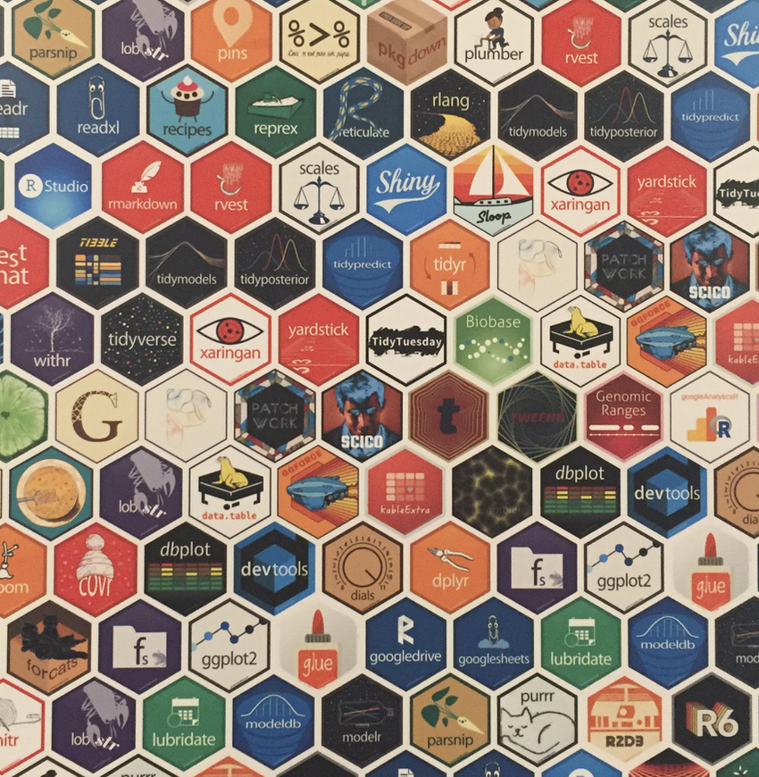
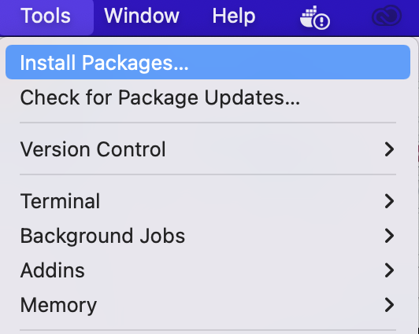
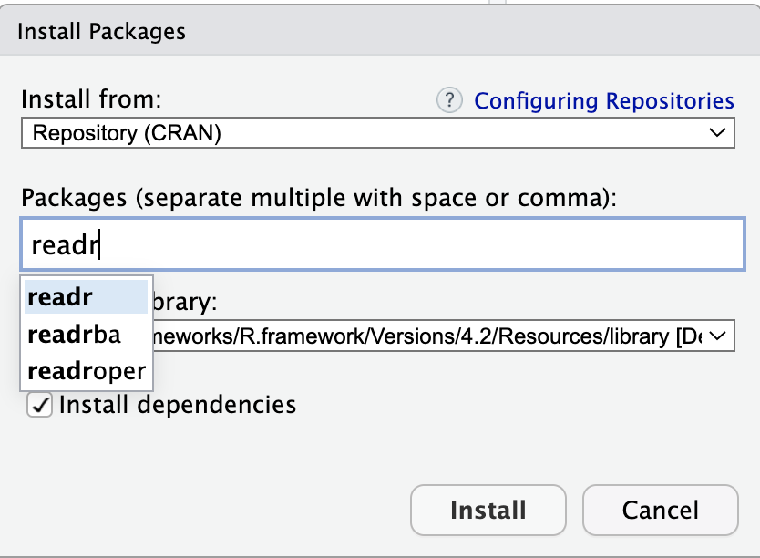
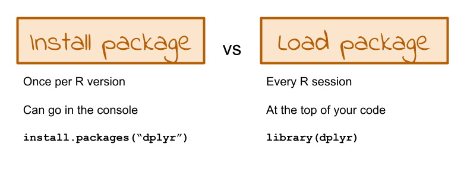

---
title: "Introduction"
output:
  ioslides_presentation:
    css: ../../docs/styles.css
    widescreen: yes
--- 

```{r, echo = FALSE}
library(knitr)
opts_chunk$set(comment = "")
```

## Welcome to class!

1. Introductions
2. Class overview
3. Getting R up and running


```{r, fig.alt="Welcome!", out.width = "60%", echo = FALSE, fig.align='center'}
knitr::include_graphics("images/welcome.jpg")
```


<sub>[Photo by <a href="https://unsplash.com/@bel2000a?utm_source=unsplash&utm_medium=referral&utm_content=creditCopyText">Belinda Fewings</a> on <a href="https://unsplash.com/s/photos/welcome?utm_source=unsplash&utm_medium=referral&utm_content=creditCopyText">Unsplash</a>]</sub>
  
## Before we start ..

Poll: How are you feeling right now?

## About Us

**Carrie Wright (she/her)** 

Senior Staff Scientist and Training Lead, Fred Hutchinson Cancer Center

Associate, Department of Biostatistics, JHSPH

PhD in Biomedical Sciences

Email: cwrigh60@jhu.edu  Web: https://carriewright11.github.io

```{r, fig.alt="Carrie's picture", out.width = "30%", echo = FALSE, fig.align='center'}
# knitr::include_graphics("https://ca.slack-edge.com/T023TPZA8LF-U024F9G49S8-9861ddd543db-192")
knitr::include_graphics(here::here("modules", "Intro", "images", "carrie.png"))
```

## About Us

**Ava Hoffman (she/her)**

Senior Staff Scientist, Fred Hutchinson Cancer Center

Associate, Department of Biostatistics, JHSPH

PhD in Ecology

Email: ava.hoffman@jhu.edu  Web: https://avahoffman.com

```{r, fig.alt="Ava's picture", out.width = "30%", echo = FALSE, fig.align='center'}
knitr::include_graphics(here::here("modules", "Intro", "images", "ava.png"))
```

## About Us

**Clif McKee (he/him)**

Research Associate, Department of Epidemiology, JHSPH

Masters and PhD in Ecology

Email: cmckee7@jhu.edu Web: http://clifmckee.github.io 

```{r, fig.alt="Clif's picture", out.width = "27%", echo = FALSE, fig.align='center'}
knitr::include_graphics("https://ca.slack-edge.com/T05B63VRKQU-U05B3L06SQK-a423994b2612-512")
```

## About Us - TAs

**Alex Newman (he/him)**

3rd Year PhD Student, Department of Mental Health, BSPH   

MA in Psychology, Brandeis University   

BA in Biological Basis of Behavior, University of Pennsylvania  

Email: anewma28@jhu.edu

```{r, fig.alt="Alex's picture", out.width = "25%", echo = FALSE, fig.align='center'}
knitr::include_graphics(here::here("modules", "Intro", "images", "Alex.jpg"))
```

## About Us - TAs

**Padmashri Saravanan (she/they)**

2nd Year MHS Student, Department of Epidemiology, BSPH   

MSc in Mathematics, Birla Institute of Technology and Science, Pilani

Email: psarava1@jhu.edu

```{r, fig.alt="Padma's picture", out.width = "25%", echo = FALSE, fig.align='center'}
knitr::include_graphics(here::here("modules", "Intro", "images", "Padma.jpg"))
```

## About you!

Please introduce yourself on Slack!

[Slack Workspace](`r config::get("slack_workspace")`)


## The Learning Curve

Learning a programming language can be very intense and sometimes overwhelming.

We recommend fully diving in and minimizing other commitments to get the most out of this course.

Like learning a spoken language, programming takes **practice**.

```{r, fig.alt="Sweeping the ocean", out.width = "25%", echo = FALSE, fig.align='center'}
knitr::include_graphics("images/sweeping-the-ocean.gif")
```


## The Learning Curve

Learning R has been career changing for all of us, and we want to share that!

We want you to succeed -- We will get through this together!

```{r, fig.alt="High five", out.width = "25%", echo = FALSE, fig.align='center'}
knitr::include_graphics("images/low-five-high-five.gif")
```


## What is R?

- R is a language and environment for statistical computing and graphics developed in 1991

- R is the open source implementation of the [S language](https://en.wikipedia.org/wiki/S_(programming_language)), which was developed by [Bell laboratories](https://ca.slack-edge.com/T023TPZA8LF-U024EN26Q0L-113294823b2c-512) in the 70s.

- The aim of the S language, as expressed by John Chambers, is "to turn ideas into software, quickly and faithfully"

```{r, fig.alt="Bell Labs old logo", out.width = "40%", echo = FALSE, fig.align='center'}
knitr::include_graphics("https://upload.wikimedia.org/wikipedia/commons/thumb/9/98/Bell_Laboratories_logo.svg/2880px-Bell_Laboratories_logo.svg.png")
```


<sub>[source: http://www.r-project.org/, https://en.wikipedia.org/wiki/S_(programming_language), https://en.wikipedia.org/wiki/Bell_Labs)] </sub>

## What is R?

- **R**oss Ihaka and **R**obert Gentleman at the University of Auckland, New Zealand developed R


- R is both [open source](https://en.wikipedia.org/wiki/Open_source) and [open development](https://en.wikipedia.org/wiki/Open-source_software_development)

```{r, fig.alt="R logo", out.width = "20%", echo = FALSE, fig.align='center'}
knitr::include_graphics("images/Rlogo.png")
```


<sub>[source: http://www.r-project.org/, https://en.wikipedia.org/wiki/R_(programming_language)]</sub>

## Why R?

* Free (open source)

* High level language designed for statistical computing

* Powerful and flexible - especially for data wrangling and visualization

* Extensive add-on software (packages)

* Strong community 

```{r, fig.alt="R-Ladies - a non-profit civil society community", out.width = "20%", echo = FALSE, fig.align='center'}
knitr::include_graphics("https://github.com/rladies/branding-materials/raw/main/logo/R-LadiesGlobal_RBG_online_LogoWithText_Horizontal.png")
```
<sub>[source: https://github.com/rladies/meetup-presentations_baltimore]</sub>

## Why not R?

    
* Little centralized support, relies on online community and package developers

* Annoying to update

* Slower, and more memory intensive, than the more traditional programming languages (C, Perl, Python)

```{r, fig.alt="tortoise and hare", out.width = "40%", echo = FALSE, fig.align='center'}
knitr::include_graphics("images/tortoise_hare.jpg")
```

<sub>[[source -School vector created by nizovatina - www.freepik.com](https://www.freepik.com/vectors/school)]</sub>


## Introductions

What do you hope to get out of the class?

Why do you want to use R?

```{r, fig.alt="image of rocks with word hope painted on", out.width = "60%", echo = FALSE, fig.align='center'}
knitr::include_graphics("images/hope.jpg")
``` 
<sub>[Photo by <a href="https://unsplash.com/@jannerboy62?utm_source=unsplash&utm_medium=referral&utm_content=creditCopyText">Nick Fewings</a> on <a href="https://unsplash.com/s/photos/hope?utm_source=unsplash&utm_medium=referral&utm_content=creditCopyText">Unsplash</a>]</sub>
  

## Course Website

http://jhudatascience.org/intro_to_r

Materials will be uploaded the night before class.
We are constantly trying to improve content!
Please refresh/download materials before class.

```{r, fig.alt="Intro to R course logo", out.width = "60%", echo = FALSE, fig.align='center'}
knitr::include_graphics("../../docs/images/Intro_to_R.png")
```

## Learning Objectives

- Understanding basic programming syntax
- Reading data into R
- Recoding and manipulating data
- Using add-on packages (more on what this is soon!)
- Making exploratory plots
- Performing basic statistical tests
- Writing R functions
- **Building intuition** 

## Course Format

 * Lecture with slides, interactive
 * Lab/Practical experience
 * Two 10 min breaks each day - timing may vary
 * `r config::get("course_dates")` `r config::get("course_time")` on Zoom
 * `r config::get("holiday")`
 * Final classes will focus on final project
 
## CoursePlus
 
`r config::get("courseplus_web")`

- Upload homework

## Surveys

- _End of class_ Survey from JHU: https://courseevaluations.jhsph.edu/
- Daily survey / pulse check : `r config::get("google_survey")`

```{r, fig.alt="Surveys count", out.width = "40%", echo = FALSE, fig.align='center'}
knitr::include_graphics("images/feedback-illustration.jpeg")
```

<sub>[[source - Banner vector created by pch.vector - www.freepik.com]("https://www.freepik.com/vectors/banner")]</sub>

## Grading

 1. Attendance/Participation: 20% - this can be asynchronous - just some sort of interaction with the instructors/TAs (turning in assignments, emailing etc.)
 2. Homework: 3 x 15%
 3. Final "Project": 35%

Homework and Final Project due by **`r config::get("final_due_date")`**.

If you turn homework in earlier this can allow us to potentially give you feedback earlier.
 
Note: Only people taking the course for credit must turn in the assignments. However, we will evaluate all submitted assignments in case others would like feedback on their work.

## Your Setup

If you can, we suggest working virtually with a **large monitor or two screens**. This setup allows you to follow along on Zoom while also doing the hands-on coding.

```{r, fig.alt="Surveys count", out.width = "40%", echo = FALSE, fig.align='center'}
knitr::include_graphics("images/monitors.jpg")
```

<sub>[[source - reddit.com]("https://www.reddit.com/r/ProgrammerHumor/comments/11ygrjj/deducing_your_personality_from_your_monitor_setup/")]</sub>

## Installing R

* Install the [latest R version](http://cran.r-project.org/) `r config::get("r_version")`

* [Install RStudio](https://www.rstudio.com/products/rstudio/download/)

More detailed instructions [on the website](https://jhudatascience.org/intro_to_r/docs/module_details/day0.html).

RStudio is an **integrated development environment** (IDE) that makes it easier to work with R.

More on that soon!

## Getting files from downloads

This course will involve moving files around on your computer and downloading files.

If you are new to this - check out these videos.

If you have a PC: https://youtu.be/we6vwB7DsNU

If you have a Mac: https://www.youtube.com/watch?v=Ao9e0cDzMrE

You can find these on the resource page of the website.

## Basic terms

R jargon: https://link.springer.com/content/pdf/bbm%3A978-1-4419-1318-0%2F1.pdf

**Package** - a package in R is a bundle or "package" of code (and or possibly data) that can be loaded together for easy repeated use or for **sharing** with others.

Packages are analogous to a software application like Microsoft Word on your computer. Your operating system allows you to use it, just like having R installed (and other required packages) allows you to use packages.

```{r, fig.alt="R hex stickers for packages", out.width = "35%", echo = FALSE, fig.align='center'}

```

## Basic terms


**Function** - a function is a piece of code that allows you to do something in R. You can write your own, use functions that come directly from installing R, or use functions from additional packages.

You can think of a function as **verb** in R.

A function might help you add numbers together, create a plot, or organize your data. More on that soon!

```{r}
sum(1, 20234)
```


## Basic terms

 **Argument** - what you pass to a function

- can be data like the number 1 or 20234 

```{r}
sum(1, 20234)
```

- can be options about how you want the function to work such as `digits`

```{r}
round(0.627, digits = 2)
round(0.627, digits = 1)
```


## Basic terms


**Object** - an object is something that can be worked with or on in R - can be lots of different things! You can think of objects as **nouns** in R.

- a matrix of numbers
- a plot
- a function
- data

... many more

## Variable and Sample

- **Variable**: something measured or counted that is a characteristic about a sample

examples: temperature, length, count, color, category

- **Sample**: individuals that you have data about -

examples: people, houses, viruses etc.

```{r}
head(iris)
```


## Columns and Rows

```{r, fig.alt="R hex stickers for packages", out.width = "50%", echo = FALSE, fig.align='center'}
knitr::include_graphics("https://keydifferences.com/wp-content/uploads/2016/09/rows-vs-column.jpg")
```
[[source](https://keydifferences.com/difference-between-rows-and-columns.html)]

Sample = Row  
Variable = Column

Data objects that looks like this is often called a **data frame**.

Fancier versions from the tidyverse are called **tibbles** (more on that soon!).


## More on Functions and Packages

* When you download R, it has a "base" set of functions/packages (**base R**)  
    * You can install additional packages for your uses from [CRAN](https://cran.r-project.org/) or [GitHub](https://github.com/) 
    * These additional packages are written by RStudio or R users/developers (like us)
    * There are also packages for bioinformatics available at [Bioconductor](https://www.bioconductor.org/)
    
    
```{r, fig.alt="Picture of R package stickers", out.width = "30%", echo = FALSE, fig.align='center'}

```


## Using Packages

* Not all packages available on CRAN or GitHub are trustworthy
* Posit makes [many useful packages](https://posit.co/products/open-source/rpackages/)
* How to [trust](https://simplystatistics.org/posts/2015-11-06-how-i-decide-when-to-trust-an-r-package/) an R package
* Many packages have accompanying academic papers published in peer-reviewed journals
* Widely used packages have better documentation (official and in forums) and are more likely free of errors


## Tidyverse and Base R: Two Dialects

We will mostly show you how to use tidyverse packages and functions. 

This is a newer set of packages designed for data science that can make your code more **intuitive** as compared to the original older Base R.

**Tidyverse advantages**:  
 - **consistent structure** - making it easier to learn how to use different packages  
 - particularly good for **wrangling** (manipulating, cleaning, joining) data  
 - more flexible for **visualizing** data  

Packages for the tidyverse are managed by a team of respected data scientists at Posit.

```{r, fig.alt="Tidyverse hex sticker", out.width = "10%", echo = FALSE, fig.align='center'}
knitr::include_graphics("https://tidyverse.tidyverse.org/logo.png")
```

See this [article](https://tidyverse.tidyverse.org/articles/paper.html) for more info.

## Package Installation

We will practice this in labs :) 

Differs depending on the source (CRAN, GitHub, etc)

Must be done **once** for each installation of R (e.g., version 4.2 >> 4.3). 

## Installing Packages: Dropdown Menu

You can install packages from CRAN using the tool menu in RStudio:

tools > Install Packages

```{r, fig.alt="Install packages menu in RStudio", out.width = "20%", echo = FALSE, fig.align='center'}

```

Type in the package name to install.

```{r, fig.alt="The 'readr' package has been typed into the dropdown menu", out.width = "30%", echo = FALSE, fig.align='center'}

```

## Installing Packages: Using Code

We use a function called `install.packages()` for CRAN packages.

Here is an example where we "install" the `dplyr` package:

```{r, eval = FALSE}
install.packages("dplyr")
```

The package name is enclosed in quotation marks.

## Loading packages

After installing packages, you will need to "load" them into memory so that you can use them.

This must be done **every time** you start R.

We use a function called `library` to load packages.

Here is an example where we "load" the `dplyr` package:

```{r, eval = FALSE}
library(dplyr)
```

Quotation marks are optional.

## Installing + Loading packages

```{r, fig.alt="Installing must be done once via 'install.packages() while loading must be done every R session via 'library()'.", out.width = "80%", echo = FALSE, fig.align='center'}

```

## Installing + Loading packages

```{r, fig.alt="Installing must be done once via 'install.packages() while loading must be done every R session via 'library()'.", out.width = "80%", echo = FALSE, fig.align='center'}
knitr::include_graphics("../../images/lol/install_packages.jpg")
```

## Useful (+ mostly Free) Resources

Found on our website under the `Resources` tab:
https://jhudatascience.org/intro_to_r/resources.html

-  videos from previous offerings of the class
-  cheatsheets for each class 

## Help!!!

Error messages can be scary!

- Check out the FAQ/Help page on the website: https://jhudatascience.org/intro_to_r/help.html
- Ask questions in Slack! Copy+pasting your error messages is really helpful!
- Leverage our awesome TA time for 1:1 troubleshooting

**We will also dedicate time today to debug any installation issues**

```{r, fig.alt="Muppets hugging it out", out.width = "25%", echo = FALSE, fig.align='center'}
knitr::include_graphics("images/forrest-gump-running.gif")
```

## Summary

- R is a powerful data visualization and analysis software language.
- Add-on **packages** like the `tidyverse` can help make R more intuitive.
- **Functions** (like verbs) perform specific tasks in R and are found within packages.
- **Arguments** within functions specify how to perform a function.
- **Objects** (like nouns) are data or variables.
- We will be both installing and loading packages.
- Materials will be updated frequently as we improve it. Please use the **Google Form survey** so you can provide feedback throughout the class!
- Lots of **resources** can be found on the website. _You will have access to the website after the class is over._

🏠 [Class Website](https://jhudatascience.org/intro_to_r/)

## Website tour!

🏠 [Class Website](https://jhudatascience.org/intro_to_r/)

```{r, fig.alt="The End", out.width = "50%", echo = FALSE, fig.align='center'}
knitr::include_graphics(here::here("images/the-end-g23b994289_1280.jpg"))
```

Image by <a href="https://pixabay.com/users/geralt-9301/?utm_source=link-attribution&amp;utm_medium=referral&amp;utm_campaign=image&amp;utm_content=812226">Gerd Altmann</a> from <a href="https://pixabay.com//?utm_source=link-attribution&amp;utm_medium=referral&amp;utm_campaign=image&amp;utm_content=812226">Pixabay</a>


