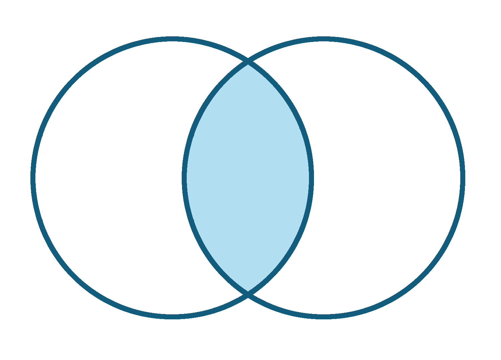
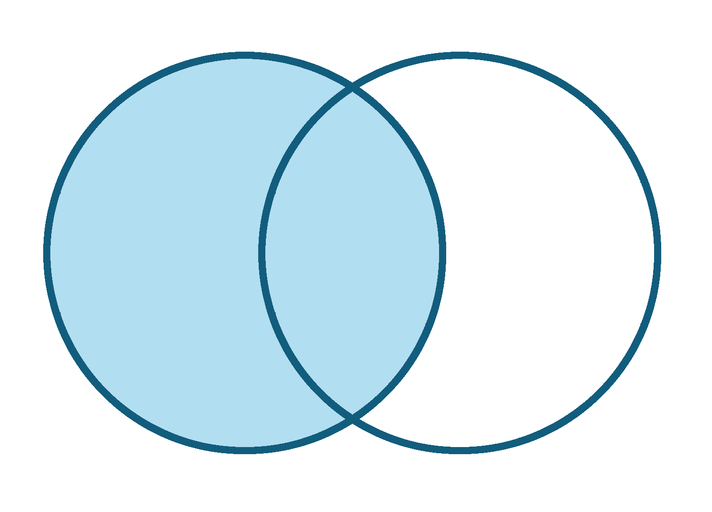
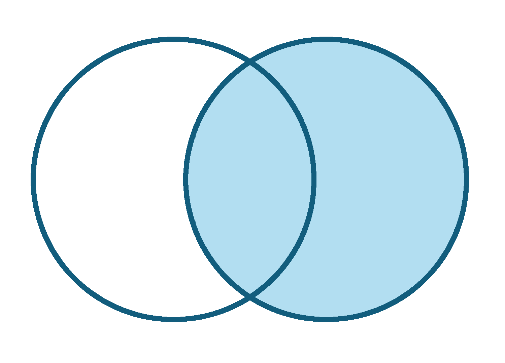
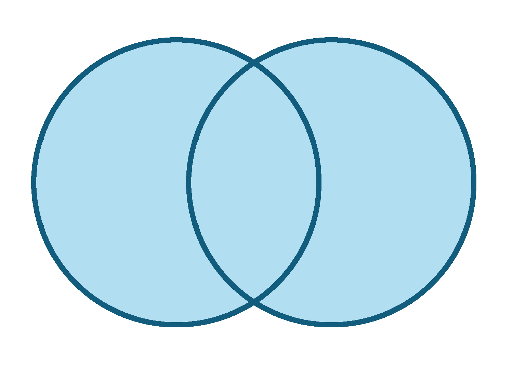
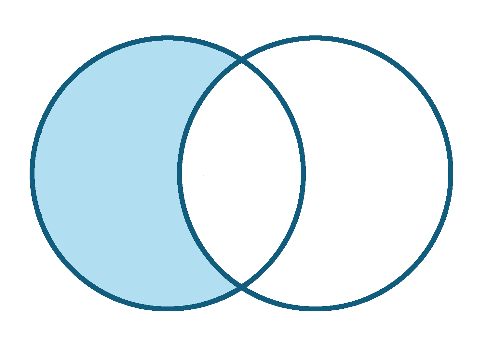

```{r, echo = FALSE, include=FALSE}
library(knitr)
opts_chunk$set(comment = "")
library(tidyverse)
```

## Recap of Data Cleaning

-   `is.na()`,`any(is.na())`, `all(is.na())`,`count()`, and functions from `naniar` like `gg_miss_var()` and `miss_var_summary` can help determine if we have `NA` values
-   `miss_var_which()` can help you drop columns that have any missing values.
-   `filter()` automatically removes `NA` values
-   `drop_na()` can help you remove `NA` values
-   `NA` values can change your calculation results
-   think about what `NA` values represent - don't drop them if you shouldn't
-   `replace_na()` will replace `NA values with a particular value

## Recap of Data Cleaning

-   `case_when()` can recode **entire values** based on conditions
    -   remember `case_when()` needs `TRUE ~ variable` to keep values that aren't specified by conditions, otherwise will be `NA`
-   `stringr` package has great functions for looking for specific **parts of values** especially `filter()` and `str_detect()` combined
    - also has other useful string manipulation functions like `str_replace()` and more!
    - `separate()` can split columns into additional columns
    - `unite()` can combine columns

📃[Cheatsheet](https://jhudatascience.org/intro_to_r/modules/cheatsheets/Day-5.pdf)

## Manipulating Data 

In this module, we will show you how to:

1. Reshape data from wide to long
2. Reshape data from long to wide
3. Merge Data/Joins

## What is wide/long data?

<div style="font-size:40pt">
Data is wide or long **with respect** to certain variables.
</div>

```{r, fig.alt="Wide versus long data rearanges the position of column names and row content.", out.width = "60%", echo = FALSE, fig.align='center'}
knitr::include_graphics("images/pivot.jpg")
```

## What is wide/long data?

Data is stored *differently* in the tibble.

Here's a small dataset looking at vaccination rates over three months in Alabama.

```{r, echo = FALSE}
ex_wide <- tibble(State = "Alabama",
                 June_vacc_rate = 0.516,
                 May_vacc_rate = 0.514,
                 April_vacc_rate = 0.511
                     )
ex_long <- pivot_longer(ex_wide, cols = !State)
```

Wide: has many columns

```{r, echo = FALSE}
ex_wide
```

Long: column names become data

```{r, echo = FALSE}
ex_long
```

## What is wide/long data?

```{r, echo = FALSE}
ex_wide <- tibble(State = c("Alabama", "Alaska"),
                 June_vacc_rate = c(0.516, 0.627),
                 May_vacc_rate = c(0.514, 0.626),
                 April_vacc_rate = c(0.511, 0.623)
                     )
ex_long <- pivot_longer(ex_wide, cols = !State)
```

Wide: multiple columns per individual, values spread across multiple columns 

```{r, echo = FALSE}
ex_wide
```

Long: multiple rows per observation, a single column contains the values

```{r, echo = FALSE}
ex_long
```

## What is wide/long data?

https://github.com/gadenbuie/tidyexplain/blob/main/images/tidyr-pivoting.gif

```{r, fig.alt="A gif visualization of data going from wide to long form.", out.width = "40%", echo = FALSE, align = "center"}
knitr::include_graphics("images/tidyr_pivoting.gif")
```

## Why do we need to switch between wide/long data?

Wide: **Easier for humans to read**

```{r, echo = FALSE}
ex_wide
```

Long: **Easier for R to make plots & do analysis**

```{r, echo = FALSE}
ex_long
```

## Pivoting using `tidyr` package

`tidyr` allows you to "tidy" your data.  We will be talking about:

- `pivot_longer` - make multiple columns into variables, (wide to long)
- `pivot_wider` - make a variable into multiple columns, (long to wide)

The `reshape` command exists.  Its arguments are considered more confusing, so we don't recommend it.

You might see old functions `gather` and `spread` when googling. These are older iterations of `pivot_longer` and `pivot_wider`, respectively.

# `pivot_longer`...

## Reshaping data from **wide to long**

```{r}
ex_wide
ex_long <- ex_wide %>% pivot_longer(cols = ends_with("rate"))
ex_long
```

## GUT CHECK!

What does `pivot_longer()` do?

A. Summarize data

B. Import data

C. Reshape data

## Reshaping wide to long: Better column names {.codesmall} 

`pivot_longer()` - puts column data into rows (`tidyr` package)

- First describe which columns we want to "pivot_longer"
- `names_to =` new name for old columns
- `values_to =` new name for old cell values

<div class = "codeexample">
```{r, eval=FALSE}
{long_data} <- {wide_data} %>% pivot_longer(cols = {columns to pivot},
                                        names_to = {name for old columns},
                                        values_to = {name for cell values})
```
</div>

## Reshaping wide to long: Better column names {.codesmall}

Newly created column names ("Month" and "Rate") are enclosed in quotation marks. It helps us be more specific than "name" and "value".

```{r}
ex_long <- ex_wide %>% pivot_longer(cols = ends_with("rate"),
                                    names_to = "Month",
                                    values_to = "Rate")
ex_long
```

## Data used: Charm City Circulator

```{r, message = FALSE}
circ <- read_csv("http://jhudatascience.org/intro_to_r/data/Charm_City_Circulator_Ridership.csv")
head(circ, 5)
```

## Mission: Taking the average boardings by line

Let's imagine we want to create a table of average boardings by route/line. Results should look something like:

```{r, message = FALSE, echo = FALSE}
example <- tibble(line = c("orange","purple","green","banner"),
                  avg_boardings = c("600(?)", "700(?)", "500(?)", "400(?)")
)
example
```

## Reshaping data from **wide to long**

```{r}
long <- circ %>% 
  pivot_longer(starts_with(c("orange","purple","green","banner")))
long
```

## Just keep "boardings"

Filter by Boardings only..

```{r}
long <- long %>% filter(str_detect(name, "Boardings"))
```

## Mission: Taking the average boardings by line

Now our data is more tidy, and we can take the averages easily!

```{r}
long %>% 
  group_by(name) %>% 
  summarize("avg_boardings" = mean(value, na.rm = TRUE))
```

## Reshaping data from **wide to long**

There are many ways to **select** the columns we want. Check out https://dplyr.tidyverse.org/reference/dplyr_tidy_select.html to look at more column selection options.

```{r}
circ %>% 
  pivot_longer( !c(day, date, daily))
```

# `pivot_wider`...

## Reshaping data from **long to wide**

`pivot_wider()` - spreads row data into columns (`tidyr` package)

- `names_from =` the old column whose contents will be spread into multiple new column names.
- `values_from =` the old column whose contents will fill in the values of those new columns.

<div class = "codeexample">
```{r, eval=FALSE}
{wide_data} <- {long_data} %>% 
  pivot_wider(names_from = {Old column name: contains new column names},
              values_from = {Old column name: contains new cell values})
```
</div>

## Reshaping data from **long to wide**

We can use `pivot_wider` to convert long data to wide format. Let's try it with the vaccine data from earlier.

```{r}
ex_long
```

## Reshaping data from **long to wide**

We can use `pivot_wider` to convert long data to wide format. Let's try it with the vaccine data from earlier.

```{r}
ex_wide2 <- ex_long %>% pivot_wider(names_from = "Month", 
                                       values_from = "Rate") 
ex_wide2
```

## Reshaping Charm City Circulator

```{r}
wide <- long %>% pivot_wider(names_from = "name", 
                             values_from = "value") 
wide
```

## Summary

- `tidyr` package helps us convert between wide and long data
- `pivot_longer()` goes from wide -> long
     - Specify columns you want to pivot
     - Specify `names_to = ` and `values_to = ` for custom naming
- `pivot_wider()` goes from long -> wide
     - Specify `names_from =` and `values_from = `

## Lab Part 1

🏠 [Class Website](https://jhudatascience.org/intro_to_r/)

💻 [Lab](https://jhudatascience.org/intro_to_r/modules/Manipulating_Data_in_R/lab/Manipulating_Data_in_R_Lab.Rmd)

## Joining

"Combining datasets"

```{r, fig.alt="Inner, outer, left, and right joins represented with venn diagrams", out.width = "70%", echo = FALSE, align = "center"}
knitr::include_graphics("images/joins.png")
```

## Joining in `dplyr`

* Merging/joining data sets together - usually on key variables, usually "id"
* `?join` - see different types of joining for `dplyr`
* `inner_join(x, y)` - only rows that match for `x` and `y` are kept
* `full_join(x, y)` - all rows of `x` and `y` are kept 
* `left_join(x, y)` - all rows of `x` are kept even if not merged with `y`
* `right_join(x, y)` - all rows of `y` are kept even if not merged with `x`
* `anti_join(x, y)` - all rows from `x` not in `y` keeping just columns from `x`.

## Merging: Simple Data

```{r message=FALSE}
data_As <- read_csv(
  file = "https://jhudatascience.org/intro_to_r/data/data_As_1.csv")
data_cold <- read_csv(
  file = "https://jhudatascience.org/intro_to_r/data/data_cold_1.csv")
```

```{r}
data_As
data_cold
```

## Inner Join

https://github.com/gadenbuie/tidyexplain/blob/main/images/inner-join.gif

```{r, fig.alt="A gif showing the inner joining of two simple datasets.", out.width = "70%", echo = FALSE, align = "center"}
knitr::include_graphics("images/inner_join.gif")
```

## Inner Join

```{r inner_join}
ij <- inner_join(data_As, data_cold)
ij
```



## Left Join

https://raw.githubusercontent.com/gadenbuie/tidyexplain/main/images/left-join.gif

```{r, fig.alt="A gif showing the left joining of two simple datasets.", out.width = "70%", echo = FALSE, align = "center"}
knitr::include_graphics("images/left_join.gif")
```

## Left Join

"Everything to the left of the comma"

```{r left_join}
lj <- left_join(data_As, data_cold)
lj
```



## Install `tidylog` package to log outputs

```{r, include=FALSE}
# install.packages("tidylog")
library(tidylog)
```

```{r left_join_log}
# install.packages("tidylog")
library(tidylog)
left_join(data_As, data_cold)
```


## Right Join

https://raw.githubusercontent.com/gadenbuie/tidyexplain/main/images/right-join.gif

```{r, fig.alt="A gif showing the right joining of two simple datasets.", out.width = "70%", echo = FALSE, align = "center"}
knitr::include_graphics("images/right_join.gif")
```

## Right Join

"Everything to the right of the comma"

```{r right_join}
rj <- right_join(data_As, data_cold)
rj
```



## Left Join: Switching arguments

```{r right_join2}
lj2 <- left_join(data_cold, data_As)
lj2
```


## Full Join

https://raw.githubusercontent.com/gadenbuie/tidyexplain/main/images/full-join.gif

```{r, fig.alt="A gif showing the full joining of two simple datasets.", out.width = "70%", echo = FALSE, align = "center"}
knitr::include_graphics("images/full_join.gif")
```

## Full Join

```{r}
fj <- full_join(data_As, data_cold)
fj
```



## "`includes duplicates`"

```{r message=FALSE}
data_As <- read_csv(
  file = "https://jhudatascience.org/intro_to_r/data/data_As_2.csv")
data_cold <- read_csv(
  file = "https://jhudatascience.org/intro_to_r/data/data_cold_2.csv")
```

```{r}
data_As
data_cold
```

## "`includes duplicates`"

```{r}
lj <- left_join(data_As, data_cold)
```


## "`includes duplicates`"

Data including the joining column ("State") has been duplicated.

```{r}
lj
```

<br>

Note that "Alaska willow ptarmigan" appears twice.


## "`includes duplicates`"

https://github.com/gadenbuie/tidyexplain/blob/main/images/left-join-extra.gif

```{r, fig.alt="A gif showing how data can be duplicated from one dataset when joining two simple datasets.", out.width = "70%", echo = FALSE, align = "center"}
knitr::include_graphics("images/left_join_extra.gif")
```

## Stop `tidylog`

`unloadNamespace()` does the opposite of `library()`.

```{r}
unloadNamespace("tidylog")
```

## Using the `by` argument

By default joins use the intersection of column names. If `by` is specified, it uses that.

```{r use_by}
full_join(data_As, data_cold, by = "State")
```


## Using the `by` argument

You can join based on multiple columns by using something like `by = c(col1, col2)`.

If the datasets have two different names for the same data, use:

```{r eval=FALSE}
full_join(x, y, by = c("a" = "b"))
```


## `anti_join` : what's missing

Entries in `data_As` but not in `data_cold`

```{r}
anti_join(data_As, data_cold, by = "State")
```

Entries in `data_cold` but not in `data_As`

```{r}
anti_join(data_cold, data_As, by = "State") # order switched
```



## GUT CHECK!

Why use `join` functions?

A. Combine different data sources

B. Connect Rmd to other files

C. Using one data source is too easy and we want our analysis ~ fancy ~

## Summary

* Merging/joining data sets together - assumes all column names that overlap
     - use the `by = c("a" = "b")` if they differ
* `inner_join(x, y)` - only rows that match for `x` and `y` are kept
* `full_join(x, y)` - all rows of `x` and `y` are kept 
* `left_join(x, y)` - all rows of `x` are kept even if not merged with `y`
* `right_join(x, y)` - all rows of `y` are kept even if not merged with `x`
* Use the `tidylog` package for a detailed summary
* `anti_join(x, y)` shows what is only in `x` (missing from `y`)

## Lab Part 2

🏠 [Class Website](https://jhudatascience.org/intro_to_r/)

💻 [Lab](https://jhudatascience.org/intro_to_r/modules/Manipulating_Data_in_R/lab/Manipulating_Data_in_R_Lab.Rmd)

📃 [Day 6 Cheatsheet](https://jhudatascience.org/intro_to_r/modules/cheatsheets/Day-6.pdf)

📃 [Posit's `tidyr` Cheatsheet](https://rstudio.github.io/cheatsheets/tidyr.pdf)

📃 [Posit's `dplyr` Cheatsheet](https://rstudio.github.io/cheatsheets/data-transformation.pdf)


```{r, fig.alt="The End", out.width = "50%", echo = FALSE, fig.align='center'}
knitr::include_graphics(here::here("images/the-end-g23b994289_1280.jpg"))
```

Image by <a href="https://pixabay.com/users/geralt-9301/?utm_source=link-attribution&amp;utm_medium=referral&amp;utm_campaign=image&amp;utm_content=812226">Gerd Altmann</a> from <a href="https://pixabay.com//?utm_source=link-attribution&amp;utm_medium=referral&amp;utm_campaign=image&amp;utm_content=812226">Pixabay</a>


# Additional Slides


## Getting the set difference with `setdiff`

We might want to determine what indexes ARE in the first dataset that AREN'T in the second.

For this to work, the datasets need the same columns.

We'll just select the index using `select()`.

```{r}
A_states <- data_As %>% select(State)
cold_states <- data_cold %>% select(State)
```

## Getting the set difference with `setdiff`

States in `A_states` but not in `cold_states`

```{r}
dplyr::setdiff(A_states, cold_states)
```

States in `cold_states` but not in `A_states`

```{r}
dplyr::setdiff(cold_states, A_states)
```

## Getting the set difference with `setdiff`

Why did we use `dplyr::setdiff`? 

There is a base R function, also called `setdiff` that requires vectors.

In other words, we use `dplyr::` to be specific about the package we want to use.

More set operations can be found here:
https://dplyr.tidyverse.org/reference/setops.html

## Fast manipulation using `collapse` package

https://sebkrantz.github.io/collapse/

Might be helpful if your data is very large. However, `dplyr` and `tidyr` functions are great for most applications.
