```{r, echo = FALSE}
library(knitr)
opts_chunk$set(comment = "")
```

## Working with R -- RStudio

RStudio is an Integrated Development Environment (IDE) for R

-   It helps the user effectively use R
-   Makes things easier
-   Is NOT a dropdown statistical tool (such as Stata)
    -   See [Rcmdr](https://cran.r-project.org/web/packages/Rcmdr/index.html) or [Radiant](http://vnijs.github.io/radiant/)
-   All R Studio snapshots are taken from <http://ayeimanol-r.net/2013/04/21/289/>

```{r, fig.alt="RStudio logo", out.width = "30%", echo = FALSE, fig.align='center'}
knitr::include_graphics("https://d33wubrfki0l68.cloudfront.net/62bcc8535a06077094ca3c29c383e37ad7334311/a263f/assets/img/logo.svg")
```

<sub>[[source](https://www.rstudio.com/)]</sub>

## RStudio

Easier working with R

-   Syntax highlighting, code completion, and smart indentation
-   Easily manage multiple working directories and projects

More information

-   Workspace browser and data viewer
-   Plot history, zooming, and flexible image and file export
-   Integrated R help and documentation
-   Searchable command history

## RStudio

```{r, fig.alt="RStudio", out.width = "80%", echo = FALSE, fig.align='center'}
knitr::include_graphics("https://ayeimanolr.files.wordpress.com/2013/04/r-rstudio-1-1.png?w=640&h=382")
```

<!-- ## RStudio/R Console  -->

## Getting the editor

```{r, out.width = "90%", echo = FALSE}
knitr::include_graphics("images/both.png")
```

## Working with R in R Studio - 2 major panes:

1)  The **Source/Editor**: "Analysis" Script + Interactive Exploration
    -   Static copy of what you did (reproducibility)
    -   Top by default
2)  The **R Console**: "interprets" whatever you type
    -   Calculator
    -   Try things out interactively, then add to your editor
    -   Bottom by default

## Source / Editor

-   Where files open to
-   Have R code and comments in them
-   Can highlight and press (CMD+Enter (Mac) or Ctrl+Enter (Windows)) to run the code

In a .R file (we call a script), code is saved on your disk

```{r, out.width = "90%", echo = FALSE}
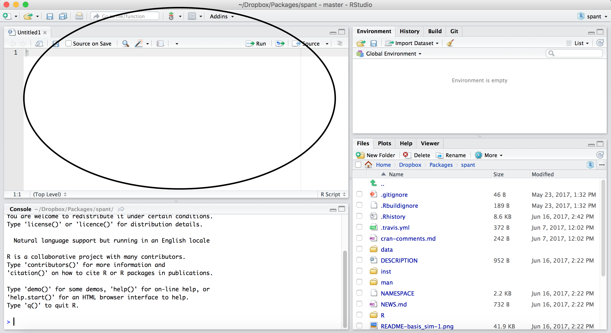
```

<!-- ## Workspace/Environment  -->

## R Console

<!--  -->

```{r, out.width = "60%", echo = FALSE, fig.align='center'}
knitr::include_graphics("images/rstudio_console.png")
```

-   Where code is executed (where things happen)
-   You can type here for things interactively
-   Code is **not saved** on your disk

## RStudio

Super useful "cheat sheet": <https://github.com/rstudio/cheatsheets/raw/master/rstudio-ide.pdf>

```{r, fig.alt="RStudio", out.width = "65%", echo = FALSE, fig.align='center'}
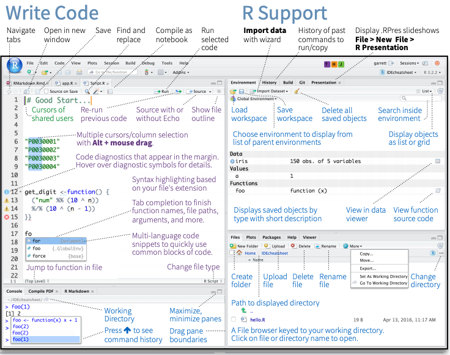
```

## RStudio layout

```{r, fig.alt="RStudio layout", out.width = "100%", echo = FALSE, fig.align='center'}
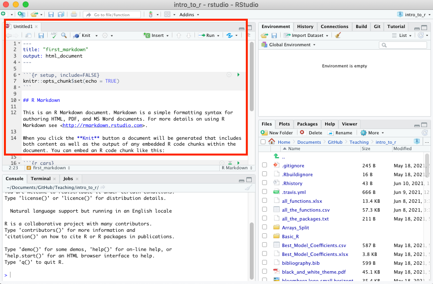
```

## RStudio Layout

If RStudio doesn't look the way you want (or like our RStudio), then do:

RStudio --\> Preferences --\> Pane Layout

```{r, out.width = "500px", echo = FALSE, fig.align='center'}
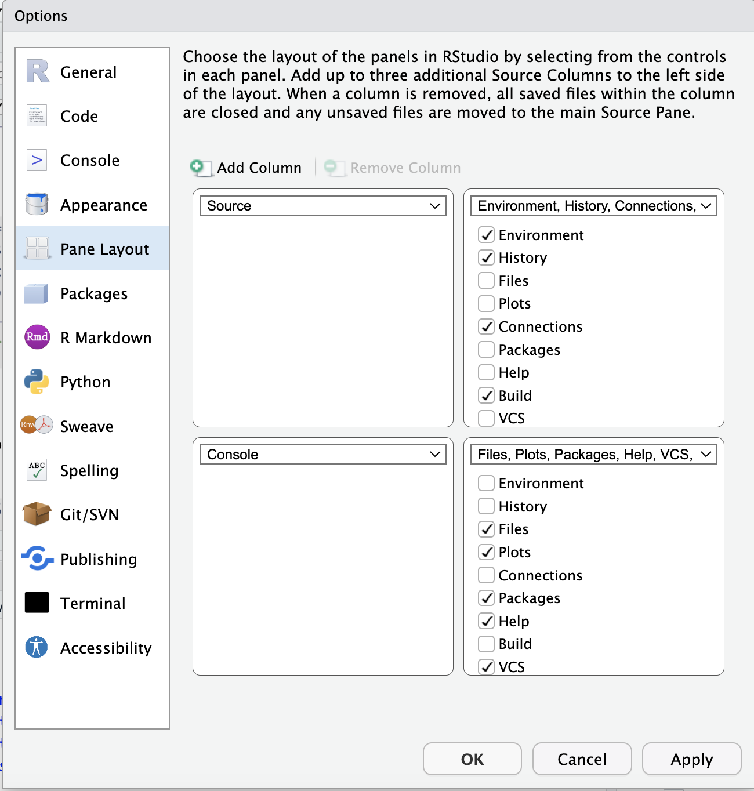
```

<!-- ## Source/Editor  -->

## Workspace/Environment

<!-- 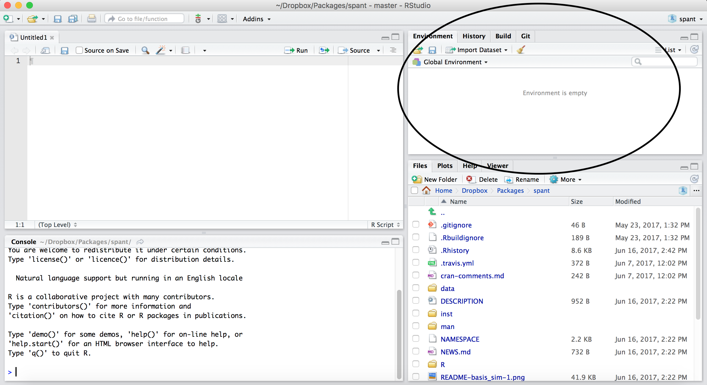 -->

```{r, out.width = "90%", echo = FALSE}

```

## Workspace/Environment

-   Tells you what **objects** are in R
-   What exists in memory/what is loaded?/what did I read in?

**History**

-   Shows previous commands. Good to look at for debugging, but **don't rely** on it.\
    Instead use RMarkdown!
-   Also type the "up" key in the Console to scroll through previous commands

## Other Panes

-   **Files** - shows the files on your computer of the directory you are working in
-   **Viewer** - can view data or R objects
-   **Help** - shows help of R commands
-   **Plots** - pictures and figures
-   **Packages** - list of R packages that are loaded in memory

# Let's take a look at R Studio ourselves!

## Lab: Starting with R and RMarkdown

💻 [RStudio Lab](https://jhudatascience.org/intro_to_r/modules/RStudio/lab/RStudio_Lab.Rmd)

To do this lab we need to:

1)  Download the file at the link above by clicking on the link or typing in:
`https://jhudatascience.org/intro_to_r/modules/RStudio/lab/RStudio_Lab.Rmd`
(Also on the [website](https://jhudatascience.org/intro_to_r/materials_schedule.html) schedule page - Lab for day 1)
2)  Find the downloaded file on your computer
3)  Open the file in RStudio 

This may require finding your downloads on your computer.

Recall that these videos can help:

If you have a PC: https://youtu.be/we6vwB7DsNU

If you have a Mac: https://www.youtube.com/watch?v=Ao9e0cDzMrE


## R Markdown file

R Markdown files (.Rmd) help generate reports that include your code and output. Think of them as fancier scripts.

1.  Helps you describe your code
2.  Allows you to check the output
3.  Can create many different file types

## Create an R Markdown file

Go to File → New File → R Markdown

Call your file "first_markdown"

```{r, out.width = "40%", echo = FALSE, fig.align='center'}
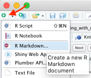
```

## Code chunks

Within R Markdown files are code "chunks"

This is where you can type R code and run it!

```{r, out.width = "80%", echo = FALSE, fig.align='center'}
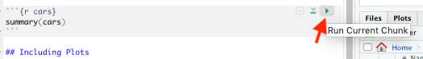
```

## Create Chunks

To create a new R code chunk:

Copy paste an existing chunk in the R Markdown file and replace the code **OR**

1)  Use the insert code chunk button at the top of RStudio.

```{r, out.width = "80%", echo = FALSE, fig.align='center'}
knitr::include_graphics("images/insert_chunk.png")
```

2)  Select R as the language:

```{r, out.width = "13%", echo = FALSE, fig.align='center'}
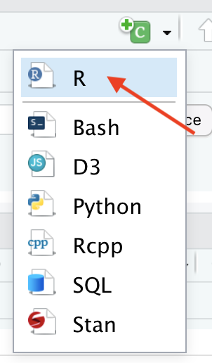
```

## Run previous chunks button

You can run all chunks above a specific chunk using this button:

```{r echo=FALSE, fig.align='center', out.width="80%"}
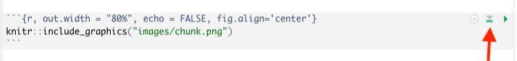
```

## Chunk settings

```{r echo=FALSE, fig.align='center', out.width="80%"}
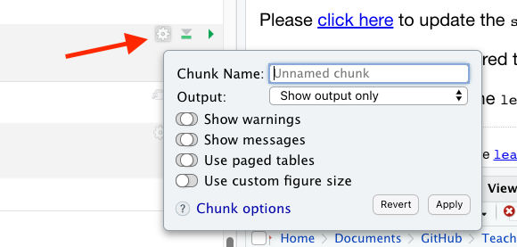
```

## Chunk settings

You can specify if a chunk will be seen in the report or not.

```{r echo=FALSE, fig.align='center', out.width="80%"}
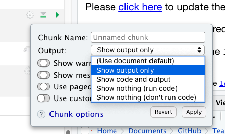
```

## Knit file to html

This will create a report from the R Markdown document!

```{r, fig.alt="knit", out.width = "100%", echo = FALSE, fig.align='center'}
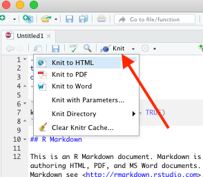
```

## Useful R Studio Shortcuts

-   `Ctrl + Enter` in your script evaluates that line of code
    -   It's like copying and pasting the code into the console for it to run.
-   `Ctrl+1` takes you to the script page
-   `Ctrl+2` takes you to the console
-   <http://www.rstudio.com/ide/docs/using/keyboard_shortcuts>


## Summary

-  RStudio makes working in R easier
-  the Editor is for static code like scripts or R Markdown documents
-  The console is for testing code
-  R markdown documents are really helpful for lots of reasons!
-  R code goes within what is called a chunk
-  Code chunks can be modified so that they show differently in reports

🏠 [Class Website](https://jhudatascience.org/intro_to_r/)

💻 [Lab](https://jhudatascience.org/intro_to_r/modules/RStudio/lab/RStudio_Lab.Rmd)


