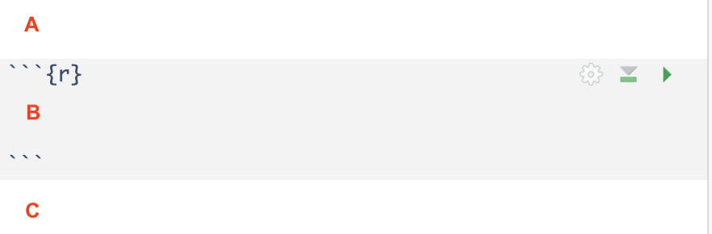

```{r, echo = FALSE}
library(knitr)
opts_chunk$set(comment = "")
```


## Working with R -- RStudio

RStudio is an Integrated Development Environment (IDE) for R and it helps you:

-   write code - makes suggestions
-   view the output of your code, including plots
-   find errors
-   manage files
-   view documentation


```{r, fig.alt="RStudio logo", out.width = "30%", echo = FALSE, fig.align='center'}
knitr::include_graphics("https://d33wubrfki0l68.cloudfront.net/62bcc8535a06077094ca3c29c383e37ad7334311/a263f/assets/img/logo.svg")
```

<sub>[[source](https://www.rstudio.com/)]</sub>

RStudio used to be the name of a company that is now called [Posit](https://posit.co/).


## RStudio

First it is important to be familiar with the layout. When you first open RStudio, you will see 3 panes.

```{r, fig.align='center', out.width="70%", echo = FALSE, fig.alt= "When RStudio is first opened you will see 3 panes"}
knitr::include_graphics("images/three_panes.png")
```


<!-- ## Pane 1 (Left side) for writing code -->

<!-- ```{r, fig.align='center', out.width="60%", echo = FALSE, fig.alt= "The left pane is for writing code."} -->
<!-- knitr::include_graphics("images/Pane1_for_writing.png") -->
<!-- ``` -->

<!-- ## Pane 2 - where objects will be -->

<!-- We will start seeing this tomorrow! -->

<!-- ```{r, fig.align='center', out.width="60%", echo = FALSE, fig.alt= "We we see objects"} -->
<!-- knitr::include_graphics("images/pane2.png") -->
<!-- ``` -->

<!-- ## Pane 3 - where we get help and see plots -->

<!-- ```{r, fig.align='center', out.width="60%", echo = FALSE, fig.alt= "The left pane is for writing code."} -->
<!-- knitr::include_graphics("images/pane3.png") -->
<!-- ``` -->

## Hidden Pane

To save a copy of your code. You must open a file first - this will open a 4th pane. These files include Scripts or what are called R Markdown files.

```{r, out.width = "90%", echo = FALSE}
knitr::include_graphics("images/start_R_markdown.png")
```

## Hidden Pane

You will see a popup that you can just say "OK" to for now.

```{r, out.width = "90%", echo = FALSE}
knitr::include_graphics("images/rmarkdown_popup.png")
```

## Hidden Pane

Nice! now we have a place to save code! This is where we will mostly be working.

```{r, out.width = "90%", echo = FALSE}
knitr::include_graphics("images/new_pane.png")
```


## Working with R in R Studio - 2 major panes:

1)  The **Source/Editor**: 

    -   Top by default
    -   **saves your code** 
    
2)  The **R Console**:

    -   Bottom by default
    -   Calculator
    -   Place to try things out, then add to your editor
    -   **doesn't save your code**
    
## RStudio

Super useful "cheatsheet": [LINK](https://raw.githubusercontent.com/rstudio/cheatsheets/main/rstudio-ide.pdf)

```{r, fig.alt="RStudio", out.width = "65%", echo = FALSE, fig.align='center'}
knitr::include_graphics("images/rstudio_sheet.png")
```

## R Markdown files look different form scripts

It will look like this with text in it.

```{r, fig.alt="RStudio layout", out.width = "100%", echo = FALSE, fig.align='center'}
knitr::include_graphics("images/first_markdown.png")
```

## Scripts will just be empty

```{r, out.width = "90%", echo = FALSE}
knitr::include_graphics("images/rstudio_script.png")
```

## Scripts and R Markdown

Although people will use scripts often, and they are good for more programmatic purposes, we generally don't recommend them for Public Health Researchers.

For data analyses, R Markdown files are generally superior because they allow you to check your code and write more info about your code.


## Workspace/Environment

<!--  -->

```{r, out.width = "90%", echo = FALSE}
knitr::include_graphics("images/rstudio_environment.png")
```

## Workspace/Environment

-   Tells you what **objects** are in R
-   What exists in memory/what is loaded?/what did I read in?

**History**

-   Shows previous commands. Good to look at for debugging, but **don't rely** on it.\
    Instead use RMarkdown!
-   Also type the "up" key in the Console to scroll through previous commands

## Lower Right Pane

-   **Files** - shows the files on your computer of the directory you are working in
-   **Viewer** - can view data or R objects
-   **Help** - shows help of R commands
-   **Plots** - pictures and figures
-   **Packages** - list of R packages that are loaded in memory


## RStudio Layout

If RStudio doesn't look the way you want (or like our RStudio), then:

Click on the pane button, which looks like a waffle with 4 indentations.
Scroll down to "Pane Layout".

```{r, fig.align='center', out.width="80%", echo = FALSE, fig.alt= "Pane button."}
knitr::include_graphics("images/pane_button.png")
```
<!-- ## Source/Editor  -->


## Default Layout

```{r, fig.align='center', out.width="60%", echo = FALSE, fig.alt= "The Pane Layout menu allows you to modify the layout of RStudio. This shows the default settings with Source on the top left, Console on the bottom left, Environment, History, Connections, and Build on the top right, and Files, Plots, Packages, Help, VCS (version control) on the bottom right."}
knitr::include_graphics("images/pane_layout.png")
```


## R Markdown file

R Markdown files (.Rmd) help generate reports that include your code and output.

1.  Helps you describe your code
2.  Allows you to check the output
3.  Can create many different file types


## Code chunks

Within R Markdown files are code "chunks".

This is where you can type R code and run it! 

```{r, out.width = "80%", echo = FALSE, fig.align='center'}
knitr::include_graphics("images/chunk.png")
```

## Run code in a chunk

Clicking the run (play) button runs the code in the chunk.

```{r, out.width = "80%", echo = FALSE, fig.align='center'}
knitr::include_graphics("images/chunk.png")
```

`Ctrl + Enter` on Windows or `Command + Enter` on Mac in your script evaluates that line of code

## Running a chunk executes the code

- generally see a preview of the output of the code just below the chunk
- see the code in the console

```{r, out.width = "80%", echo = FALSE, fig.align='center'}
knitr::include_graphics("images/output.png")
```

## If you get annoyed by code previews in Markdown files...

See the [Help page](https://jhudatascience.org/intro_to_r/help.html) of the website. You can adjust this and change your RStudio settings:

Tools > Global Options > Appearance

## Knit file to html

Running all chunks - this will create a report from the R Markdown document! Note that it can't use anything not included in the file, it can't use objects in your environment that you were modifying interactively.

```{r, fig.alt="knit", out.width = "40%", echo = FALSE, fig.align='center'}
knitr::include_graphics("images/knit.png")
```


## Nice report!

This generates a nice report that you can share with others who can open in any browser.

```{r, fig.alt="knit", out.width = "100%", echo = FALSE, fig.align='center'}
knitr::include_graphics("images/report.png")
```


## Create Chunks

To create a new R code chunk:

- Use the insert code chunk button at the top of RStudio.

```{r, out.width = "80%", echo = FALSE, fig.align='center'}
knitr::include_graphics("images/insert_chunk.png")
```

- Select R (default) as the language:

```{r, out.width = "13%", echo = FALSE, fig.align='center'}
knitr::include_graphics("images/select_R.png")
```

## Create Chunks

 If you like keyboard shortcuts: 
 
 - Windows & Linux use Ctrl+Alt+I
 - Mac use Command+Option+I

I is for insert.
 
## Run previous chunks button

You can run all chunks above a specific chunk using this button:

```{r echo=FALSE, fig.align='center', out.width="80%"}
knitr::include_graphics("images/previous_chunks.png")
```

## Errors

R studio can help you find issues in your code.
Note that sometimes the error occurs earlier than RStudio thinks.

```{r echo=FALSE, fig.align='center', out.width="80%"}
knitr::include_graphics("images/errors.png")
```


## Recap of where code goes

- you can test code in the console

```{r, fig.alt="knit", out.width = "90%", echo = FALSE, fig.align='center'}
knitr::include_graphics("images/where_code_console.png")
```

- you can save code in a chunk in the editor (Markdown file)

```{r, fig.alt="knit", out.width = "90%", echo = FALSE, fig.align='center'}
knitr::include_graphics("images/where_code.png")
```

## Gut Check

Why are R Markdown files so useful?

A) They let you test your code
B) They let you view the output of your code
C) They let you generate cool reports 
D) All of the above

## Gut Check 

Where does code go typically in an Rmd file?

```{r, fig.alt="help_pane", out.width = "90%", echo = FALSE, fig.align='center'}

```

## Gut Check

Which button do you click to run the code in a current chunk?

```{r, fig.alt="help_pane", out.width = "90%", echo = FALSE, fig.align='center'}
knitr::include_graphics("images/chunk_gut_check.png")
```

## Getting help from the preview 

When you type in a function name, a pop up will preview documentation to help you. It also helps you remember the name of the function if you don't remember all of it!

```{r, fig.alt="preview a function", out.width = "80%", echo = FALSE, fig.align='center'}
knitr::include_graphics("images/preview1.png")
```

```{r, fig.alt="preview a function", out.width = "80%", echo = FALSE, fig.align='center'}
knitr::include_graphics("images/preview2.png")
```


## Get help with the help pane

```{r, fig.alt="help_pane", out.width = "90%", echo = FALSE, fig.align='center'}
knitr::include_graphics("images/help_pane.png")
```

## Getting Help with `?`

If you know the name of a package or function: 

Type `?package_name` or `?function_name` in the console to get information about packages and functions.

For example: `?readr` or `?read_csv`.

```{r, fig.alt="getting help", out.width = "90%", echo = FALSE, fig.align='center'}
knitr::include_graphics("images/gettinghelp.png")
```


## Double Question Mark

If you haven't loaded a package yet into R than you may get a response that there is no documentation.

Typing in `??package_name` can show you packages that you haven't loaded yet.

```{r, fig.alt="help_pane", out.width = "90%", echo = FALSE, fig.align='center'}
knitr::include_graphics("images/double_question.png")
```


## Summary

-  RStudio makes working in R easier
-  the Editor (top) is for static code like scripts or R Markdown documents
-  The console is for testing code (bottom) - best to save your code though!
-  R markdown documents are really helpful for lots of reasons!
-  R code goes within what is called a chunk (the gray box with a green play button)


🏠 [Class Website](https://jhudatascience.org/intro_to_r/)
💻 [Lab](https://jhudatascience.org/intro_to_r/modules/RStudio/lab/RStudio_Lab.Rmd)
📃 [Posit Cheatsheet](https://raw.githubusercontent.com/rstudio/cheatsheets/main/rstudio-ide.pdf)
📃 [Day 1 Cheatsheet](https://jhudatascience.org/intro_to_r//modules/cheatsheets/Day-1.pdf)

```{r, fig.alt="The End", out.width = "25%", echo = FALSE, fig.align='center'}
knitr::include_graphics(here::here("images/the-end-g23b994289_1280.jpg"))
```

Image by <a href="https://pixabay.com/users/geralt-9301/?utm_source=link-attribution&amp;utm_medium=referral&amp;utm_campaign=image&amp;utm_content=812226">Gerd Altmann</a> from <a href="https://pixabay.com//?utm_source=link-attribution&amp;utm_medium=referral&amp;utm_campaign=image&amp;utm_content=812226">Pixabay</a>


# Extra Slides

## Chunk settings

```{r echo=FALSE, fig.align='center', out.width="80%"}
knitr::include_graphics("images/chunk_settings.png")
```

## Chunk settings

You can specify if a chunk will be seen in the report or not.

```{r echo=FALSE, fig.align='center', out.width="80%"}
knitr::include_graphics("images/chunk_settings2.png")
```


## Rainbow Parentheses

Tools --> Global Options --> Code --> Display --> Use rainbow parentheses

This can help you see your code more easily.

Press enter to save this setting and get out of this menu.

<br>
<br>

```{r echo=FALSE, fig.align='center', out.width="80%"}
knitr::include_graphics("https://posit.co/wp-content/themes/Posit/public/markdown-blogs/rstudio-1-4-preview-rainbow-parentheses/colorfulCode.png")
```
