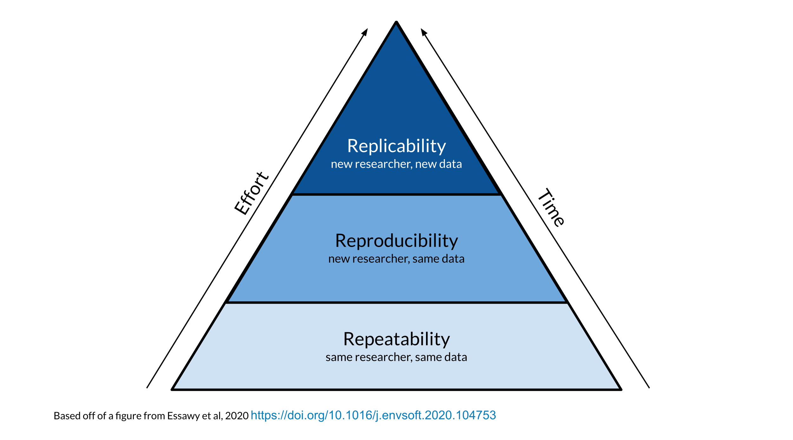
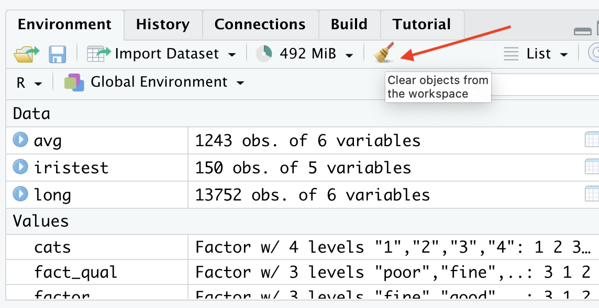
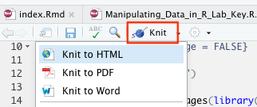
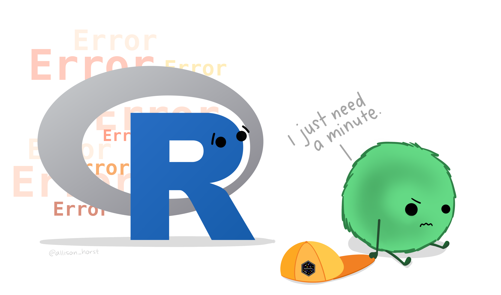
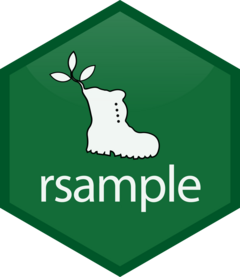
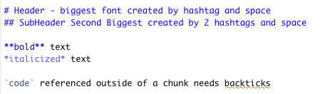
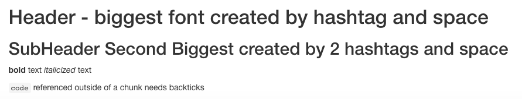
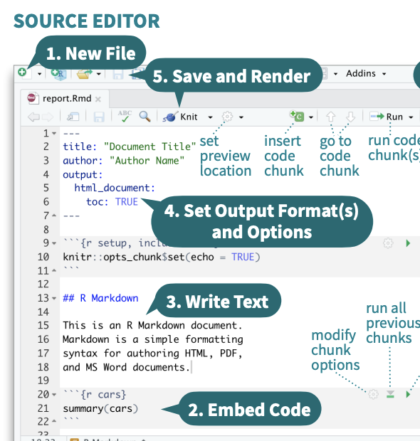

---
title: "Reproducibility"
output:
  ioslides_presentation:
    css: ../../docs/styles.css
    widescreen: yes
--- 

```{r include=FALSE}
knitr::opts_chunk$set(echo = FALSE, message = FALSE, comment=FALSE, warning=FALSE)
```

```{r}
# from these slides: https://docs.google.com/presentation/d/1-cauITbscmnDEDt5IqrZOLlCjyhzEOZY5fqwVY7l8tQ/edit?usp=sharing
library(knitr)
opts_chunk$set(comment = "")
library(readr)
suppressPackageStartupMessages(library(dplyr))
library(tidyverse)
library(devtools)
library(remotes)
install.packages("ottrpal", repos = "https://cloud.r-project.org", quiet = TRUE)
library(ottrpal)
library(patchwork)
```

## What's Reproducibility

```{r, fig.alt="session info", out.width = "80%", echo = FALSE, fig.align='center'}
ottrpal::include_slide("https://docs.google.com/presentation/d/1-cauITbscmnDEDt5IqrZOLlCjyhzEOZY5fqwVY7l8tQ/edit#slide=id.gf1accd298e_0_146")
```

Content adapted from [Candace Savonen](https://www.cansavvy.com/).

##

```{r, fig.alt="session info", out.width = "80%", echo = FALSE, fig.align='center'}
ottrpal::include_slide("https://docs.google.com/presentation/d/1-cauITbscmnDEDt5IqrZOLlCjyhzEOZY5fqwVY7l8tQ/edit#slide=id.gf1accd298e_0_0")
```

##

```{r, fig.alt="session info", out.width = "80%", echo = FALSE, fig.align='center'}
ottrpal::include_slide("https://docs.google.com/presentation/d/1-cauITbscmnDEDt5IqrZOLlCjyhzEOZY5fqwVY7l8tQ/edit#slide=id.gf1accd298e_0_413")
```

## 

```{r, fig.alt="session info", out.width = "80%", echo = FALSE, fig.align='center'}
ottrpal::include_slide("https://docs.google.com/presentation/d/1-cauITbscmnDEDt5IqrZOLlCjyhzEOZY5fqwVY7l8tQ/edit#slide=id.gf1accd298e_0_368")
```

## 

```{r, fig.alt="session info", out.width = "80%", echo = FALSE, fig.align='center'}
ottrpal::include_slide("https://docs.google.com/presentation/d/1-cauITbscmnDEDt5IqrZOLlCjyhzEOZY5fqwVY7l8tQ/edit#slide=id.gf1accd298e_0_464")
```

## Reproducibility vs Repeatability vs Replicability

```{r, fig.alt="session info", out.width = "70%", echo = FALSE, fig.align='center'}

```

## Why Reproducibility is important...

```{r, fig.alt="session info", out.width = "80%", echo = FALSE, fig.align='center'}
ottrpal::include_slide("https://docs.google.com/presentation/d/1-cauITbscmnDEDt5IqrZOLlCjyhzEOZY5fqwVY7l8tQ/edit#slide=id.gf1accd298e_0_673")
```

## We can't get to replicability without reproducibility

```{r, fig.alt="session info", out.width = "80%", echo = FALSE, fig.align='center'}
ottrpal::include_slide("https://docs.google.com/presentation/d/1nV7x0mIIE4oWVKxpv4qJNvO17y51MajsERGtzR2qClk/edit#slide=id.g3070a1ee60e_0_0")
```

## It's worth the wait

```{r, fig.alt="session info", out.width = "80%", echo = FALSE, fig.align='center'}
ottrpal::include_slide("https://docs.google.com/presentation/d/1-cauITbscmnDEDt5IqrZOLlCjyhzEOZY5fqwVY7l8tQ/edit#slide=id.gf7bed24491_1_38")
```

##

```{r, fig.alt="session info", out.width = "70%", echo = FALSE, fig.align='center'}
knitr::include_graphics("../../images/lol/reproducibility.jpg")
```

## Reproducibility can also be for your future self!

```{r, fig.alt="session info", out.width = "80%", echo = FALSE, fig.align='center'}
ottrpal::include_slide("https://docs.google.com/presentation/d/1-cauITbscmnDEDt5IqrZOLlCjyhzEOZY5fqwVY7l8tQ/edit#slide=id.gf1cd772e00_0_330")
```

## The process

```{r, fig.alt="session info", out.width = "80%", echo = FALSE, fig.align='center'}
ottrpal::include_slide("https://docs.google.com/presentation/d/1-cauITbscmnDEDt5IqrZOLlCjyhzEOZY5fqwVY7l8tQ/edit#slide=id.g10ab57f2c44_0_221")
```

## R Markdown

```{r, fig.alt="session info", out.width = "80%", echo = FALSE, fig.align='center'}
ottrpal::include_slide("https://docs.google.com/presentation/d/1-cauITbscmnDEDt5IqrZOLlCjyhzEOZY5fqwVY7l8tQ/edit#slide=id.g10ab57f2c44_0_0")
```

## R Markdown lets you test your work

```{r, fig.alt="session info", out.width = "80%", echo = FALSE, fig.align='center'}
ottrpal::include_slide("https://docs.google.com/presentation/d/1-cauITbscmnDEDt5IqrZOLlCjyhzEOZY5fqwVY7l8tQ/edit#slide=id.gf8f405fdab_0_186")
```

## R Markdown allows you to more clearly show what you did

```{r, fig.alt="session info", out.width = "80%", echo = FALSE, fig.align='center'}
ottrpal::include_slide("https://docs.google.com/presentation/d/1-cauITbscmnDEDt5IqrZOLlCjyhzEOZY5fqwVY7l8tQ/edit#slide=id.gf8f405fdab_0_102")
```

## R Markdown makes it easier to update code and see results

```{r, fig.alt="session info", out.width = "80%", echo = FALSE, fig.align='center'}
ottrpal::include_slide("https://docs.google.com/presentation/d/1-cauITbscmnDEDt5IqrZOLlCjyhzEOZY5fqwVY7l8tQ/edit#slide=id.gf9440130d0_0_0")
```

## Clean your environment

Regularly cleaning your environment and trying your code again, can help ensure that your code is running as expected.

Occasionally we might forget to save a step of our code in our R Markdown file that we ran only in the console. This will help us figure that out.

```{r, fig.alt="session info", out.width = "60%", echo = FALSE, fig.align='center'}

```

## Check if your file knits regularly {.small}

Regularly checking if your file knits will help you spot a missing step or error earlier when you have less code to try to identify where your code might have gone wrong.

```{r, fig.alt="session info", out.width = "35%", echo = FALSE, fig.align='center'}

```

```{r, fig.alt="session info", out.width = "35%", echo = FALSE, fig.align='center'}

```

Image by [Allison Horst](https://allisonhorst.com/data-science-art).

## Tell your future self and others what you did! {.small}

Provide sufficient detail so that you can understand what you did and why.

```{r, echo = TRUE}
# Taking a random sample of 100 individuals from the population
# WITHOUT replacement
samp_pop <- sample(100, replace = FALSE)

# Then split them into two groups of 50
# a[x:xx] is the syntax for indexing a vector
samp_pop1 <- samp_pop[1:50]
samp_pop2 <- samp_pop[51:100]
```

```{r, fig.alt="session info", out.width = "25%", echo = FALSE, fig.align='center'}

```

Image by [Allison Horst](https://allisonhorst.com/data-science-art).

## Need random numbers to stay consistent?

Use `set.seed()`: sets the starting state for the random number generator.

```{r, echo = TRUE}
set.seed(123)
sample(10)
set.seed(123)
sample(10)
set.seed(456)
sample(10)
```

Note that these are only pseudo random and the values are created doing calculations based on the given seed. Thus the same "random" values will be reproduced by everyone using the same seed with `set.seed`.

## `set.seed()` visualization {.smaller}

```{r, echo = TRUE, fig.height=3}
Aset <- data.frame(x = rnorm(100)) # no seed
Bset <- data.frame(x = rnorm(100)) # no seed
set.seed(111); Cset <- data.frame(x = rnorm(100)) # set seed = 111
set.seed(111); Dset <- data.frame(x = rnorm(100)) # set seed = 111
randomA <- ggplot(Aset) + geom_histogram(aes(x = x)) + ggtitle("no seed")
randomB <- ggplot(Bset) + geom_histogram(aes(x = x)) + ggtitle("no seed")
randomC <- ggplot(Cset) + geom_histogram(aes(x = x)) + ggtitle("seed = 111")
randomD <- ggplot(Dset) + geom_histogram(aes(x = x)) + ggtitle("seed = 111")
randomA + randomB + randomC + randomD + plot_layout(ncol = 4) # combine plots with patchwork
```

## Very helpful for bootstrapping

```{r, fig.alt="Rsample", out.width = "10%", echo = FALSE, fig.align='center'}

```

https://rsample.tidymodels.org/reference/bootstraps.html

## R Markdown syntax

Before:
```{r, fig.alt="Markdown sytax before rendering", out.width = "60%", echo = FALSE, fig.align='center'}

```

After knit:
```{r, fig.alt="Result of markdown sytax after rendering", out.width = "70%", echo = FALSE, fig.align='center'}

```

## R Markdown syntax

Go to the RStudio toolbar: Help > Cheat Sheets > R Markdown Cheat Sheet (which will download it)

Or Help > Cheat Sheets > R Markdown Reference Guide

```{r, fig.alt="The End", out.width = "35%", echo = FALSE, fig.align='center'}

```

## Additional references

Or check out the 🏠 [Class Website](https://jhudatascience.org/intro_to_r/)! The [Resources](https://jhudatascience.org/intro_to_r/resources.html) page has links to additional helpful cheat sheets.

## Versions matter

```{r, fig.alt="session info", out.width = "80%", echo = FALSE, fig.align='center'}
ottrpal::include_slide("https://docs.google.com/presentation/d/1-cauITbscmnDEDt5IqrZOLlCjyhzEOZY5fqwVY7l8tQ/edit#slide=id.gf62875ddf7_0_404")
```

## Session info can help

```{r, eval = FALSE}
sessionInfo()
```


```{r, fig.alt="session info", out.width = "80%", echo = FALSE, fig.align='center'}
knitr::include_graphics("images/session_info.png")
```

## GUT CHECK

Why is reproducibility so important?

A. It helps to ensure that your code is working consistently and it helps others understand what you did 

B. It ensures that your code is correct 

## GUT CHECK

What is NOT a practice to improve the reproducibility of our work?

A. Using R Markdown files to describe what your code is doing 

B. Using scripts instead of R Markdown files   

C. Testing your code with R Markdown files or the run previous button

D. Regularly cleaning the environment 

## More resources

These are just some quick tips, for more information:

- [Reproducibility in Cancer Informatics course](https://jhudatascience.org/Reproducibility_in_Cancer_Informatics/)
- [Advanced Reproducibility in Cancer Informatics course](https://jhudatascience.org/Adv_Reproducibility_in_Cancer_Informatics)
- [The RMarkdown book](https://bookdown.org/yihui/rmarkdown/)
- [Jenny Bryan's organizational strategies](https://www.stat.ubc.ca/~jenny/STAT545A/block19_codeFormattingOrganization.html).
- [Write efficient R code for science](https://www.earthdatascience.org/courses/earth-analytics/automate-science-workflows/write-efficient-code-for-science-r/).

## Summary

To help make your work more reproducible:

- Use RMarkdown
- Clean your environment regularly
- Check the knit of your RMarkdown regularly
- Tell your future self and others what you did!
- Print session info!

## Resources & Lab {.small}

🏠 [Class Website](https://jhudatascience.org/intro_to_r/)

💻 [Lab](https://jhudatascience.org/intro_to_r/modules/Reproducibility/lab/Reproducibility_Lab.Rmd)

🗒 [Day 1 Cheatsheet](https://jhudatascience.org/intro_to_r/modules/cheatsheets/Day-1.pdf)

🗒 [RStudio Cheatsheet](https://d33wubrfki0l68.cloudfront.net/374f4c769f97c4ded7300d521eb59b24168a7261/c72ad/lesson-images/cheatsheets-1-cheatsheet.png)

```{r, fig.alt="The End", out.width = "35%", echo = FALSE, fig.align='center'}
knitr::include_graphics(here::here("images/the-end-g23b994289_1280.jpg"))
```

Image by <a href="https://pixabay.com/users/geralt-9301/?utm_source=link-attribution&amp;utm_medium=referral&amp;utm_campaign=image&amp;utm_content=812226">Gerd Altmann</a> from <a href="https://pixabay.com//?utm_source=link-attribution&amp;utm_medium=referral&amp;utm_campaign=image&amp;utm_content=812226">Pixabay</a>
