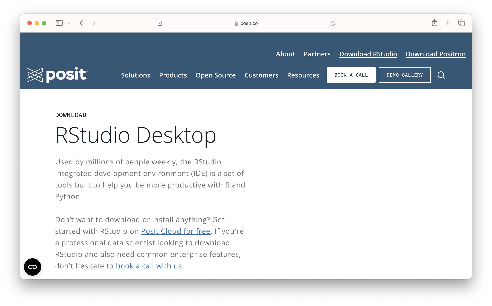
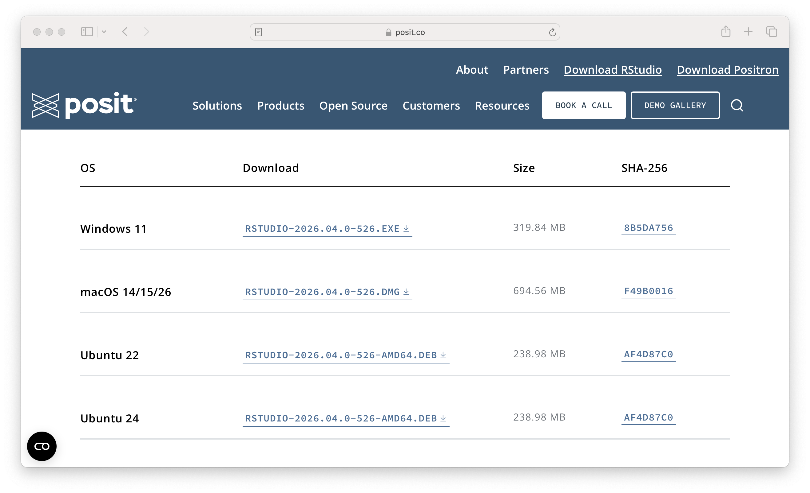
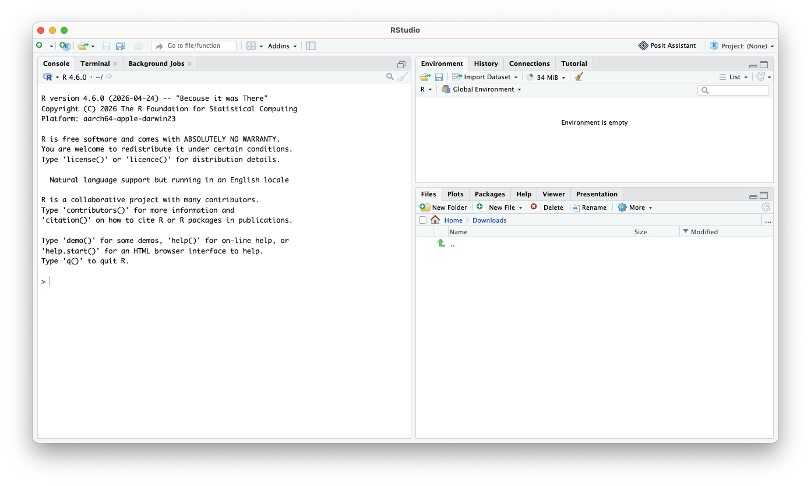
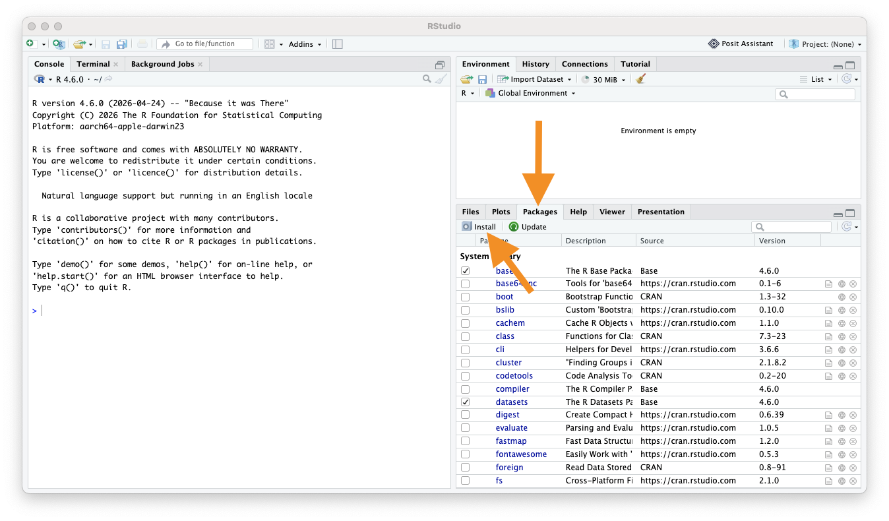
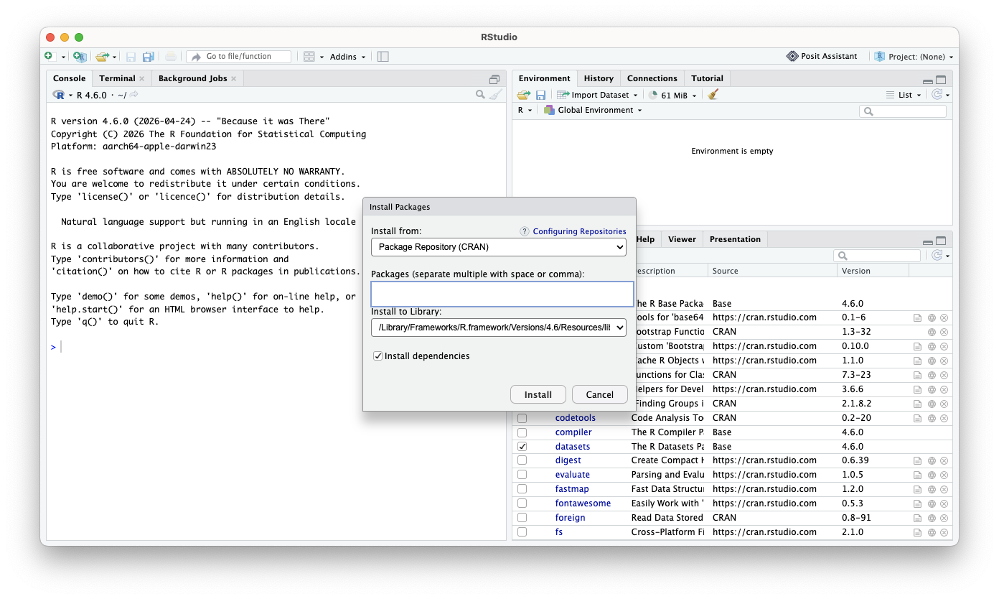
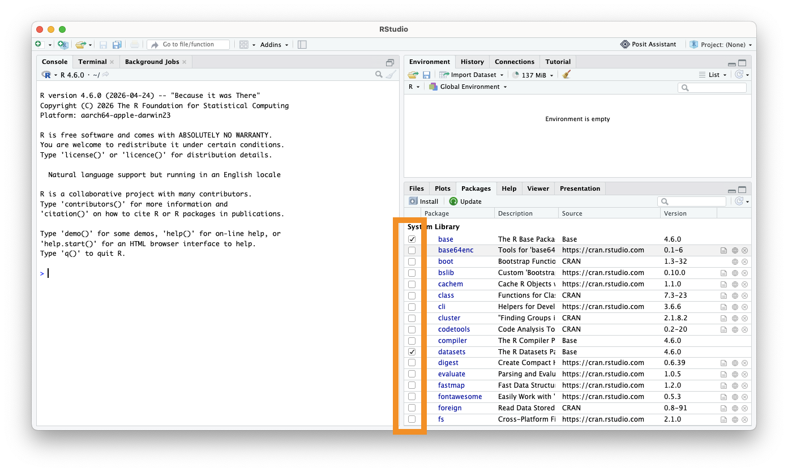
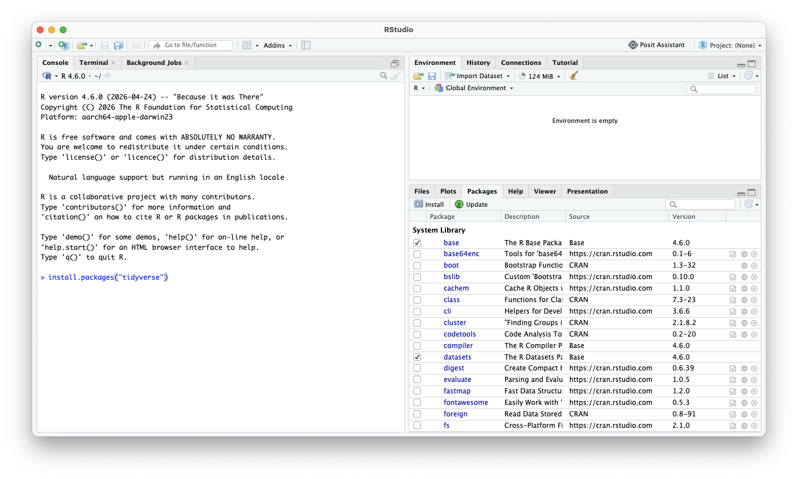
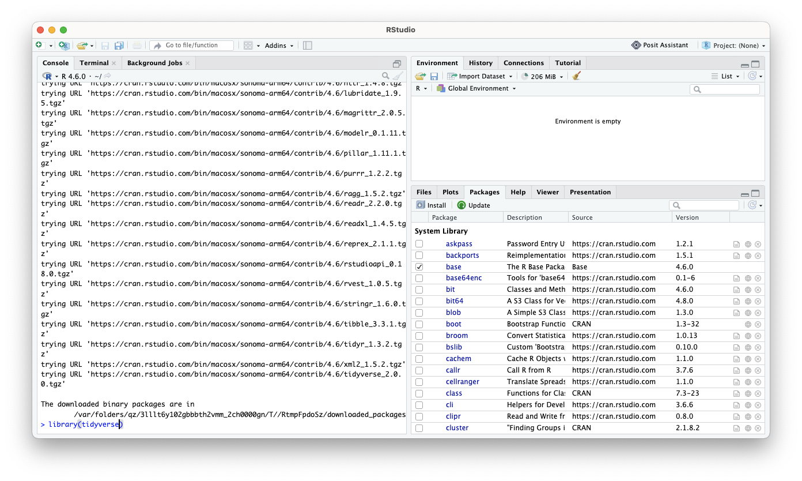
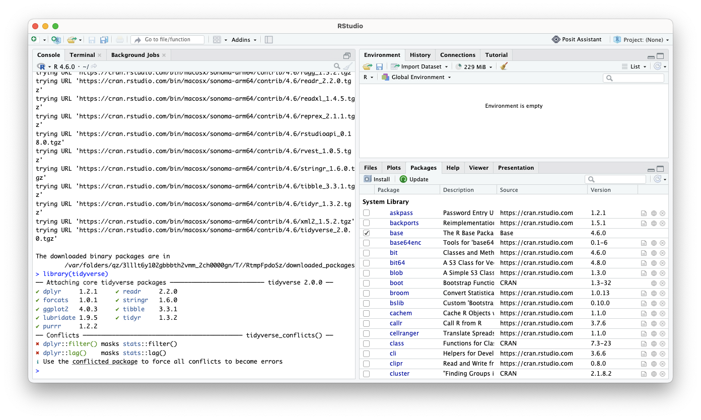

`R` is a powerful analytical language and contains a number of useful packages for analyzing data.

`RStudio` is a free and open-source integrated development environment (IDE) for R. `RStudio` provides comprehensive facilities to `R` programmers and is highly recommended in this class.

Please complete the following before the start of the class to hit the ground running.

Sections:

-   [Installing `R`](#installing-r)
-   [Installing `RStudio`](#installing-rstudio)
-   [`R` packages](#r-packages)
    -   [Installing `R` Packages (Point and Click)](#installing-r-package-manual)
    -   [Installing `R` Packages (Code)](#installing-r-package-code)
    -   [Exercise: Install an `R` package](#exercise-install-r-package)  

## Installing `R` {#installing-r}

We recommend installing the most recent version or `R` `r config::get("r_version")`. **If you have had installed `R` already some time ago, we recommend updating/reinstalling it to the most recent version.** Use a link below to launch download of `R` installers (if the download does not start, a fix may be to copy-paste the below link to your browser):

-   [Download For Mac users (M1 chip)](`r config::get("r_dl_mac_m1")`)

-   [Download For Mac users (Intel chip)](`r config::get("r_dl_mac_intel")`)

-   [Download For Windows users](`r config::get("r_dl_windows")`)

For other operating systems, or if you prefer to access the download link from the official website, visit <https://cran.r-project.org/> and select `Download R for Linux`, `Download R for macOS` or `Download R for Windows` based on which device you have.

Once the proper installer has been selected, run the installer and follow the on-screen directions. This installation includes the `R` language and a basic graphical user interface (GUI). Rather using the basic GUI, we recommend installing `RStudio` - an integrated development environment (IDE) that lets you interact with `R` with some added benefits.

## Installing `RStudio` {#installing-rstudio}

To install `RStudio`, visit <https://posit.co/download/rstudio-desktop/>. The website should look something like this:



Once on the website, scroll down and select the proper installation file for your platform (Windows, Mac, etc.). Open up the installer and follow the directions to install RStudio. 

**Note** that your operating system may be **too old** to install the current version of RStudio. If this is the case try installing progressively older versions found [here](https://www.rstudio.com/products/rstudio/older-versions/) until it works. You will know if it worked if you try to open RStudio and you see an interface without a message about things going poorly.



When you open up `RStudio`, it should look like this:



When you open RStudio for the first time, there are three main windows.

-   The **Console** is the left window where you can run lines of code and see the output.

-   The **Environment** is the upper-right window where you can manage your data and variables and see previous commands entered (under the "History" tab).

-   The **Files** is the bottom-right window where you can look at directories, install packages, see plots, and look at help files for various `R` commands.

You can customize the look of your RStudio IDE in `Tools > Global Options...`.

### Troubleshooting the Installation Process

If you run into trouble, did you install the correct version of software for your operating system?

- Check that you installed the version right for your type of system, (`macOS` vs `Windows` for example).

- Check if maybe you need a different version for the age of your system. First, check that your version of R was suitable.

- There are multiple versions for different `macOS` systems. You can check the apple icon (top left corner) and "About This Mac" to learn more about the age of your operating system. If your operating system is older (and you can't update it), try installing progressively older versions found [here](https://www.rstudio.com/products/rstudio/older-versions/) until it works. You will know if it worked if you try to open RStudio and you see an interface without a message about things going poorly. Here you can see an [example](https://community.rstudio.com/t/rstudio-desktop-crashes-on-startup-with-library-not-loaded/130296) of this. Unfortunately, the documentation is poor about what older versions work for which operating systems.

- If you get an error about something called "Rtools", You probably need some add-on software for a Windows machine. Note that this is not an additional R package to install. Here is a quick guide to installing Rtools: [link](https://docs.google.com/viewer?url=https://raw.githubusercontent.com/jhudsl/intro_to_r/main/resources/rtools_windows.pdf).

## `R` packages {#r-packages}

Packages are the fundamental units of reproducible `R` code. They are collections of `R` code that typically share some common purpose. 

Examples:

- `dplyr` - package of functions for fast data set manipulation (subsetting, summarizing, rearranging, and joining together data sets);

- `ggplot2` - "R's famous package for making beautiful graphics"; allows to build multiple-layers, highly customizable plots.

You can install a package via point-and-click methods or with code.

### Installing `R` Package (Point and Click) {#installing-r-package-manual}

First, click on the "Packages" tab, followed by the "Install" Button.


Select "Package Repository (CRAN)" and type in the name of the package you want to install.


To load the package, check the box next to the package name.



### Installing `R` Package (Code) {#installing-r-package-code}

To install an `R` package, type in the `RStudio` console

```
install.packages("replace_with_package_name")
```

Press enter to execute the command.

Once a package is installed, to use its contents in current `R` session, we run in the `RStudio` console the command

```
library(replace_with_package_name)
```

(Note the difference in presence of the quotation mark in the two above commands.)

### Exercise: Install an `R` package {#exercise-install-r-package}

Use the above to install the `tidyverse` package. Execute the `library(...)` command above to check if the package loads successfully.







If you want extra practice, we will also be using the packages `rmarkdown`, `naniar`, and `janitor`.
