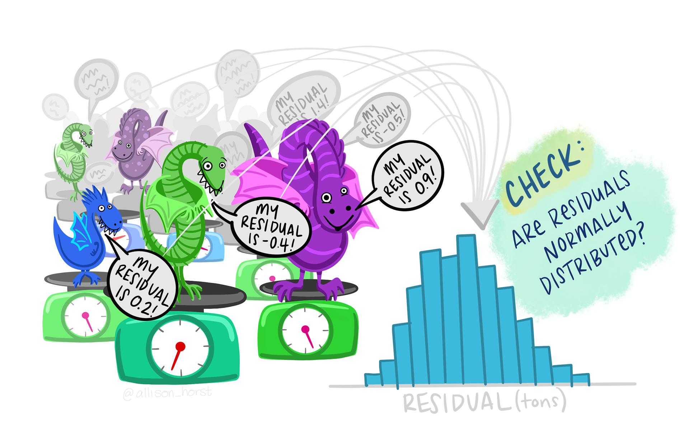

```{r knit-setup, include=FALSE}
knitr::opts_chunk$set(
  echo = TRUE,
  message = FALSE,
  warning = FALSE,
  fig.height = 4,
  fig.width = 7,
  comment = ""
)
library(tidyverse)
library(emo)
options(scipen = 999)
```

## Summary: Data visualization

- `ggplot()` specifies what data to use and what variables will be mapped to where
- inside `ggplot()`, `aes(x = , y = , color = )` specify what variables correspond to what aspects of the plot in general
- layers of plots can be combined using the `+` at the **end** of lines
- use `geom_line()` and `geom_point()` to add lines and points
- sometimes you need to add a `group` element to `aes()` if your plot looks strange
- make sure you are plotting what you think you are by checking the numbers!
- `facet_grid(~variable)` and `facet_wrap(~variable)` can be helpful to quickly split up your plot

## Summary: Factors

- the factor class allows us to have a different order from alphanumeric for categorical data
- we can change data to be a factor variable using `mutate()`, `as_factor()` (in the `forcats` package), or `factor()` functions and specifying the levels with the `levels` argument
- `fct_reorder({variable_to_reorder}, {variable_to_order_by})` helps us reorder a variable by the values of another variable
- arranging, tabulating, and plotting the data will reflect the new order

## Overview

We will cover how to use R to compute some of basic statistics and fit some basic statistical models. 

* Correlation
* T-test
* Linear Regression / Logistic Regression

<br>

## 

```{r, fig.alt="I was told there would be no math", out.width = "70%", echo = FALSE, fig.show='hold',fig.align='center'}
knitr::include_graphics("https://c.tenor.com/O3x8ywLm380AAAAd/chevy-chase.gif")
```

## Overview

::: {style="color: red;"}
`r emo::ji("rotating_light")` We will focus on how to use R software to do these. We will be glossing over the statistical **theory** and "formulas" for these tests. Moreover, we do not claim the data we use for demonstration meet **assumptions** of the methods. `r emo::ji("rotating_light")`
:::

There are plenty of resources online for learning more about these methods, as well as dedicated Biostatistics series (at different advancement levels) at the JHU School of Public Health.

Check out [www.opencasestudies.org](https://www.opencasestudies.org/) for deeper dives on some of the concepts covered here and the [resource page](https://jhudatascience.org/intro_to_r/resources.html) for more resources.

# Correlation

## Correlation

The correlation coefficient is a summary statistic that measures the strength of a linear relationship between two numeric variables.

- The strength of the relationship - based on how well the points form a line
- The direction of the relationship - based on if the points progress upward or downward

```{r, fig.alt="The End", out.width = "90%", echo = FALSE, fig.align='center'}
knitr::include_graphics("https://www.mathsisfun.com/data/images/correlation-examples.svg")
```
[source](https://www.mathsisfun.com/data/correlation.html)

See this [case study](https://www.opencasestudies.org/ocs-bp-co2-emissions/#Data_Analysis) for more information.

## Correlation

Function `cor()` computes correlation in R.

```
cor(x, y = NULL, use = c("everything", "complete.obs"),
    method = c("pearson", "kendall", "spearman"))
```
- provide two numeric vectors of the same length (arguments `x`, `y`), or
- provide a data.frame / tibble with numeric columns only
- by default, Pearson correlation coefficient is computed

## Correlation test

Function `cor.test()` also computes correlation and tests for association.

```
cor.test(x, y = NULL, alternative(c("two.sided", "less", "greater")),
    method = c("pearson", "kendall", "spearman"))
```
- provide two numeric vectors of the same length (arguments `x`, `y`), or
- provide a data.frame / tibble with numeric columns only
- by default, Pearson correlation coefficient is computed
- alternative values:
   - two.sided means true correlation coefficient is not equal to zero (default)
   - greater means true correlation coefficient is > 0 (positive relationship)
   - less means true correlation coefficient is < 0 (negative relationship)

## GUT CHECK!

What class of data do you need to calculate a correlation?

A. Character data

B. Factor data

C. Numeric data

## Correlation {.codesmall}

Using the Charm City Circulator data.

```{r cor1, comment="", message = FALSE}
circ <- read_csv("https://jhudatascience.org/intro_to_r/data/Charm_City_Circulator_Ridership.csv")
head(circ)
```

## Correlation for two vectors {.smaller}

First, we compute correlation by providing two numeric vectors.

Like other functions, if there are `NA`s, you get `NA` as the result.  But if you specify to use only the complete observations, then it will give you correlation using the non-missing data. 

```{r}
# x and y must be numeric vectors
x <- circ %>% pull(orangeAverage)
y <- circ %>% pull(purpleAverage)
```

```{r,fig.width=3, fig.height=3}
# have to specify which data on each axis
# can accomodate missing data
plot(x, y)
```

## Correlation coefficient calculation and test

```{r}
library(broom)
cor(x, y)
cor(x, y, use = "complete.obs")
cor.test(x, y)
```

## Broom package

The `broom` package helps make stats results look tidy

```{r}
cor_result <- tidy(cor.test(x, y))
glimpse(cor_result)
```

## Correlation for two vectors with plot {.smaller}

In plot form... `geom_smooth()` and `annotate()` can help.

```{r}
corr_value <- pull(cor_result, estimate) %>% round(digits = 4)
cor_label <- paste0("R = ", corr_value)
circ %>%
  ggplot(aes(x = orangeAverage, y = purpleAverage)) +
  geom_point(size = 0.3) +
  geom_smooth() +
  annotate("text", x = 2000, y = 7500, label = cor_label)
```

## Correlation for data frame columns

We can compute correlation for all pairs of columns of a data frame / matrix. This is often called, *"computing a correlation matrix"*.

Columns must be all numeric! 

```{r}
circ_subset_Average <- circ %>% select(ends_with("Average"))
head(circ_subset_Average)
```

## Correlation for data frame columns

We can compute correlation for all pairs of columns of a data frame / matrix. This is often called, *"computing a correlation matrix"*.

```{r}
cor_mat <- cor(circ_subset_Average, use = "complete.obs")
cor_mat
```

## Correlation for data frame columns with plot

`corrplot` package can make correlation matrix plots

```{r, fig.width=4, fig.height=4}
library(corrplot)
corrplot(cor_mat)
```

## Correlation does not imply causation

```{r, fig.alt="Simpson's paradox!", out.width = "75%", echo = FALSE, fig.align='center'}
knitr::include_graphics(here::here("images/lyme_and_fried_chicken_map.png"))
knitr::include_graphics(here::here("images/lyme_and_fried_chicken.png"))
```

[source](http://doi.org/10.1007/s10393-020-01472-1)

# T-test

## T-test

The commonly used are: 

- **one-sample t-test** -- used to test mean of a variable in one group 
- **two-sample t-test** -- used to test difference in means of a variable between two groups (if the "two groups" are data of the *same* individuals collected at 2 time points, we say it is two-sample paired t-test)

The `t.test()` function in R is one to address the above. 

```
t.test(x, y = NULL,
       alternative = c("two.sided", "less", "greater"),
       mu = 0, paired = FALSE, var.equal = FALSE,
       conf.level = 0.95, ...)
```

## Running one-sample t-test {.smaller}

It tests the mean of a variable in one group. By default (i.e., without us explicitly specifying values of other arguments): 

- tests whether a mean of a variable is equal to 0 (`mu = 0`)
- uses "two sided" alternative (`alternative = "two.sided"`)
- returns result assuming confidence level 0.95 (`conf.level = 0.95`)
- omits `NA` values in data

```{r}
sum(is.na(x)) # count NAs in x
t.test(x)
```

## Running two-sample t-test {.small}

It tests the difference in means of a variable between two groups. By default:

- tests whether difference in means of a variable is equal to 0 (`mu = 0`) 
- uses "two sided" alternative (`alternative = "two.sided"`) 
- returns result assuming confidence level 0.95 (`conf.level = 0.95`)
- assumes data are not paired (`paired = FALSE`)
- assumes true variance in the two groups is not equal (`var.equal = FALSE`)
- omits `NA` values in data

Check out this this [case study](https://www.opencasestudies.org/ocs-bp-rural-and-urban-obesity/#Data_Analysis) and this [case study](https://www.opencasestudies.org/ocs-bp-diet/#Data_Analysis) for more information.

## Running two-sample t-test in R

```{r}
sum(is.na(x))
sum(is.na(y)) # count NAs in x and y
t.test(x, y)
```

## T-test: retrieving information from the result with `broom` package 

The `broom` package has a `tidy()` function that can organize results into a data frame so that they are easily manipulated (or nicely printed).

```{r broom, comment=""}
result <- t.test(x, y)
result_tidy <- tidy(result)
glimpse(result_tidy)
```

## P-value adjustment {.smaller}

`r emo::ji("rotating_light")` You run an increased risk of Type I errors (a "false positive") when multiple hypotheses are tested simultaneously. `r emo::ji("rotating_light")`

Use the `p.adjust()` function on a vector of p-values. Use `method = ` to specify the adjustment method:

```{r}
my_pvalues <- c(0.049, 0.001, 0.31, 0.00001)
p.adjust(my_pvalues, method = "BH") # Benjamini Hochberg
p.adjust(my_pvalues, method = "bonferroni") # multiply by number of tests
my_pvalues * 4
```

See [here](https://www.nature.com/articles/nbt1209-1135) for more about multiple testing correction. Bonferroni also often done as p-value threshold divided by number of tests (0.05/test number).

## Some other statistical tests

- `wilcox.test()` -- Wilcoxon signed rank test, Wilcoxon rank sum test
- `shapiro.test()` -- Shapiro-Wilk test of normality
- `ks.test()` -- Kolmogorov-Smirnov test
- `var.test()`-- Fisher’s F-Test
- `chisq.test()` -- Chi-squared test
- `aov()` -- Analysis of Variance (ANOVA)

## Summary

- use `cor()` to calculate correlation between two vectors, `cor.test()` can give more information
- `corrplot()` is nice for a quick visualization!
- `t.test()` one sample test to test the difference in mean of a single vector from zero (one input)
- `t.test()` two sample test to test the difference in means between two vectors (two inputs)
- `tidy()` in the `broom` package is useful for organizing and saving statistical test output
- remember to adjust p-values with `p.adjust()` when doing multiple tests on data

## Lab Part 1

🏠 [Class Website](https://jhudatascience.org/intro_to_r/)  

💻 [Lab](https://jhudatascience.org/intro_to_r/modules/Statistics/lab/Statistics_Lab.Rmd)

# Regression

## Linear regression

Linear regression is a method to model the relationship between a response and one or more explanatory variables. 

Most commonly used statistical tests are actually specialized regressions, including the two sample t-test, [see here for more](https://www.opencasestudies.org/ocs-bp-diet/#(t)-test_and_linear_regression).

## Linear regression notation

Here is some of the notation, so it is easier to understand the commands/results.

$$
y_i = \alpha + \beta x_{i} + \varepsilon_i 
$$
where:

* $y_i$ is the outcome for person i
* $\alpha$ is the intercept
* $\beta$ is the slope (also called a coefficient) - the mean change in y that we would expect for one unit change in x ("rise over run")
* $x_i$ is the predictor for person i
* $\varepsilon_i$ is the residual variation for person i

## Linear regression

```{r,echo=FALSE}
coefs <- lm(data = iris, Petal.Width ~ Petal.Length) %>% coef()

line_df <- data.frame(x = c(0, 7), y = c(coefs[1], (coefs[2] * 7 + coefs[1])))
riserun_df <- data.frame(x = c(2.1, 2.9, 2.9), y = c((coefs[1] + coefs[2] * 2.1), (coefs[1] + coefs[2] * 2.1), (coefs[1] + coefs[2] * 2.9)))
residual_df <- data.frame(x = c(3, 3), y = c(1.1, (coefs[1] + coefs[2] * 3)))
labels_df <- data.frame(x = c(0.5, 3.2, 2.7), y = c(coefs[1], 0.65, 1), labels = c("alpha", "beta", "epsilon[i]"))

print(ggplot(data = iris, aes(x = Petal.Length, y = Petal.Width)) +
  geom_point() +
  geom_line(data = line_df, aes(x = x, y = y)) +
  geom_point(data = line_df[1, ], aes(x = x, y = y, color = "red", size = 1.5)) +
  geom_line(data = riserun_df, aes(x = x, y = y, color = "orange", size = 1.4)) +
  geom_line(data = residual_df, aes(x = x, y = y, color = "blue", size = 1.4)) +
  geom_label(data = labels_df, aes(x = x, y = y, label = labels, size = 2), parse = TRUE) +
  theme_bw() +
  ylab(expression(y)) +
  xlab(expression(x)) +
  theme(legend.position = "none", text = element_text(size = 20)))
```

## Linear regression {.smaller}

Linear regression is a method to model the relationship between a response and one or more explanatory variables. 

We provide a little notation here so some of the commands are easier to put in the proper context.

$$
y_i = \alpha + \beta_1 x_{i1} + \beta_2 x_{i2} + \beta_3 x_{i3} + \varepsilon_i 
$$
where:

* $y_i$ is the outcome for person i
* $\alpha$ is the intercept
* $\beta_1$, $\beta_2$, $\beta_2$ are the slopes/coefficients for variables $x_{i1}$, $x_{i2}$, $x_{i3}$ - average difference in y for a unit change (or each value) in x while accounting for other variables
* $x_{i1}$, $x_{i2}$, $x_{i3}$ are the predictors for person i
* $\varepsilon_i$ is the residual variation for person i

See this [case study](https://www.opencasestudies.org/ocs-bp-diet/#Data_Analysis) for more details.

## Linear regression fit in R 

To fit regression models in R, we use the function `glm()` (Generalized Linear Model). 

You may also see `lm()` which is a more limited function that only allows for normally/Gaussian distributed error terms (aka typical linear regressions).

We typically provide two arguments:

- `formula` -- model formula written using names of columns in our data 
- `data` -- our data frame 

## Linear regression fit in R: model formula 

Model formula 
$$
y_i = \alpha + \beta x_{i} + \varepsilon_i 
$$
In R translates to 

<p style="text-align: center;">
`y ~ x`
</p>

## Linear regression fit in R: model formula 

Model formula 
$$
y_i = \alpha + \beta x_{i} + \varepsilon_i 
$$
In R translates to 

<p style="text-align: center;">
`y ~ x`
</p>

In practice, `y` and `x` are replaced with the **names of columns from our data set**. 

For example, if we want to fit a regression model where outcome is `income` and predictor is `years_of_education`, our formula would be: 

<p style="text-align: center;">
`income ~ years_of_education`
</p>

## Linear regression fit in R: model formula 

Model formula 
$$
y_i = \alpha + \beta_1 x_{i1} + \beta_2 x_{i2} + \beta_3 x_{i3} + \varepsilon_i 
$$
In R translates to 

<p style="text-align: center;">
`y ~ x1 + x2 + x3`
</p>

In practice, `y` and `x1`, `x2`, `x3` are replaced with the **names of columns from our data set**. 

For example, if we want to fit a regression model where outcome is `income` and predictors are `years_of_education`, `age`, and `location` then our formula would be: 

<p style="text-align: center;">
`income ~ years_of_education + age + location`
</p>

## Linear regression 

We will use data about emergency room doctor complaints. 

"Data was recorded on 44 doctors working in an emergency service at a hospital to study the factors affecting the number of complaints received."

```{r}
# install.packages("faraway")
library(faraway)
data(esdcomp)
esdcomp
```

## Linear regression: model fitting 

We fit linear regression model with the number of patient visits (`visits`) as an outcome and total number of hours worked (`hours`) as a predictor. In other words, we are evaluation if the number of hours worked is predictive of the number of visits a doctor had.

```{r}
fit <- glm(visits ~ hours, data = esdcomp)
fit
```

## Linear regression: model summary

The `summary()` function returns a list that shows us some more detail.

```{r}
summary(fit)
```

## tidy results

The broom package can help us here too!

The estimate is the coefficient or slope -- for one change in hours worked (1 hour increase), we see 1.58 more visits. The error for this estimate is relatively small at 0.167. This relationship appears to be significant with a small p-value <0.001.

```{r}
tidy(fit) %>% glimpse()
```

## Linear regression: multiple predictors {.smaller}

Let's try adding another explanatory variable to our model, dollars per hour earned by the doctor (`revenue`). The meaning of coefficients is more complicated here.

```{r}
fit2 <- glm(visits ~ hours + revenue, data = esdcomp)
summary(fit2)
```

## Linear regression: multiple predictors

Can also use `tidy` and `glimpse` to see the output nicely.

```{r}
fit2 %>%
  tidy() %>%
  glimpse()
```

## Linear regression: factors 

Factors get special treatment in regression models -- lowest level of the factor is the comparison group, and all other factors are **relative** to its values.

`residency` takes values Y or N to indicate whether the doctor is a resident.

```{r}
esdcomp %>% count(residency)
```

## Linear regression: factors {.smaller}

Yes relative to No -- baseline is no

```{r regressbaseline, comment="", fig.height=4,fig.width=8}
fit_3 <- glm(visits ~ residency, data = esdcomp)
summary(fit_3)
```

## Linear regression: factors {.smaller}

Comparison group is not listed -- treated as intercept. All other estimates are relative to the intercept.

```{r regress8, comment="", fig.height=4,fig.width=8}
circ <- read_csv("https://jhudatascience.org/intro_to_r/data/Charm_City_Circulator_Ridership.csv")
fit_4 <- glm(orangeBoardings ~ factor(day), data = circ)
summary(fit_4)
```

## Linear regression: factors {.smaller}

Relative to the level is not listed.

```{r}
circ <- circ %>% mutate(day = factor(day,
  levels =
    c(
      "Monday", "Tuesday", "Wednesday",
      "Thursday", "Friday", "Saturday", "Sunday"
    )
))
fit_5 <- glm(orangeBoardings ~ day, data = circ)
summary(fit_5)
```

## Linear regression: factors {.smaller}

You can view estimates for the comparison group by removing the intercept in the GLM formula

`y ~ x - 1`

*Caveat* is that the p-values change, and interpretation is often confusing.

```{r regress9, comment="", fig.height=4, fig.width=8}
fit_6 <- glm(orangeBoardings ~ factor(day) - 1, data = circ)
summary(fit_6)
```

## Linear regression: interactions {.smaller}

You can also specify interactions between variables in a formula `y ~ x1 + x2 + x1 * x2`. This allows for not only the intercepts between factors to differ, but also the slopes with regard to the interacting variable.

```{r fig.height=4, fig.width=8}
fit_7 <- glm(visits ~ hours + residency + hours * residency, data = esdcomp)
tidy(fit_7)
```

## Linear regression: interactions {.smaller}

By default, `ggplot` with a factor added as a color will look include the interaction term. Notice the different intercept and slope of the lines.

```{r fig.height=3.5, fig.width=7}
ggplot(esdcomp, aes(x = hours, y = visits, color = residency)) +
  geom_point(size = 1, alpha = 0.8) +
  geom_smooth(method = "glm", se = FALSE) +
  scale_color_manual(values = c("black", "grey50")) +
  theme_classic()
```

## Generalized linear models (GLMs)

Generalized linear models (GLMs) allow for fitting regressions for non-continuous/normal outcomes. Examples include: logistic regression, Poisson regression. 

Add the `family` argument -- a description of the error distribution and link function to be used in the model. These include: 

- `binomial(link = "logit")` - outcome is binary
- `poisson(link = "log")` - outcome is count or rate
- others

Very important to use the right test!

See this [case study](https://www.opencasestudies.org/ocs-bp-vaping-case-study/#Data_Analysis) for more information.

See `?family` documentation for details of family functions. 

## Logistic regression {.smaller}

We will use data about breast cancer tumors. 

"Data come from a study of breast cancer in Wisconsin. There are 681 cases of potentially cancerous tumors of which 238 are actually malignant. Determining whether a tumor is really malignant is traditionally determined by an invasive surgical procedure. The purpose of this study was to determine whether a new procedure called fine needle aspiration which draws only a small sample of tissue could be effective in determining tumor status."

```{r}
data(wbca)
head(wbca)
```

## Logistic regression {.smaller}

`Class` is a 0/1-valued variable indicating if the tumor was malignant (0 if malignant, 1 if benign).

```
# General format
glm(y ~ x, data = DATASET_NAME, family = binomial(link = "logit"))
```

```{r regress7, comment="", fig.height=4,fig.width=8}
binom_fit <- glm(Class ~ UShap + USize, data = wbca, family = binomial(link = "logit"))
summary(binom_fit)
```

## Odds ratios

> An odds ratio (OR) is a measure of association between an exposure and an outcome. The OR represents the odds that an outcome will occur given a particular exposure, compared to the odds of the outcome occurring in the absence of that exposure.

Check out [this paper](https://www.ncbi.nlm.nih.gov/pmc/articles/PMC2938757/).

Use `oddsratio(x, y)` from the `epitools()` package to calculate odds ratios.

## Odds ratios

This data shows whether people became ill after eating ice cream in the 1940s.

```{r}
# install.packages(epitools)
library(epitools)
data(oswego)
ice_cream <-
  oswego %>%
  select(ill, vanilla.ice.cream) %>%
  mutate(
    ill = recode(ill, "Y" = 1, "N" = 0),
    vanilla.ice.cream = recode(vanilla.ice.cream, "Y" = 1, "N" = 0)
  )
```

## Odds ratios

```{r}
head(ice_cream)
ice_cream %>% count(ill, vanilla.ice.cream)
```

## Odds ratios {.smaller}

```{r}
response <- ice_cream %>% pull(ill)
predictor <- ice_cream %>% pull(vanilla.ice.cream)
oddsratio(predictor, response)
```

See this [case study](https://www.opencasestudies.org/ocs-bp-vaping-case-study/#Logistic_regression_%E2%80%9Cby_hand%E2%80%9D_and_by_model) for more information.

## Odds ratios {.smaller}

The odds ratio is 21.4. When the predictor is TRUE (aka the individual ate vanilla ice cream), the odds of the response (having acute GI illness) were 21 times great than when it is FALSE (did not eat ice cream).

## Functions you might also see {.smaller}

- the `stat_cor()` function in the `ggpubr` can add correlation coefficients and p-values as a layer to `ggplot` objects
- the `graphics::pairs()` or `GGally::ggpairs()` functions are also useful for visualizing correlations across variables in a data frame
- `acf()` in the `stats` package can compute autocorrelation and cross-correlation with lags
- calculate confidence intervals for intercept and slopes from `glm`/lm` objects using `confint()`
- principal components analysis -- use `prcomp()`

```{r, fig.alt="There's an R package for everything", out.width = "10%", echo = FALSE, fig.show='hold',fig.align='center'}

```

## Final note {.small}

Some final notes: 

- Researcher's responsibility to **understand the statistical method** they use -- underlying assumptions, correct interpretation of method results 

- Researcher's responsibility to **understand the R software** they use -- meaning of function's arguments and meaning of  function's output elements

```{r, fig.alt="Test your assumptions!", out.width = "40%", echo = FALSE, fig.show='hold',fig.align='center'}

```

Image by [Allison Horst](https://allisonhorst.com/data-science-art).

## Summary

- `glm()` fits regression models:
     - Use the `formula =` argument to specify the model (e.g., `y ~ x` or `y ~ x1 + x2` using column names)
     - Use `data = ` to indicate the dataset
     - Use `family = ` to do a other regressions like logistic, Poisson and more
     - `summary()` gives useful statistics
- `oddsratio()` from the `epitools` package can calculate odds ratios (outside of logistic regression - which allows more than one explanatory variable)
- this is just the tip of the iceberg!

## Resources (also on the [website](https://jhudatascience.org/intro_to_r/resources.html)!)

For more check out:

- [this chapter](https://jhudatascience.org/tidyversecourse/model.html#linear-modeling) on modeling in this tidyverse book  
- [this chart on when to do what test](https://www.scribbr.com/statistics/statistical-tests/)
- [opencasestudies.org](www.opencasestudies.org)

For classes at JHU School of Public Health:

- [PH.140.621, PH.140.622, PH.140.623, PH.140.62 - Statistical Methods in Public Health I, II, III, and IV](https://e-catalogue.jhu.edu/course-descriptions/biostatistics/) - The class is mostly taught in STATA, but you can also join a group of students working in R. The class covers many topics in statistical analysis for public health data.
- [PH.140.778 - Statistical Computing, Algorithm, and Software Development](https://www.jhsph.edu/courses/course/36737/2022/140.778.01/statistical-computing-algorithm-and-software-devel) - A more advanced course for working with data in R.
Content for similar topics as this course can also be found on Leanpub.

## Lab Part 2

🏠 [Class Website](https://jhudatascience.org/intro_to_r/)  

💻 [Lab](https://jhudatascience.org/intro_to_r/modules/Statistics/lab/Statistics_Lab.Rmd)

```{r, fig.alt="The End", out.width = "50%", echo = FALSE, fig.align='center'}
knitr::include_graphics(here::here("images/the-end-g23b994289_1280.jpg"))
```

Image by <a href="https://pixabay.com/users/geralt-9301/?utm_source=link-attribution&amp;utm_medium=referral&amp;utm_campaign=image&amp;utm_content=812226">Gerd Altmann</a> from <a href="https://pixabay.com//?utm_source=link-attribution&amp;utm_medium=referral&amp;utm_campaign=image&amp;utm_content=812226">Pixabay</a>


