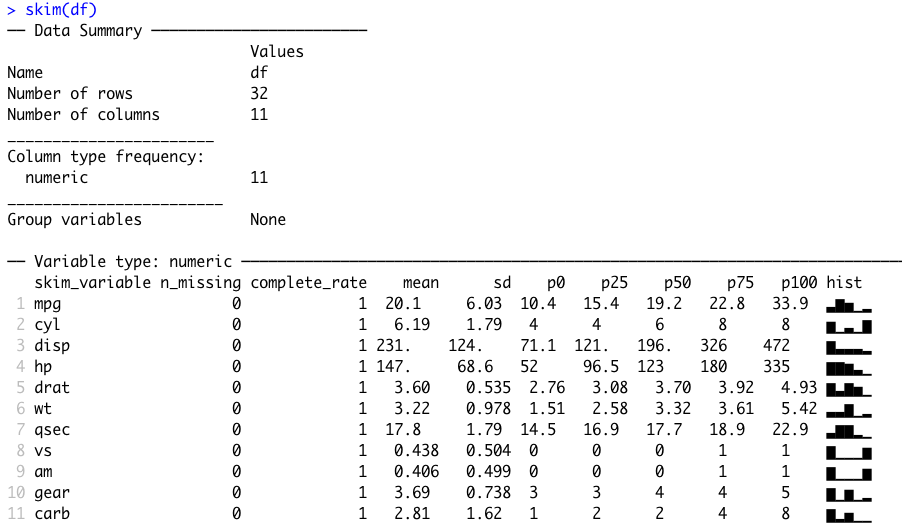

```{r, echo = FALSE}
library(knitr)
opts_chunk$set(comment = "")
suppressPackageStartupMessages(library(dplyr))
library(dplyr)
library(jhur)
```

## Recap
- R functions as a calculator
- Use `c()` to **combine** vectors
- Use `<-` to save (assign) values to objects
- if you don't use `<-` to reassign objects that you want to modify, they will stay the same
- `length()`, `class()`, and `str()` tell you information about an object
- `head()` and `tail()` can also help you inspect an object
- `readr`has helpful functions like `read_csv()` that can help you import data into R


📃[Cheatsheet](https://jhudatascience.org/intro_to_r/modules/cheatsheets/Day-2.pdf)


## Overview

In this module, we will show you how to:

1. Look at your data in different ways
2. Create a data frame and a tibble
3. Create new variables/make rownames a column
4. Rename columns of a data frame
5. Subset rows of a data frame
6. Subset columns of a data frame
7. Add/remove new columns to a data frame
8. Order the columns of a data frame
9. Order the rows of a data frame


## Setup

We will largely focus on the `dplyr` package which is part of the `tidyverse`.

```{r, fig.alt="dplyr", out.width = "25%", echo = FALSE, fig.align='center'}
knitr::include_graphics("https://tidyverse.tidyverse.org/logo.png")
```

Some resources on how to use `dplyr`: 

* https://dplyr.tidyverse.org/
* https://cran.r-project.org/web/packages/dplyr/vignettes/dplyr.html
* https://www.opencasestudies.org/


## Why dplyr?

```{r, fig.alt="dplyr", out.width = "100%", echo = FALSE, fig.align='center'}
knitr::include_graphics("images/dplyr.png")
```
The `dplyr` package is one of the most helpful packages for altering your data to get it into a form that is useful for creating visualizations, summarizing, or more deeply analyzing. 

So you can imagine using pliers on your data. 

```{r, fig.alt="dplyr", out.width = "20%", echo = FALSE, fig.align='center'}
knitr::include_graphics("https://d33wubrfki0l68.cloudfront.net/621a9c8c5d7b47c4b6d72e8f01f28d14310e8370/193fc/css/images/hex/dplyr.png")
```


## Loading in dplyr and tidyverse

See this website for a list of the packages included in the `tidyverse`: https://www.tidyverse.org/packages/
```{r}
library(tidyverse) # loads dplyr and other packages!
```

## Getting data to work with

Here we use one of the datasets that comes with base R called `mtcars`. We will now create a toy data frame named `df` using this data. This way we can alter `df` without worrying about changing `mtcars`.

```{r}
df <- mtcars # df is a copy of mtcars
head(df) # changing df does **not** change mtcars!
```

## Checking the data `dim()`

The `dim()` , `nrow()`, and `ncol()` functions are good options to check the dimensions of your data before moving forward.

```{r}
dim(df) # rows, columns
nrow(df) # number of rows
ncol(df) # number of columns
```

## Checking the data: `glimpse()`

In addition to `head()` and `tail()`, the `glimpse()`function of the `dplyr` package  is another great function to look at your data. 

```{r}
glimpse(df)
```


## Checking your data: `slice_sample()`

What if you want to see the middle of your data? You can use the `slice_sample()` function of the `dplyr` package to see a random set of rows. You can specify the number of rows with the `n` argument or use a proportion with the `prop` argument.

```{r}
slice_sample(df, n = 3)
slice_sample(df, prop = .2)

```

## `skimr` package

```{r, eval = FALSE}
library(skimr)
skim(df)

```

```{r, fig.alt="dplyr", out.width = "90%", echo = FALSE, fig.align='center'}

```

# Making data frames (base R) and tibbles (tidyverse)
## Creating data frames using base R data frame function
```{r}
data.frame(df)
```


## Keep in mind...

Need to assign the output of the function to keep the result!
```{R}
df_updated <- data.frame(df)
# this would overwrite the existing df object
df <- data.frame(df) 
```

## Or create a data frame when reading in the file {.codesmall}

Or directly when reading in a csv with the `read.csv()` function (also base R)

```{r, eval = FALSE}
# function comes from base R - no package loading required
df_example_readr <- read.csv(file = "documents/data_analysis/data_file.csv")
```


## tibble

We can create a **fancier** version of the previous data frame which can be really helpful. 


## Creating a `tibble`

If we would like to create a `tibble` ("fancy" data frame), we can using the  `tibble()` function.  

```{r}
tbl <- tibble(df) 
tbl
```

Note don't necessarily need to use `head()`- tibbles conveniently print a portion of the data.

## tibbles form read_csv(){.codesmall}

Alternatively we can read data files using the `tidyverse` with the `read_csv()` function of the `readr` package from the `tidyverse` to make a tibble.


```{r, eval = FALSE}

df_example_readr <- read_csv(file = "documents/data_analysis/data_file.csv")
```

You may start to notice how the tidyverse package work well together!

## Summary of tibbles and data frames

**Base R:**  
Using `read.csv()` and `data.frame()` you can make data frames  

**Tidyverse (fancier version):**  
Using `read_csv()` and `tibble()` you can make tibbles 

We generally recommend using tibbles, but you are likely to run into lots of data frames with your work.

## Data frames vs tibbles
 
In the "tidy" data format, rownames are removed.  For example, `df` has each car name as a row name. Here we use the `head()` function to see the first 2 rows of each using the `n` argument. In this case we would want to make the rownames a new column first before making into a tibble.

```{r}
head(df, n = 2)
head(tibble(df), n = 2)
```


## rownames_to_column function{.codesmall}

If you run into losing a variable contained in your row names, you can also use `rownames_to_column` (of `tibble` package) to add it before turning it into a `tibble` to keep them:

<div class = "codeexample">
```{r, eval = FALSE, size = "tiny"}
# general format! not code!
{data you are creating or changing} <- # reassign if you want to keep changes
      rownames_to_column({data you are using}, 
                        {Name of column you are making from rownames})
```
</div>

```{r, size = "tiny"}
head(df,  n = 2)
df <- rownames_to_column(df, "car")
head(df, n = 2)
```


## Let's stick with the tibble version

```{r}
tb <- tibble(df)
tb
```


# Renaming Columns

## Renaming Columns of a data frame or tibble

To rename columns in `dplyr`, you can use the `rename` function.

For example, let's rename mpg to MPG. Notice the new name is listed **first**!

<div class = "codeexample">
```{r, eval = FALSE}
# general format! not code!
{data you are creating or changing} <- rename({data you are using}, 
                                          {New Name} = {Old name})
```
</div>

```{r}
tb <- rename(tb, MPG = mpg)
head(tb)
```


## Take Care with Column Names

When you can, avoid spaces, special punctuation, or numbers in column names, as these require quotes to refer to them. 

See https://jhudatascience.org/intro_to_r/quotes_vs_backticks.html for more guidance.

```{r, eval = FALSE}
tb <- rename(tb, MPG! = MPG) # this will cause an error
```

```{r}
tb_rename <-rename(tb, `MPG!` = MPG) # this will work
head(tb_rename, 2)
```

You will need to refer to a column like this with most functions.


## Take Care with Column Names and Character Strings

These are the conventions, most options will work for most functions.

Backticks are typically for nonstandard variable names:

- those with spaces `col 1`
- those with punctuation `col.1`
- those that are just numbers  `1`
- those that start with numbers `1st col`

Single or double quotes are typically used for character strings (data values that has characters): 

- `"words"` 
- `"phrases with spaces"`
- `'words'`
- `'phrases with spaces'`

## Be careful about copy pasting code!

Curly quotes will not work!

```{r, eval = FALSE}
tb_rename <-rename(tb, ‘MPG!’ = MPG) # this will cause an error!
```

```{r, eval = FALSE}
tb_rename <-rename(tb, `MPG!` = MPG) # this will work!
```

Also true for double quotes
```{r, eval = FALSE}
tb_rename <-rename(tb, “MPG!” = MPG) # this will cause an error!
```

```{r, eval = FALSE}
tb_rename <-rename(tb, "MPG!" = MPG) # this will work!
```


## Renaming All Columns of a data frame: dplyr

To rename all columns you use the `rename_with()`. In this case we will use `toupper()` to make all letters upper case. Could also use `tolower()` function.

```{r}
tb_upper <- rename_with(tb, toupper)
head(tb_upper, 3)
```

```{r}
tb <- rename_with(tb, tolower)
head(tb, 3)
```

## Summary

- data frames are simpler version of a data table
- tibbles are fancier `tidyverse` version
- data frames are made with `data.frames()` and `read.csv()`
- tibbles are made with `tibble()` and `read_csv()` from `readr`
- If your original data has rownames, you need to use `rownames_to_column` before converting to tibble
- the `rename()` function of `dplyr` can help you rename columns
- avoid using punctuation (except underscores), spaces, and numbers (to start or alone) in column names
- If you must use backticks around those column names
- quotes can be used for character values
- avoid copy and pasting code from other sources - quotation marks will change!

## Lab Part 1

🏠 [Class Website](https://jhudatascience.org/intro_to_r/)    
💻 [Lab](https://jhudatascience.org/intro_to_r/modules/Subsetting_Data_in_R/lab/Subsetting_Data_in_R_Lab.Rmd)

# Subsetting Columns

## Subset columns of a data frame - `tidyverse` way: 

To grab (or "pull" out) the `carb` column the `tidyverse` way we can use the `pull` function:
```{r}
pull(tb, carb)
```


## Subset columns of a data frame: dplyr

The `select` command from `dplyr` allows you to subset (still a `tibble`!)
```{r}
select(tb, mpg)
```

## Select mutiple columns

We can use `select` to select for multiple columns.

```{r}
select(tb, mpg, car, gear)
```

## Subset columns of a data frame: dplyr

Note that if you want the values (not a `tibble`), use `pull` - as it pulls out the data:
```{r}
pull(tb, mpg)

# pull with select works too!

pull(select(tb, mpg))
```

## Select columns of a data frame: dplyr

The `select` command from `dplyr` allows you to subset columns matching patterns:

```{r}
head(tb, 2)
select(tb, starts_with("c"))
```

## See the Select "helpers"

Here are a few:

```{r, eval = FALSE}
last_col()
starts_with()
ends_with()
contains() # like searching
```

Type `tidyselect::` in the **console** and see what RStudio suggests:

```{r, fig.alt="dplyr", out.width = "80%", echo = FALSE, fig.align='center'}
knitr::include_graphics("images/tidyselect.png")
```
## Combining tidyselect helpers with regular selection

```{r}
head(tb, 2)
select(tb, starts_with("d"), car)
```
## Multiple tidyselect functions

Follows OR logic.

```{r}
tb %>%select(starts_with("c"), ends_with("r"))

```

## Multiple patterns with tidyselect

Need to combine the patterns with the `c()` function.

```{r}
tb %>%  select(starts_with(c("c", "d")))

```


## The `where()` function can help select columns of a specific class{.codesmall}

`is.character()` and `is.numeric()` are often the most helpful

```{r}
head(tb, 2)
tb %>%select(where(is.numeric))

```

## Summary

- `pull()` to get values out of a data frame/tibble
- `select()` is the `tidyverse` way to get a tibble with only certain columns
-  you can `select()` based on patterns in the column names
-  you can also `select()` based on column class with the `where()` function
-  you can combine multiple tidyselector functions together like `select(starts_with("C"), ends_with("state"))`
-  you can combine multiple patterns with the `c()` function like `select(starts_with(c("A", "C")))`


## Lab Part 2

🏠 [Class Website](https://jhudatascience.org/intro_to_r/)    
💻 [Lab](https://jhudatascience.org/intro_to_r/modules/Subsetting_Data_in_R/lab/Subsetting_Data_in_R_Lab.Rmd)

# Subsetting Rows

## Subset rows of a data frame: dplyr

The command in `dplyr` for subsetting rows is `filter`.

```{r}
filter(tb, mpg > 20)
```


## Subset rows of a data frame: dplyr

You can have multiple logical conditions using the following:

* `==` : equals to
* `!=`: not equal to (`!` : not/negation)
* `>` / `<`: greater than / less than
* `>=` or `<=`: greater than or equal to / less than or equal to
* `&` : AND
* `|` : OR

## Common error for filter

If you try to filter for a column that does not exist it will not work:
 
 - misspelled column name 
 - column that was already removed 


## Subset rows of a data frame: dplyr {.codesmall}

You can filter by two conditions using `&` or commas (must meet both conditions):

```{r, eval = FALSE}
filter(tb, mpg > 20, cyl == 4) # same result
```

```{r}
filter(tb, mpg > 20 & cyl == 4)
```

## Subset rows of a data frame: dplyr

If you want OR statements (meaning the data can meet either condition does not need to meet both), you need to use `|` between conditions:

```{r}
filter(tb, mpg > 20 | cyl == 4)

```

## Subset rows of a data frame: dplyr {.codesmall}

The `%in%` operator can be used find values from a pre-made list (using `c()`) for a **single column** at a time. 

```{r}
filter(tb, mpg %in% c(20,21,22))

filter(tb, mpg ==20 | mpg ==21 | mpg ==22) #equivalent
```
## Subset rows of a data frame: dplyr {.codesmall}

The `%in%` operator can be used find values from a pre-made list (using `c()`) for a **single column** at a time.

```{r}
filter(tb, gear %in% c(4,5), cyl %in% c(6,5))

```


## `distinct()` function

To filter for distinct values from a variable, multiple variables, or an entire tibble you can use the `distinct()` function from the `dplyr` package.

```{r}
distinct(tb, cyl)

distinct(tb, cyl, gear)
```

## Summary

- `filter()` can be used to filter out rows based on logical conditions
- `==` is the same as equivalent to
- `&` means both conditions must be met to remain after `filter()`
- `|` means either conditions needs to be met to remain after `filter()`
- `distinct()` helps you filter for unique values

## Lab Part 3

🏠 [Class Website](https://jhudatascience.org/intro_to_r/)    
💻 [Lab](https://jhudatascience.org/intro_to_r/modules/Subsetting_Data_in_R/lab/Subsetting_Data_in_R_Lab.Rmd)

## Combining `filter` and `select`

You can combine `filter` and `select` to subset the rows and columns, respectively, of a data frame:

```{r}
select(filter(tb, mpg > 20 & cyl == 4), cyl, hp)
```

In `R`, the common way to perform multiple operations is to wrap functions around each other in a "nested" way such as above. 

## Assigning Temporary Objects

One can also create temporary objects and reassign them:

```{r}
tb2 <- filter(tb, mpg > 20 & cyl == 4)
tb2 <- select(tb2, cyl, hp)

head(tb2,4)
```

## Using the `pipe` (comes with `dplyr`):

The pipe `%>%` makes things such as this much more readable.  It reads left side "pipes" into right side.  RStudio `CMD/Ctrl + Shift + M` shortcut. Pipe `tb` into `filter`, then pipe that into `select`:


```{r}
tb %>% filter(mpg > 20 & cyl == 4) %>% select(cyl, hp)
```


# Adding/Removing Columns


## Adding columns to a data frame: dplyr (`tidyverse` way){.codesmall}

The `mutate` function in `dplyr` allows you to add or modify columns of a data frame.

<div class = "codeexample">
```{r, eval = FALSE}
# General format - Not the code!
{data object to update} <- mutate({data to use}, 
                           {new variable name} = {new variable source}) 
```
</div>

```{r}
tb <- mutate(tb, newcol = wt / 2.2)
head(tb, 4)
```


## Use mutate to modify existing columns {.codesmall}

The `mutate` function in `dplyr` allows you to add or modify columns of a data frame.

<div class = "codeexample">
```{r, eval = FALSE}
# General format - Not the code!
{data object to update} <- mutate({data to use}, 
                           {variable name to change} = {variable modification}) 
```
</div>

```{r}
tb <- mutate(tb, wt = wt * 2)
head(tb, 4)
```


## You can pipe data into mutate {.codesmall}


```{r}
tb <- tb %>% mutate(wt = wt / 2)
head(tb,4)
```


## Removing columns of a data frame: dplyr

The `NULL` method is still very common.

The `select` function can remove a column with minus (`-`):
```{r, eval = FALSE}
select(tb, - newcol)
```

```{r, echo = FALSE}
head(select(tb, - newcol))
```

**Or, you can simply select the columns you want to keep, ignoring the ones you want to remove.**

## Removing columns in a data frame: dplyr

You can use `c()` to list the columns to remove.

Remove `newcol` and `drat`:
```{r}
select(tb, -c("newcol", "drat"))
```


# Ordering columns

## Ordering the columns of a data frame: dplyr

The `select` function can reorder columns.
```{r}
head(tb, 2)
select(tb, cyl, mpg, wt, car) %>%
head(2)
```

## Ordering the columns of a data frame: dplyr {.codesmall}

The `select` function can reorder columns.  Put `newcol` first, then select the rest of columns:
```{r, eval = FALSE}
select(tb, newcol, everything())
```

```{r, echo = FALSE}
head(select(tb, newcol, everything()), 3)
```

## Ordering the columns of a data frame: dplyr {.codesmall}

Put `newcol` at the end ("remove, everything, then add back in"):

```{r, eval = FALSE}
select(tb, -newcol, everything(), newcol)
```

```{r, echo = FALSE}
head(select(tb, -newcol, everything(), newcol), 3)
```


## Ordering the column names of a data frame: alphabetically {.codesmall}

Using the base R `order()` function.

```{r}
order(colnames(tb))
tb %>% select(order(colnames(tb)))
```


## Ordering the columns of a data frame: dplyr {.codesmall}

In addition to `select` we can also use the `relocate()` function of dplyr to rearrange the columns for more complicated moves.

For example, let say we just wanted `wt` to be before `cyl`.

```{r}

head(tb, 1)

tb_carb <- relocate(tb, wt, .before = cyl)

head(tb_carb, 1)
```


# Ordering rows

## Ordering the rows of a data frame: dplyr

The `arrange` function can reorder rows  By default, `arrange` orders in increasing order:
```{r}
arrange(tb, mpg)
```

## Ordering the rows of a data frame: dplyr

Use the `desc` to arrange the rows in descending order:
```{r}
arrange(tb, desc(mpg))
```

## Ordering the rows of a data frame: dplyr

You can combine increasing and decreasing orderings:
```{r}
arrange(tb, mpg, desc(hp))
```


## Summary

- `select()` and `filter()` can be combined together
- you can do sequential steps in a few ways:
    1. nesting them inside one another using parentheses `()`
    2. creating intermediate data objects in between
    3. using pipes `%>%` (like "then" statements)
- `select()` and `relocate()` can be used to reorder columns
- `arrange()` can be used to reorder rows
- can remove rows with `filter()`
- can remove a column in a few ways:  
    2. using `select()` with negative sign in front of column name(s)  
    3. not selecting it (without negative sign)  

## Summary cont...

- `mutate()` can be used to create new variables or modify them

<div class = "codeexample">
```{r, eval = FALSE}
# General format - Not the code!
{data object to update} <- mutate({data to use}, 
                                {new variable name} = {new variable source}) 
```
</div>

```{r, eval = FALSE}
tb <- mutate(tb, newcol = wt/2.2)
```

## A note about base R: 

The `$` operator is similar to `pull()`. This is the base R way to do this:

```{r}
tb$carb
```

Although it is easier (for this one task), mixing and matching the `$` operator with tidyverse functions usually doesn't work. Therefore, we want to let you know about it in case you see it, but we suggest that you try working with the tidyverse way.

## Adding new columns to a data frame: base R

You can add a new column (or modify an existing one) using the `$` operator instead of `mutate`.

Just want you to be aware of this as it is very common.

```{r}
tb$newcol <- tb$wt/2.2
head(tb,3)
```

Even though `$` is easier for creating new columns, `mutate` is really powerful, so it's worth getting used to.

## Lab Part 4

🏠 [Class Website](https://jhudatascience.org/intro_to_r/)

💻 [Lab](https://jhudatascience.org/intro_to_r/modules/Subsetting_Data_in_R/lab/Subsetting_Data_in_R_Lab.Rmd)


```{r, fig.alt="The End", out.width = "50%", echo = FALSE, fig.align='center'}
knitr::include_graphics(here::here("images/the-end-g23b994289_1280.jpg"))
```

Image by <a href="https://pixabay.com/users/geralt-9301/?utm_source=link-attribution&amp;utm_medium=referral&amp;utm_campaign=image&amp;utm_content=812226">Gerd Altmann</a> from <a href="https://pixabay.com//?utm_source=link-attribution&amp;utm_medium=referral&amp;utm_campaign=image&amp;utm_content=812226">Pixabay</a>

# Extra Slides

## `which()` function

Instead of removing rows like filter, `which()` simply shows where the values occur if they pass a specific condition. We will see that this can be helpful later when we want to select and filter in more complicated ways.

```{r}
which(select(tb,carb) == 4)
select(tb, carb) == 4
```


# base R subsetting

## Subset columns of a data frame: 

We can grab the `carb` column using the `$` operator. This is the base R way to do this:

```{r}
df$carb
```

## Remove a column in base R

```{r, eval = FALSE}
df$mpg <- NULL
```
## Renaming Columns of a data frame: base R

We can use the `colnames` function to extract and/or directly reassign column names of `df`:

```{r}
colnames(df) # just prints
colnames(df)[1:3] <- c("MPG", "CYL", "DISP") # reassigns
head(df)
colnames(df)[1:3] <- c("mpg", "cyl", "disp") #reset - just to keep consistent
```

## Renaming Columns of a data frame: base R

We can assign the column names, change the ones we want, and then re-assign
the column names:
```{r}
cn <- colnames(df)
cn[ cn == "drat"] <-"DRAT"
colnames(df) <- cn
head(df)
colnames(df)[ colnames(df) == "DRAT"] <- "drat" #reset
```

## Subset rows of a data frame with indices: 

Let's select **rows** 1 and 3 from `df` using brackets:

```{r}
df[ c(1, 3), ]
```

## Subset columns of a data frame: 

We can also subset a data frame using the bracket `[, ]` subsetting. 

For data frames and matrices (2-dimensional objects), the brackets are `[rows, columns]` subsetting.  We can grab the `x` column using the index of the column or the column name ("`carb`") 

```{r}
df[, 11]
df[, "carb"]
```

## Another difference between `tbl` and data frame: 

Mostly, `tbl` (tibbles) are the same as data frames, except they don't print all lines.  When subsetting only one column using brackets, a data frame will return the values, but a `tbl` will return a `tbl`

```{r}
df[, 1]
tbl[, 1]
tbl[, "mpg"]
df[, 1, drop = FALSE]
```

## Subset columns of a data frame: 

We can select multiple columns using multiple column names:

```{r}
df[, c("mpg", "cyl")]
```


