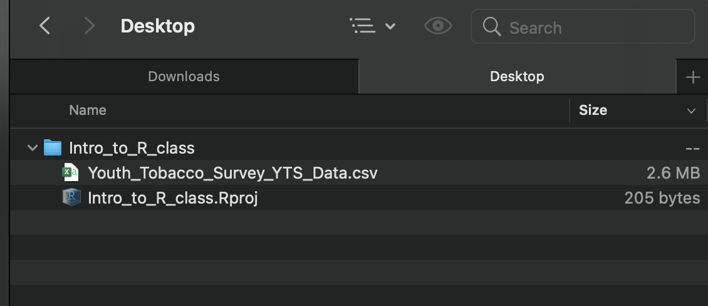
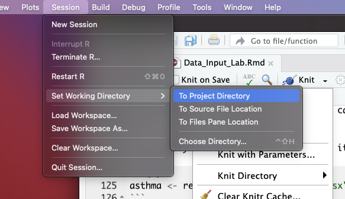

```{r, echo = FALSE}
library(knitr)
library(readr)
opts_chunk$set(comment = "")
```

R Projects are a super helpful feature of RStudio. They help you:

- **Stay organized.** R Projects help in organizing your work into self-contained directories (folders), where all related scripts, data, and outputs are stored together. This organization simplifies file management and makes it easier to locate and manage files associated with your analysis or project.

- **Find the right files.** When you open an R Project, RStudio automatically sets the working directory to the project's directory. This is where RStudio "looks" for files. Because it's always the Project folder, it can help avoid common issues with file paths.

- **Be more reproducible.** By encapsulating all the files for an analysis within a single project, R Projects enhance reproducibility. You can share the entire project directory with others, and they can replicate your environment and analysis without much hassle. This is particularly important for research and collaborative work where transparency is key -- i.e., for publications!

**Let's go over how to create and use an R Project!**


## New R Project

Let's make an R Project so we can stay organized in the next steps. Click the new R Project button at the top left of RStudio:

```{r, fig.alt="The New R Project button is highlighted.", out.width = "40%", echo = FALSE, align = "center"}
knitr::include_graphics("../modules/Data_Input/images/Data_Input_Rproject.png")
```

In the New Project Wizard, click "New Directory":

```{r, fig.alt="In the New Project Wizard, the 'New Directory' option is highlighted.", out.width = "60%", echo = FALSE, align = "center"}
knitr::include_graphics("../modules/Data_Input/images/Data_Input_new_directory.png")
```

Click "New Project":

```{r, fig.alt="In the New Project Wizard, the 'New Project' option is highlighted.", out.width = "60%", echo = FALSE, align = "center"}
knitr::include_graphics("../modules/Data_Input/images/Data_Input_new_project.png")
```

Type in a name for your new folder.

Store it somewhere easy to find, such as your Desktop:

```{r, fig.alt="In the New Project Wizard, the new project has been given a name and is going to be stored in the Desktop directory. The 'Create Project' button is highlighted.", out.width = "60%", echo = FALSE, align = "center"}
knitr::include_graphics("../modules/Data_Input/images/Data_Input_new_project_details.png")
```

You now have a new R Project folder on your Desktop! 

Make sure you add any scripts or data files to this folder as you go through your Intro to R lessons, or work on a new project. This will make sure R is able to "find" your files.

```{r, fig.alt="The image shows an image of an arrow pointing to the newly created R project repository.", out.width = "60%", echo = FALSE, align = "center"}
knitr::include_graphics("../modules/Data_Input/images/Data_Input_new_desktop.png")
```


## Testing out your R Project

Let's read in some data.

`read_csv()` needs an argument `file =`.

-  `file` is the path to your file, **in quotation marks**
-  can be path to a file on a website (URL)
-  can be **path** in your local computer -- absolute file path or relative file path 

```{r, eval = FALSE}
# Examples

dat <- read_csv(file = "www.someurl.com/table1.csv")

dat <- read_csv(file = "/Users/avahoffman/Downloads/Youth_Tobacco_Survey_YTS_Data.csv")

dat <- read_csv(file = "Youth_Tobacco_Survey_YTS_Data.csv")
```

If we *aren't* reading from URL, and we *are* Reading from your computer.. What is the "path"?

```{r, fig.alt="GIF with text. PC: *autosaves file* Me: Cool, so where did the file save? PC: shows image of Power Rangers shrugging.", out.width = "40%", echo = FALSE, align = "center"}
knitr::include_graphics("../modules/Data_Input/images/Data_Input_where_are_the_files.gif")
```

When you set up an R Project, R looks for files in that folder.

Download the data file at http://jhudatascience.org/intro_to_r/data/Youth_Tobacco_Survey_YTS_Data.csv. Move downloaded files into the R Project folder.

```{r, fig.alt="Image showing the csv dataset being moved to the R Project directory created earlier.", out.width = "60%", echo = FALSE, align = "center"}
knitr::include_graphics("../modules/Data_Input/images/Data_Input_file_move.png")
```

Confirm the data is in the R Project folder.

```{r, fig.alt="Image showing the csv dataset inside the R Project directory created earlier.", out.width = "70%", echo = FALSE, align = "center"}

```

If we add the `Youth_Tobacco_Survey_YTS_Data.csv` file to the R Project folder, we only need to use the file name for the `file` argument:

```{r, eval = FALSE}
dat <- read_csv(file = "Youth_Tobacco_Survey_YTS_Data.csv")
```

**NICE!**


## Why does this work?

When we create an R Project, we establish the **working directory**.

Working directory is a folder (directory) that RStudio assumes "you are working in". 

It's where R looks for files.

```{r, fig.alt="The files are in the computer text overlaid on still shot of the movie Zoolander.", out.width = "30%", echo = FALSE, align = "center"}
knitr::include_graphics("../modules/Data_Input/images/files.jpg")
```

The working directory is wherever the `.Rproj` file is.

```{r, fig.alt="Image showing the RStudio console. There is an arrow pointing to the .Rproj file. The top right corner shows that the 'Intro_to_r' project has been selected.", out.width = "80%", echo = FALSE, align = "center"}
knitr::include_graphics("../modules/Data_Input/images/Data_Input_Rproj_file.png")
```


## TROUBLESHOOTING

If your R project directory and working directory do not match:

- Session > Set Working Directory > To Project Directory

```{r, fig.alt="Screenshot of the session menu, with set working directory selected, and To Project Directory selected.", out.width = "60%", echo = FALSE, align = "center"}

```

If you are trying to knit your work, it might help to set the knit directory to the "Current Working Directory":

```{r, fig.alt="Screenshot of the Knit menu, with Knit directory open, and Current Working Directory selected.", out.width = "60%", echo = FALSE, align = "center"}
knitr::include_graphics("../modules/Data_Input/images/Data_Input_knit_directory.png")
```

You can also run the `getwd()` function to determine your working directory.

```{r eval=FALSE}
# Get the working directory
getwd()
```

You can also set the working directory manually with the `setwd()` function:

```{r eval=FALSE}
# set the working directory
setwd("/Users/avahoffman/Desktop")
```


## `here` package

the `here()` function from the `here` package gives you the absolute path of the R Project file. It can be useful for being very explicit about what the path is.

```{r eval=FALSE}
library(here)
here()
```
